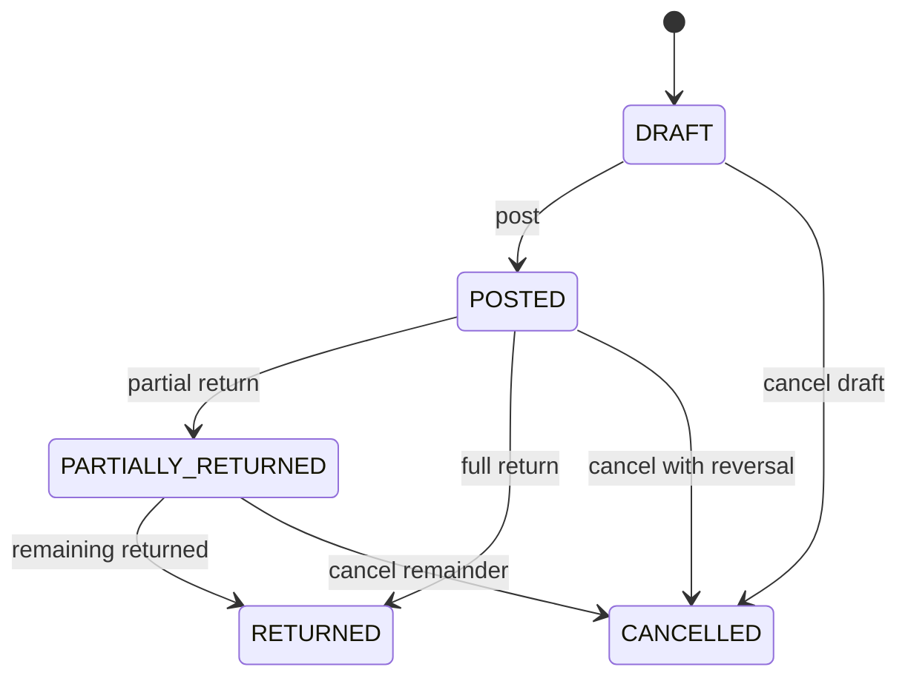
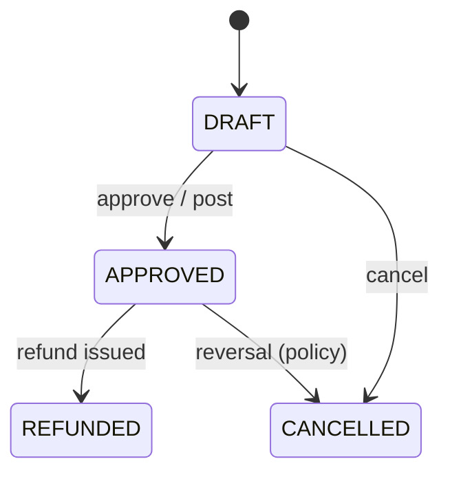
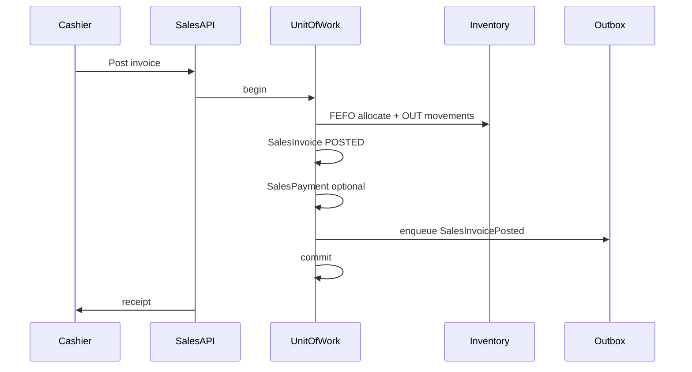

# Sales Domain

The Sales domain governs how a pharmacy bills customers, collects payment, and handles returns. It is the retail counter-facing boundary between customer demand, branch inventory, pricing, and finance. Every posted sale reduces branch stock, snapshots commercial terms at transaction time, and produces auditable records for compliance (Schedule H, GST) and reconciliation.

There is **no SalesOrder or Quotation** in the current data model. Billing starts directly on `SalesInvoice`. See [future-roadmap](../roadmap/future-roadmap.md#deferred--not-modeled) for planned concepts.

**Database reference:** [Sales tables overview](../database/tables/sales/sales.md)

**Related domains:** [customer.md](customer.md), [finance.md](finance.md)

## Overview & Aggregate

### Responsibilities

- Create and post customer invoices with line-level batch traceability
- Resolve branch-scoped selling prices from `PriceListItem` and snapshot them on lines
- Allocate stock using FEFO (First Expiry First Out) at the selling branch
- Record payments (`SalesPayment`) and derive `paymentStatus` on the invoice
- Process customer returns (`SalesReturn`, `SalesReturnItem`) linked to the original invoice
- Enforce document lifecycle (`status`) separate from settlement (`paymentStatus`)
- Emit domain events and outbox records atomically with inventory and audit writes

### In scope

- `SalesInvoice`, `SalesInvoiceItem`, `SalesPayment`, `SalesReturn`, `SalesReturnItem`
- Branch-scoped document numbering (`invoiceNumber`, return numbers, payment numbers)
- OTC and prescription-linked sales (optional `customerId`, `prescriptionId`)
- Partial and mixed-mode payments; refunds via returns
- Integration with inventory (`Stock`, `StockMovement`, `Batch`) and pricing (`PriceList`, `PriceListItem`, `Tax`)

### Out of scope

- Sales orders and quotations (not modeled yet)
- Purchase-side documents (see Purchasing domain)
- General ledger posting rules (see [finance.md](finance.md)) — Sales triggers them but does not own chart-of-accounts logic
- Loyalty accrual/redemption mechanics ([customer.md](customer.md) owns program rules)

### Related entities

| Entity | Role in Sales |
|--------|----------------|
| `SalesInvoice` | Header billing document |
| `SalesInvoiceItem` | Line with batch, qty, price/tax snapshots |
| `SalesPayment` | Payment received against invoice |
| `SalesReturn` | Return header referencing invoice |
| `SalesReturnItem` | Returned line with batch traceability |
| `Branch` | Tenant scope; document numbers unique per branch |
| `Customer` | Optional buyer; required for credit sales |
| `Prescription` | Optional link for Schedule H / Rx sales |
| `Medicine`, `Batch`, `Stock` | Dispensing and FEFO allocation |
| `PriceList`, `PriceListItem` | Branch sale pricing source |
| `StockMovement` | Immutable OUT (sale) / IN (return) ledger |
| `SequenceGenerator` | Branch-scoped `SALES_INVOICE` numbering |

### Aggregate structure

The primary aggregate is **SalesInvoice**: the consistency boundary for billing lines, stock consumption, payments, and return eligibility. Child entities (`SalesInvoiceItem`, `SalesPayment`, `SalesReturn`) are owned through the invoice lifecycle or linked return aggregate.

```
SalesInvoice (root)
 ├── SalesInvoiceItem[*]
 ├── SalesPayment[*]
 └── SalesReturn[*] (separate root, FK to invoice)
      └── SalesReturnItem[*]
```

| Table | Aggregate | Notes |
|-------|-----------|-------|
| `SalesInvoice` | Root | Owns totals, status, paymentStatus |
| `SalesInvoiceItem` | Child | Batch snapshot, immutable after POSTED |
| `SalesPayment` | Child | Multiple per invoice |
| `SalesReturn` | Root (linked) | Must reference one POSTED invoice |
| `SalesReturnItem` | Child of return | Restores stock to original batch when possible |

Cross-aggregate reads: `Stock`, `PriceListItem`, `Batch` (no direct mutation except via domain services). Inventory aggregate (`Batch`, `Stock`, `StockMovement`) and pricing master (`PriceList`, `PriceListItem`) are owned by other domains.

UUID is the sync identity; local `BigInt id` is for FK performance only.

### Performance

- Index `(branchId, invoiceDate)`, `(branchId, status)` for counter search and day-end reports.
- FEFO allocation: query `Stock` joined to `Batch` ordered by `expiryDate ASC` for `(branchId, medicineId)`.
- Cache active branch `PriceList` / items in memory with TTL; invalidate on pricing admin changes.
- Posting uses `UnitOfWork.run` — single SQLite transaction; avoid N+1 by batch-loading lines and stock rows.
- Optimistic locking via `version` on concurrent draft edits.
- Load invoice aggregate with items + payments in one query for post validation.
- Do not load entire customer history when opening a draft — paginate list endpoints.

## Terminology

| Term | Definition |
|------|------------|
| **SalesInvoice** | Customer billing document — legal and operational record of medicines sold at a branch |
| **Post** | Transition `DRAFT → POSTED`; triggers stock OUT, price/tax snapshot, and revenue recognition |
| **FEFO** | First Expiry First Out — batch allocation ordered by `Batch.expiryDate` at branch stock |
| **paymentStatus** | Settlement state (`UNPAID`, `PARTIALLY_PAID`, `PAID`, `REFUNDED`) — orthogonal to document `status` |
| **Price snapshot** | Line `unitPrice`, MRP, and tax captured at post time; never re-read from master price lists |
| **Branch-scoped numbering** | `invoiceNumber` unique within `(branchId, invoiceNumber)`, not globally |

## Business Rules & Invariants

### Invoice

- Every posted invoice must have at least one line item.
- `invoiceNumber` is unique within `(branchId, invoiceNumber)` — not globally.
- Minimum one `SalesInvoiceItem` before post.
- In `DRAFT`, lines may be added/removed; header totals recalculate from lines.
- Only `SalesInvoice` in `DRAFT` may add/remove/edit lines.
- Posted invoices are immutable; corrections use returns or cancellation with reversal movements.
- Posted invoices cannot be edited; use returns or controlled cancellation.
- `status` values: `DRAFT`, `POSTED`, `PARTIALLY_RETURNED`, `RETURNED`, `CANCELLED`.
- `paymentStatus` values: `UNPAID`, `PARTIALLY_PAID`, `PAID`, `REFUNDED` — updated when payments/refunds change; derived from payments and refunds, not mixed into `status`.
- Schedule H medicines: require prescription reference and prescriber/patient fields when configured.
- Soft delete (`deletedAt`) only for drafts; posted invoices never hard-deleted.
- Posting the invoice is the sole operation that decrements branch `Stock` for its lines.

On **post** (`status → POSTED`):

- Resolve each line's batch via FEFO at `branchId`.
- Snapshot `unitPrice` from `PriceListItem` (and MRP/tax from resolved sources).
- Create OUT `StockMovement` per line; decrement `Stock.availableQuantity`.
- Set `paymentStatus` to `UNPAID` unless same-transaction payment zeroes balance.

Posting is atomic: invoice + items + stock movements + stock balances + audit + outbox in one transaction.

### Pricing

- Selling price comes from branch `PriceListItem`; line items snapshot `unitPrice`, MRP, tax at post time.
- **Branch-scoped `PriceListItem`** is the authoritative sale price source. `Batch` carries lot cost (`purchaseRate`) and statutory MRP only — not `saleRate`.
- Resolution order: branch `PriceList` → active `PriceListItem` for `(priceListId, medicineId)` → fallback company default list if configured.
- Inactive or expired `PriceListItem` cannot be used; block post with clear error.
- `unitPrice` on line = resolved `sellingPrice` minus line discount.
- Tax computed on taxable base per local GST rules; snapshotted on line.
- If `unitPrice > batch.mrp` and `ENFORCE_MRP_CAP` setting true → validation error.
- After POSTED, changing `PriceListItem` does not alter historical invoice lines.
- Header `discountAmount` may distribute to lines or apply after line totals — policy fixed per implementation.
- Snapshot all commercial fields on post — never re-read master price for posted lines.

### Stock and batch

- Batch selection follows FEFO using `Batch.expiryDate` and `(branchId, batchId)` stock availability.
- Sold quantity cannot exceed available branch stock for the allocated batch.
- FEFO allocation occurs at post, not at draft add-line (draft may show suggested batch).

### Payment

- Each payment belongs to exactly one `SalesInvoice`.
- `paymentAmount > 0` for collections; refunds use dedicated flow or negative adjustment per finance policy.
- Sum of completed payments cannot exceed `netAmount` unless overpayment handling is enabled in settings.
- On payment save/complete:
  - `paidAmount = SUM(completed payments)`
  - `balanceAmount = netAmount - paidAmount` (adjusted for returns)
  - Recompute `paymentStatus`: `UNPAID` | `PARTIALLY_PAID` | `PAID` | `REFUNDED`
- Posted/completed payments are immutable; cancel via reversal payment row.
- Payment methods: `CASH`, `CARD`, `UPI`, `CHEQUE`, `BANK`, `CREDIT`, `MIXED` (header-level summary on invoice optional).
- Credit sales: invoice may post with `paymentStatus = UNPAID`; collections added later.
- `SalesPayment` totals update invoice `paidAmount`, `balanceAmount`, and `paymentStatus` but do not change invoice `status` from `POSTED` unless cancelled.

### Return

- Return header requires `salesInvoiceId`.
- At least one `SalesReturnItem`.
- `SalesReturn` may only be created against `POSTED` or `PARTIALLY_RETURNED` invoices.
- Return quantity per line cannot exceed originally sold quantity minus prior returns.
- Per line: `returnQuantity <= soldQuantity - previouslyReturnedQuantity`.
- Return lines must reference medicines/batches that appeared on the original invoice (or subset thereof).
- Expired products rejected unless `ALLOW_EXPIRED_CUSTOMER_RETURN` setting is true.
- Batch on return item should match original sale batch when traceability required.
- On **approve/post**:
  - Create IN `StockMovement`; increase branch `Stock` for return batch.
  - Update invoice `status`: partial → `PARTIALLY_RETURNED`; full → `RETURNED`.
  - Set `refundAmount`; adjust invoice `paidAmount`/`balanceAmount` and `paymentStatus` if refund issued.
- Return `status`: `DRAFT`, `APPROVED`, `REFUNDED`, `CANCELLED`.
- Approved returns immutable; cancel via reversal transaction.

### Validation rules

Validation runs at DTO (API), domain service, and database constraint layers. Draft validation is lenient; post validation is strict.

**SalesInvoice (draft):**

- `branchId` required; user authorized for branch.
- `invoiceDate` required; not more than N days in future (setting).
- At least one line before post (warn on empty draft save if allowed).

**SalesInvoice (post):**

- `status` must be `DRAFT`.
- Each line: `medicineId`, `soldQuantity > 0`, `unitId` valid.
- FEFO: allocated `batchId` has `Stock.availableQuantity >= soldQuantity` at `branchId`.
- Batch not expired unless `ALLOW_EXPIRED_SALE` true.
- Price resolved; `unitPrice >= 0`; MRP cap if enforced.
- Schedule H: `prescriptionId` required when medicine schedule demands it.
- `invoiceNumber` assigned and unique per branch.

**SalesPayment:**

- `paymentAmount > 0` for collections.
- `salesInvoiceId` exists and invoice not `CANCELLED`.
- Sum completed payments + new payment ≤ `netAmount` (unless overpay allowed).
- Cheque payments require `chequeNumber`, `chequeDate` when method = `CHEQUE`.

**SalesReturn:**

- Linked invoice `status` in (`POSTED`, `PARTIALLY_RETURNED`).
- `returnQuantity > 0` per line.
- Cumulative return ≤ sold per invoice line.
- `returnReason` required non-empty.
- Expired return rejection unless policy override with approver.

**Totals integrity:**

- Header `netAmount` = sum of line `lineAmount` ± header discount (within rounding tolerance).
- `balanceAmount` = `netAmount` - `paidAmount` after returns/refunds applied.

Validators gate transitions — e.g. only `DRAFT` accepts line edits; only `POSTED` accepts returns. Validation cannot bypass branch scope — inject `branchId` from context, not client body alone.

Run expensive stock/FEFO checks only on post, not every keystroke.

## Lifecycle & States

### Invoice `status`

| status | Editable | Stock impact |
|--------|----------|--------------|
| `DRAFT` | Yes | None |
| `POSTED` | No | OUT applied |
| `PARTIALLY_RETURNED` | No | Net OUT reduced by returns |
| `RETURNED` | No | Fully reversed via returns |
| `CANCELLED` | No | Reversal if was posted |



`paymentStatus` is computed from `SalesPayment` and refund totals, not set manually on post except initial default.

### Invoice `paymentStatus` (orthogonal)

| Value | Meaning |
|-------|---------|
| `UNPAID` | No payment recorded (`paidAmount = 0`) |
| `PARTIALLY_PAID` | `0 < paidAmount < netAmount` |
| `PAID` | `paidAmount >= netAmount` |
| `REFUNDED` | Net refunds exceed or equal collected amount after returns |

### SalesPayment.status

| Value | Meaning |
|-------|---------|
| `PENDING` | Initiated, not settled (e.g. cheque pending) |
| `COMPLETED` | Counts toward `paidAmount` |
| `FAILED` | Does not affect invoice |
| `CANCELLED` | Voided before settlement |
| `REFUNDED` | Refund issued to customer |

| Condition | paymentStatus |
|-----------|---------------|
| No completed payments | `UNPAID` |
| `0 < paidAmount < netAmount` | `PARTIALLY_PAID` |
| `paidAmount >= netAmount` | `PAID` |
| Refunds net to zero or credit | `REFUNDED` |

### SalesReturn.status



| Aggregate | Primary state field | Values |
|-----------|---------------------|--------|
| `SalesInvoice` | `status` | `DRAFT`, `POSTED`, `PARTIALLY_RETURNED`, `RETURNED`, `CANCELLED` |
| `SalesInvoice` | `paymentStatus` | `UNPAID`, `PARTIALLY_PAID`, `PAID`, `REFUNDED` |
| `SalesPayment` | `status` | `PENDING`, `COMPLETED`, `FAILED`, `CANCELLED`, `REFUNDED` |
| `SalesReturn` | `status` | `DRAFT`, `APPROVED`, `REFUNDED`, `CANCELLED` |

Invoice document state and payment state evolve independently but are reconciled on read models. Pricing masters use `isActive` and optional effective dates — not invoice lifecycle states.

Primary workflow path: invoice `DRAFT` → `POSTED`; paymentStatus `UNPAID` → `PAID`; optional `PARTIALLY_RETURNED` → `RETURNED`.

## Domain Events

Events are raised from aggregate roots: `SalesInvoicePosted`, `SalesPaymentRecorded`, `SalesReturnApproved`. Outbox payload carries `entityUuid` and `entityVersion` for the root entity.

| Event | Trigger | Downstream consumers |
|-------|---------|----------------------|
| `SalesInvoiceCreated` | Draft saved | UI, audit |
| `SalesInvoiceUpdated` | Draft line/total change | UI, audit |
| `SalesInvoicePosted` | DRAFT → POSTED | Inventory, finance, reporting, outbox/sync |
| `SalesPaymentRecorded` | Payment saved/posted | Invoice `paymentStatus`, finance, audit |
| `SalesPaymentCancelled` | Payment voided | Finance, audit |
| `SalesReturnCreated` | Return draft | UI, audit |
| `SalesReturnApproved` | Return posted | Inventory IN, refund, invoice `status`/`paymentStatus` |
| `SalesReturnRefunded` | Refund completed | Finance, audit |
| `SalesInvoiceCancelled` | Cancellation with reversal | Inventory, finance, audit |
| `SalesInvoicePartiallyReturned` | Cumulative returns < full invoice | Invoice `status` → `PARTIALLY_RETURNED` |
| `SalesInvoiceFullyReturned` | All qty/value returned | Invoice `status` → `RETURNED` |
| `SalesInvoicePaid` | `paymentStatus` → `PAID` | Finance, audit |
| `SalesInvoiceRefunded` | Returns/refunds drive `paymentStatus` to `REFUNDED` | Finance, audit |
| `SalesPriceResolved` | During draft save/post validation | Internal pricing audit |

### Outbox and event rules

| Event | When | Outbox | Key payload fields |
|-------|------|--------|-------------------|
| `SalesInvoiceCreated` | Draft saved | Optional | `entityUuid`, `branchId`, `status=DRAFT` |
| `SalesInvoiceUpdated` | Draft line/total change | Optional | `entityUuid`, `entityVersion` |
| `SalesInvoicePosted` | Post success | **Yes** | `entityUuid`, `invoiceNumber`, `netAmount`, line batch snapshots |
| `SalesPaymentRecorded` | Payment COMPLETED | **Yes** | `paymentUuid`, `salesInvoiceUuid`, `paymentAmount` |
| `SalesPaymentCancelled` | Payment voided | **Yes** | `paymentUuid`, reason |
| `SalesReturnCreated` | Return draft | Optional | `returnUuid`, `salesInvoiceUuid` |
| `SalesReturnApproved` | Return posted | **Yes** | `returnUuid`, lines, stock IN refs |
| `SalesReturnRefunded` | Refund completed | **Yes** | `returnUuid`, `refundAmount` |
| `SalesInvoiceCancelled` | Invoice cancelled | **Yes** | `entityUuid`, reversal refs |
| `SalesInvoicePartiallyReturned` | Cumulative partial | Derived | `entityUuid`, returned totals |
| `SalesInvoiceFullyReturned` | All qty returned | Derived | `entityUuid` |

- Every **post** operation emits outbox entry in the same DB transaction as the business write.
- Event payload includes `entityVersion` (optimistic lock version) for conflict detection on sync.
- Use UUID for cross-device identity; never publish local `BigInt id` to sync consumers.
- Idempotent consumers: `operationId` or `(entityUuid, sequenceNo)` dedupe.
- Validation failures do not emit events; successful post emits `SalesInvoicePosted`.
- Authorization failures do not emit domain events; audit may log `ACCESS_DENIED` via application logger.
- Event payloads exclude full patient PII in outbox; sync clients re-fetch authorized detail via API.
- Log sanitizer strips payment instrument details from structured logs.
- Batch outbox inserts when posting invoice + payments in one transaction (single commit).

## Permissions

Permissions use `MODULE:RESOURCE:ACTION` format (colon-separated).

| Code | permissionCode (seed) | Description |
|------|----------------------|-------------|
| `SALES:SALES_INVOICE:CREATE` | `SALES_CREATE` | Create draft, edit draft, post invoice, record payment on invoice |
| `SALES:SALES_INVOICE:READ` | `SALES_VIEW` | List and view invoices, lines, payments, returns |

Minimum permissions: `SALES:SALES_INVOICE:CREATE`, `SALES:SALES_INVOICE:READ`.

- Permission check runs after JWT auth and before handler; `PermissionsGuard` reads `@RequirePermissions()`.
- Branch isolation: user must belong to invoice `branchId` even with READ permission.
- System permissions (`isSystemPermission: true`) cannot be deleted by tenant admin.
- All mutations scoped to user's authorized `branchId` (tenant isolation via `companyId` → `Branch`).
- Aggregate mutations require branch-scoped authorization. Cross-branch invoice access is denied even if user knows UUID.
- Posted document edits denied at API and domain layer.
- PII on invoices (patient, prescriber) subject to audit logging and log sanitization.
- Recording payment requires `SALES:SALES_INVOICE:CREATE` or dedicated payment permission (future `SALES:SALES_PAYMENT:CREATE`).
- Users cannot attach payments to invoices outside their branch.
- Return approval may require manager permission (future `SALES:SALES_RETURN:APPROVE`).
- Price list edits require pricing admin permissions, not counter staff.
- Least privilege: cashiers get CREATE + READ on own branch only.
- Sensitive fields (patient on Schedule H) still require READ — redaction is UI policy, not separate permission in v1.
- Permission list cached in JWT (15m access token) — role changes require re-login or refresh.
- Avoid per-line permission checks; gate at controller operation level.

## Workflows

End-to-end operational workflows for counter billing, payment collection, and customer returns. All posting steps run in a single database transaction. `paymentStatus` updated in same transaction when payment taken at post.

Workflow detail: [sales-flow.md](../workflows/sales-flow.md)

### Invoice entity

`SalesInvoice` is the customer billing document — the legal and operational record of medicines sold at a branch. It captures commercial totals, optional customer and prescription links, document lifecycle, and payment settlement summary. Posting an invoice is the moment inventory leaves the branch and revenue is recognized.

- Assign branch-scoped `invoiceNumber` via `SequenceGenerator` (`documentType = SALES_INVOICE`)
- Maintain header totals: `grossAmount`, `discountAmount`, `taxAmount`, `netAmount`
- Track settlement: `paidAmount`, `balanceAmount`, `paymentStatus`
- Coordinate line items that snapshot batch, price, and tax at post time
- Pre-fetch stock candidates for all medicines on invoice before post (single query per medicine or batched join).
- Denormalized totals on header avoid summing lines on every list page — recalc on line change only.

### Payment entity

`SalesPayment` records money received against a `SalesInvoice`. Retail pharmacies need immediate cash settlement, split payments (cash + UPI), partial credit collection, and refund tracking after returns.

- Record payment amount, method, and references (UPI ref, cheque no, etc.)
- Assign branch- or company-scoped `paymentNumber` where applicable
- Update parent invoice settlement fields atomically
- Support multiple payments per invoice and refund payments linked to returns
- Modes: cash, card, UPI, cheque, bank transfer, credit account, mixed
- Partial payments on credit invoices; payment at post time or after post
- Refund disbursement recorded as payment with negative amount or `REFUNDED` status
- Index payments by `salesInvoiceId` for quick settlement view on invoice detail.
- Day-end cash drawer report: aggregate `COMPLETED` payments by method for `(branchId, paymentDate)`.

### Return entity

`SalesReturn` and `SalesReturnItem` handle medicines brought back by customers after a sale. Returns restore inventory (where policy allows), reverse revenue proportionally, issue refunds, and update the original invoice's `status` to `PARTIALLY_RETURNED` or `RETURNED`.

- Validate return against original `SalesInvoice` and `SalesInvoiceItem` quantities
- Restore stock to batch where acceptable (same batch preferred)
- Compute `refundAmount` and link to payment/refund flow
- Full and partial returns against one invoice; multiple return documents per invoice (cumulative qty caps)
- Reasons: wrong medicine, damage, billing error, prescription change, recall
- Approval workflow (`approvedByEmployeeId`, `approvedAt`)
- Exchange treated as return + new invoice — two operations
- When opening return UI, load invoice lines with `alreadyReturnedQty` aggregated from prior returns in one query.

### Pricing resolution

Sales pricing determines what the customer pays at the counter.

- Resolve active branch `PriceList` and `PriceListItem` for each medicine on the invoice
- Apply tax from linked `Tax` record (percent snapshotted on line)
- Apply line/header discounts per policy
- Enforce MRP ceiling where regulations require selling price ≤ batch MRP
- Cache `(branchId → priceListId → Map<medicineId, PriceListItem>)` with invalidation on admin update.
- Batch-resolve prices for all cart lines in one query: `WHERE medicineId IN (...)`.

### Workflow 1: Counter sale (OTC)

1. Cashier selects **branch** (from session context).
2. Optional: attach **customer** for credit or loyalty.
3. Add medicines to cart; system resolves **PriceListItem** per line.
4. Save **DRAFT** `SalesInvoice` + lines (no stock movement).
5. **Post** invoice:
   - Allocate batches **FEFO** per line at branch.
   - Snapshot prices/tax on lines.
   - Create OUT **StockMovement**; update **Stock**.
   - Assign **invoiceNumber** (branch-scoped).
   - Set `status = POSTED`.
6. Record **SalesPayment** if cash/UPI now → update `paymentStatus`.
7. Write **Outbox** + **Audit**; commit.
8. Print thermal receipt.

### Workflow 2: Prescription sale

Same as Workflow 1 with:

- Link `prescriptionId`.
- Validate Schedule H / controlled drug rules before post.
- Capture prescriber and patient fields on header when required.

### Workflow 3: Credit sale (pay later)

1. Post invoice with `paymentStatus = UNPAID`, `paidAmount = 0`.
2. Customer pays later: add **SalesPayment**(s) until `PAID`.
3. Finance receivable entries created on post; payments clear receivable.

### Workflow 4: Partial return

1. Locate **POSTED** invoice.
2. Create **DRAFT** `SalesReturn` with lines and quantities.
3. Manager **approve** → stock IN, update invoice `status = PARTIALLY_RETURNED`.
4. Issue refund → `paymentStatus` may become `PARTIALLY_PAID` or `REFUNDED` depending on amounts.

### Workflow 5: Cancel draft

1. Invoice in `DRAFT` → delete or mark `CANCELLED`.
2. No stock or finance impact.

### Workflow 6: Cancel posted invoice (exception)

1. Policy-gated manager action.
2. Reverse OUT movements; set `status = CANCELLED`.
3. Reverse payments; audit reason mandatory.



Each workflow step checks `SALES:SALES_INVOICE:CREATE` or `READ` as appropriate. Post is the heavy step — optimize FEFO + stock update queries. List workflows paginate by `(branchId, invoiceDate DESC)`.

## Integrations

- **Inventory:** OUT movements on post; IN movements on approved return; FEFO allocation service. IN movement on return mirrors OUT from original sale line.
- **Pricing:** Branch `PriceList` resolution → `PriceListItem.sellingPrice`, `Tax` percent. Settings: `ENFORCE_MRP_CAP`, default price list per branch.
- **Finance:** Receivable and revenue entries on post; payment and refund entries on settlement. Ledger cash/bank entries on payment `COMPLETED`. Revenue reversal and refund ledger entries on return.
- **Sync / Outbox:** `entityUuid` on invoice and related entities for offline-first replication. `OutboxService` with `entityType` constants for `SALES_INVOICE`, `SALES_PAYMENT`, `SALES_RETURN`. Sync clients subscribe to outbox ordered by `sequenceNo` per device.
- **Printing:** Thermal invoice via branch `PrinterConfiguration` (`SALES_INVOICE`). Thermal receipt on post (optional setting).
- **Audit:** `AuditService.log` in same transaction as post. `SALES_INVOICE_POST`, `SALES_PAYMENT_RECORD`, etc.
- **UnitOfWork:** All aggregate mutations that affect inventory run inside `UnitOfWork.run(tx)`.
- **InventoryLedger / StockMovement:** Called from invoice post and return approve — not embedded in invoice table.
- **SequenceGenerator:** Allocates `invoiceNumber` per branch (`SI-{BR}-{SEQ}` format per branch seed configuration; policy: on post).
- **SettingsService:** Policy flags (`FEFO_ENABLED`, `ENFORCE_MRP_CAP`, `ALLOW_EXPIRED_SALE`, `ALLOW_EXPIRED_CUSTOMER_RETURN`, etc.).
- **class-validator** on API DTOs for shape and type; **Prisma** FK and CHECK on persist.
- **Product domain:** Medicine inactive → block sale.
- **Tax reporting:** Snapshotted tax on lines feeds GST reports.
- **Auth:** JWT payload carries permission codes resolved at login from roles. Request context: `branchId`, `userId`, `companyId` from token + session.
- **Returns:** Refund amount on `SalesReturn` triggers refund payment or adjusts balance. Refund via cash/UPI or credit to customer account.

Counter → API → `UnitOfWork` → Inventory + Outbox + Audit.
