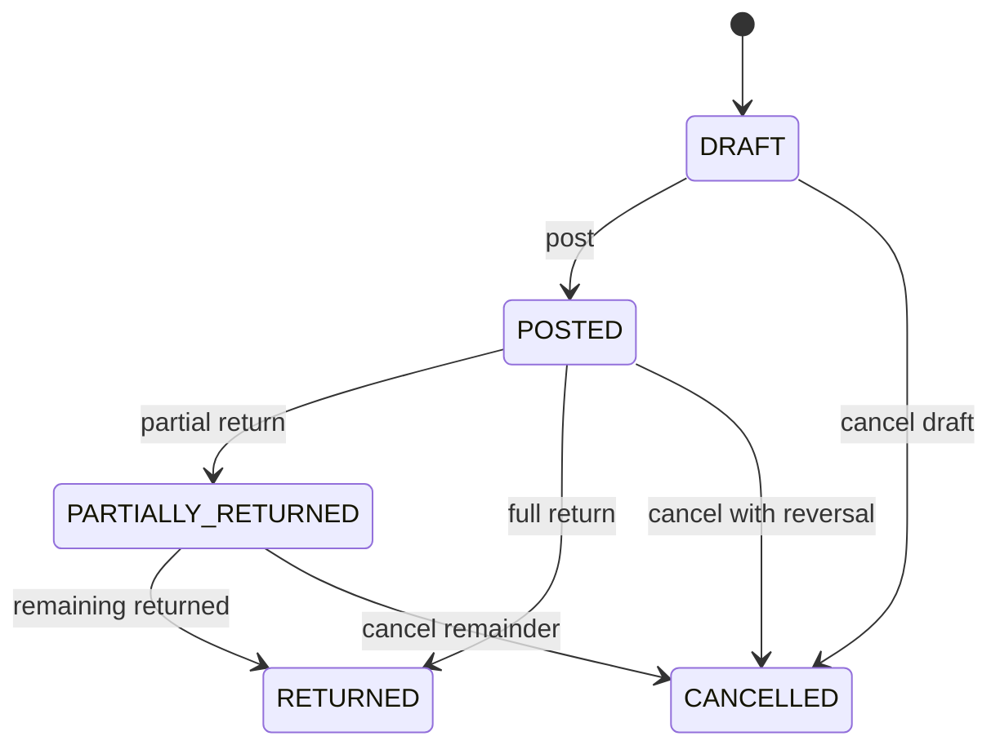

# Sales Domain

## Purpose

The Sales domain governs how a pharmacy bills customers, collects payment, and handles returns. It is the retail counter-facing boundary between customer demand, branch inventory, pricing, and finance. Every posted sale reduces branch stock, snapshots commercial terms at transaction time, and produces auditable records for compliance (Schedule H, GST) and reconciliation.

There is **no SalesOrder or Quotation** in the current data model. Billing starts directly on `SalesInvoice`. See [sales-order.md](./sales-order.md) and [quotation.md](./quotation.md) for planned future concepts.

**Database reference:** [Sales tables overview](../../database/tables/sales/sales.md)

## Responsibilities

- Create and post customer invoices with line-level batch traceability
- Resolve branch-scoped selling prices from `PriceListItem` and snapshot them on lines
- Allocate stock using FEFO (First Expiry First Out) at the selling branch
- Record payments (`SalesPayment`) and derive `paymentStatus` on the invoice
- Process customer returns (`SalesReturn`, `SalesReturnItem`) linked to the original invoice
- Enforce document lifecycle (`status`) separate from settlement (`paymentStatus`)
- Emit domain events and outbox records atomically with inventory and audit writes

## Scope

### In Scope

- `SalesInvoice`, `SalesInvoiceItem`, `SalesPayment`, `SalesReturn`, `SalesReturnItem`
- Branch-scoped document numbering (`invoiceNumber`, return numbers, payment numbers)
- OTC and prescription-linked sales (optional `customerId`, `prescriptionId`)
- Partial and mixed-mode payments; refunds via returns
- Integration with inventory (`Stock`, `StockMovement`, `Batch`) and pricing (`PriceList`, `PriceListItem`, `Tax`)

### Out of Scope

- Sales orders and quotations (not modeled yet)
- Purchase-side documents (see [Purchasing domain](../purchasing/README.md))
- General ledger posting rules (see Finance domain) — Sales triggers them but does not own chart-of-accounts logic
- Loyalty accrual/redemption mechanics (Customer domain owns program rules)

## Related Entities

| Entity | Role in Sales |
|--------|----------------|
| [SalesInvoice](../../database/tables/sales/38_sales_invoice.md) | Header billing document |
| [SalesInvoiceItem](../../database/tables/sales/39_sales_invoice_item.md) | Line with batch, qty, price/tax snapshots |
| [SalesPayment](../../database/tables/sales/42_sales_payment.md) | Payment received against invoice |
| [SalesReturn](../../database/tables/sales/40_sales_return.md) | Return header referencing invoice |
| [SalesReturnItem](../../database/tables/sales/41_sales_return_item.md) | Returned line with batch traceability |
| `Branch` | Tenant scope; document numbers unique per branch |
| `Customer` | Optional buyer; required for credit sales |
| `Prescription` | Optional link for Schedule H / Rx sales |
| `Medicine`, `Batch`, `Stock` | Dispensing and FEFO allocation |
| `PriceList`, `PriceListItem` | Branch sale pricing source |
| `StockMovement` | Immutable OUT (sale) / IN (return) ledger |
| `SequenceGenerator` | Branch-scoped `SALES_INVOICE` numbering |

## Business Rules

- Every posted invoice must have at least one line item.
- `invoiceNumber` is unique within `(branchId, invoiceNumber)` — not globally.
- Selling price comes from branch `PriceListItem`; line items snapshot `unitPrice`, MRP, tax at post time.
- Batch selection follows FEFO using `Batch.expiryDate` and `(branchId, batchId)` stock availability.
- Sold quantity cannot exceed available branch stock for the allocated batch.
- Posted invoices are immutable; corrections use returns or cancellation with reversal movements.
- `status` tracks document lifecycle: `DRAFT`, `POSTED`, `PARTIALLY_RETURNED`, `RETURNED`, `CANCELLED`.
- `paymentStatus` tracks settlement: `UNPAID`, `PARTIALLY_PAID`, `PAID`, `REFUNDED` — derived from payments and refunds, not mixed into `status`.
- Return quantity per line cannot exceed originally sold quantity minus prior returns.
- Posting is atomic: invoice + items + stock movements + stock balances + audit + outbox in one transaction.

## Domain Events

| Event | Trigger | Downstream consumers |
|-------|---------|----------------------|
| `SalesInvoiceCreated` | Draft saved | UI, audit |
| `SalesInvoicePosted` | DRAFT → POSTED | Inventory, finance, reporting, outbox/sync |
| `SalesPaymentRecorded` | Payment saved/posted | Invoice `paymentStatus`, finance, audit |
| `SalesReturnApproved` | Return posted | Inventory IN, refund, invoice `status`/`paymentStatus` |
| `SalesInvoiceCancelled` | Cancellation with reversal | Inventory, finance, audit |
| `SalesInvoicePartiallyReturned` | Cumulative returns < full invoice | Invoice `status` → `PARTIALLY_RETURNED` |
| `SalesInvoiceFullyReturned` | All qty/value returned | Invoice `status` → `RETURNED` |

## State Model

### Invoice `status`

### Invoice `paymentStatus` (orthogonal)

| Value | Meaning |
|-------|---------|
| `UNPAID` | No payment recorded (`paidAmount = 0`) |
| `PARTIALLY_PAID` | `0 < paidAmount < netAmount` |
| `PAID` | `paidAmount >= netAmount` |
| `REFUNDED` | Net refunds exceed or equal collected amount after returns |

## Integrations

- **Inventory:** OUT movements on post; IN movements on approved return; FEFO allocation service
- **Pricing:** Branch `PriceList` resolution → `PriceListItem.sellingPrice`, `Tax` percent
- **Finance:** Receivable and revenue entries on post; payment and refund entries on settlement
- **Sync / Outbox:** `entityUuid` on invoice and related entities for offline-first replication
- **Printing:** Thermal invoice via branch `PrinterConfiguration` (`SALES_INVOICE`)
- **Audit:** `AuditService.log` in same transaction as post

## Security

- Permissions use `MODULE:RESOURCE:ACTION` format (see [permissions.md](./permissions.md)).
- Minimum permissions: `SALES:SALES_INVOICE:CREATE`, `SALES:SALES_INVOICE:READ`.
- All mutations scoped to user's authorized `branchId` (tenant isolation via `companyId` → `Branch`).
- Posted document edits denied at API and domain layer; cancellation requires elevated permission (future).
- PII on invoices (patient, prescriber) subject to audit logging and log sanitization.

## Performance

- Index `(branchId, invoiceDate)`, `(branchId, status)` for counter search and day-end reports.
- FEFO allocation: query `Stock` joined to `Batch` ordered by `expiryDate ASC` for `(branchId, medicineId)`.
- Cache active branch `PriceList` / items in memory with TTL; invalidate on pricing admin changes.
- Posting uses `UnitOfWork.run` — single SQLite transaction; avoid N+1 by batch-loading lines and stock rows.
- Optimistic locking via `version` on concurrent draft edits.

## Future

- Sales order and quotation workflows before invoicing ([sales-order.md](./sales-order.md), [quotation.md](./quotation.md))
- Credit-note document type separate from cash refund
- E-invoice / GST portal integration
- Barcode scan-to-add with real-time stock hint
- Manager override for non-FEFO batch selection with mandatory reason
