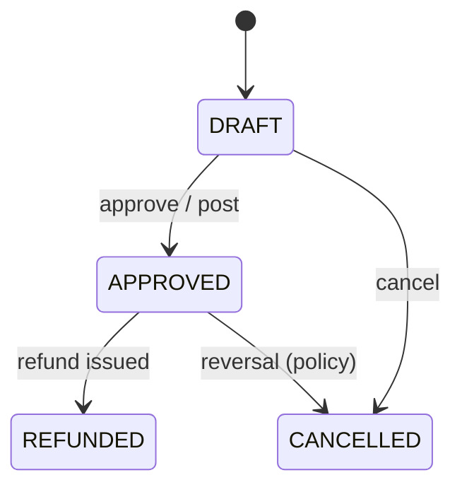

# Sales — Return

## Purpose

`SalesReturn` and `SalesReturnItem` handle medicines brought back by customers after a sale. Returns restore inventory (where policy allows), reverse revenue proportionally, issue refunds, and update the original invoice's `status` to `PARTIALLY_RETURNED` or `RETURNED`.

**Database reference:** [SalesReturn](../../database/tables/sales/40_sales_return.md) · [SalesReturnItem](../../database/tables/sales/41_sales_return_item.md) · [Sales overview](../../database/tables/sales/sales.md)

## Responsibilities

- Validate return against original `SalesInvoice` and `SalesInvoiceItem` quantities
- Restore stock to batch where acceptable (same batch preferred)
- Compute `refundAmount` and link to payment/refund flow
- Update parent invoice `status` and optionally `paymentStatus`

## Scope

### In Scope

- Full and partial returns against one invoice
- Multiple return documents per invoice (cumulative qty caps)
- Reasons: wrong medicine, damage, billing error, prescription change, recall
- Approval workflow (`approvedByEmployeeId`, `approvedAt`)

### Out of Scope

- Supplier returns (Purchasing domain)
- Expired medicine destruction without original sale link
- Exchange (treat as return + new invoice — two operations)

## Related Entities

- `SalesInvoice` — must be `POSTED`, `PARTIALLY_RETURNED`, or eligible for return
- `SalesInvoiceItem` — max return qty per line
- `Batch`, `Stock`, `StockMovement` — IN on approve
- `SalesPayment` — refund disbursement

## Business Rules

- Return header requires `salesInvoiceId`.
- At least one `SalesReturnItem`.
- Per line: `returnQuantity <= soldQuantity - previouslyReturnedQuantity`.
- Expired products rejected unless `ALLOW_EXPIRED_CUSTOMER_RETURN` setting is true.
- Batch on return item should match original sale batch when traceability required.
- On **approve/post**:
  - Create IN `StockMovement`; increase branch `Stock` for return batch.
  - Update invoice `status`: partial → `PARTIALLY_RETURNED`; full → `RETURNED`.
  - Set `refundAmount`; adjust invoice `paidAmount`/`balanceAmount` and `paymentStatus` if refund issued.
- Return `status`: `DRAFT`, `APPROVED`, `REFUNDED`, `CANCELLED`.
- Approved returns immutable; cancel via reversal transaction.

## Domain Events

- `SalesReturnCreated`
- `SalesReturnApproved` — stock IN, invoice status update
- `SalesReturnRefunded` — refund payment completed
- `SalesInvoicePartiallyReturned` / `SalesInvoiceFullyReturned`

## State Model

## Integrations

- **Inventory:** IN movement mirrors OUT from original sale line
- **Finance:** Revenue reversal and refund ledger entries
- **Payment:** Refund via cash/UPI or credit to customer account

## Security

- Return approval may require manager permission (future `SALES:SALES_RETURN:APPROVE`).
- Branch scope enforced on return and linked invoice.

## Performance

- When opening return UI, load invoice lines with `alreadyReturnedQty` aggregated from prior returns in one query.

## Future

- QR scan of original invoice to pre-fill return lines
- Restocking fee deduction from refund
- Link to product recall campaigns by batch
