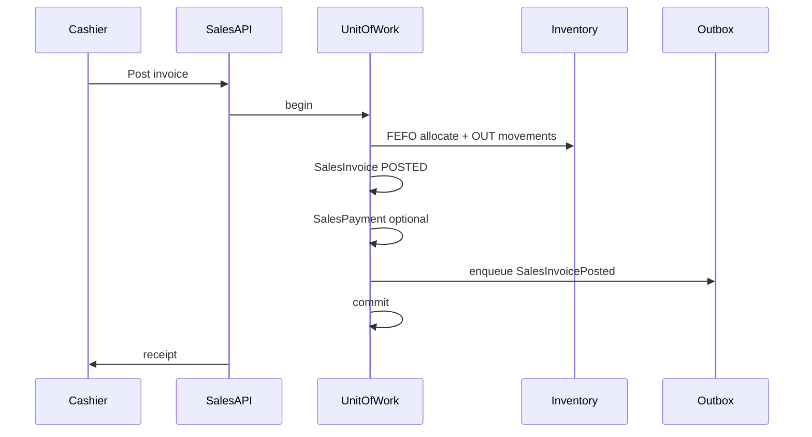

# Sales — Workflows

## Purpose

Describe end-to-end operational workflows for counter billing, payment collection, and customer returns. These workflows map user actions to domain services, persistence, and integrations.

**Database reference:** [Sales overview](../../database/tables/sales/sales.md) · Workflow detail: [sales-flow.md](../../workflows/sales-flow.md)

## Responsibilities

- Document happy-path and exception paths
- Show transaction boundaries (`UnitOfWork`)
- Link draft → post → pay → return sequences

## Scope

### In Scope

- OTC and prescription sale at branch
- Pay-at-post and pay-later
- Partial and full return

### Out of Scope

- Sales order / quotation flows (not modeled)
- End-of-day finance closing (Finance domain)

## Related Entities

- `SalesInvoice`, `SalesInvoiceItem`, `SalesPayment`, `SalesReturn`, `SalesReturnItem`
- `Stock`, `StockMovement`, `PriceListItem`, `Outbox`

## Business Rules

- All posting steps run in a single database transaction.
- FEFO allocation occurs at post, not at draft add-line (draft may show suggested batch).
- `paymentStatus` updated in same transaction when payment taken at post.

## Domain Events

See [events.md](./events.md) for event list per workflow step.

## State Model

Primary path: invoice `DRAFT` → `POSTED`; paymentStatus `UNPAID` → `PAID`; optional `PARTIALLY_RETURNED` → `RETURNED`.

## Integrations

Counter → API → `UnitOfWork` → Inventory + Outbox + Audit.

---

## Workflow 1: Counter sale (OTC)

1. Cashier selects **branch** (from session context).
2. Optional: attach **customer** for credit or loyalty.
3. Add medicines to cart; system resolves **PriceListItem** per line.
4. Save **DRAFT** `SalesInvoice` + lines (no stock movement).
5. **Post** invoice:
   - Allocate batches **FEFO** per line at branch.
   - Snapshot prices/tax on lines.
   - Create OUT **StockMovement**; update **Stock**.
   - Assign **invoiceNumber** (branch-scoped).
   - Set `status = POSTED`.
6. Record **SalesPayment** if cash/UPI now → update `paymentStatus`.
7. Write **Outbox** + **Audit**; commit.
8. Print thermal receipt.

## Workflow 2: Prescription sale

Same as Workflow 1 with:

- Link `prescriptionId`.
- Validate Schedule H / controlled drug rules before post.
- Capture prescriber and patient fields on header when required.

## Workflow 3: Credit sale (pay later)

1. Post invoice with `paymentStatus = UNPAID`, `paidAmount = 0`.
2. Customer pays later: add **SalesPayment**(s) until `PAID`.
3. Finance receivable entries created on post; payments clear receivable.

## Workflow 4: Partial return

1. Locate **POSTED** invoice.
2. Create **DRAFT** `SalesReturn` with lines and quantities.
3. Manager **approve** → stock IN, update invoice `status = PARTIALLY_RETURNED`.
4. Issue refund → `paymentStatus` may become `PARTIALLY_PAID` or `REFUNDED` depending on amounts.

## Workflow 5: Cancel draft

1. Invoice in `DRAFT` → delete or mark `CANCELLED`.
2. No stock or finance impact.

## Workflow 6: Cancel posted invoice (exception)

1. Policy-gated manager action.
2. Reverse OUT movements; set `status = CANCELLED`.
3. Reverse payments; audit reason mandatory.

## Security

- Each workflow step checks `SALES:SALES_INVOICE:CREATE` or `READ` as appropriate.
- Cancel posted requires elevated permission (future).

## Performance

- Post is the heavy step — optimize FEFO + stock update queries.
- List workflows paginate by `(branchId, invoiceDate DESC)`.

## Future

- Quotation → invoice conversion workflow
- Mobile queue for prescription pickup
