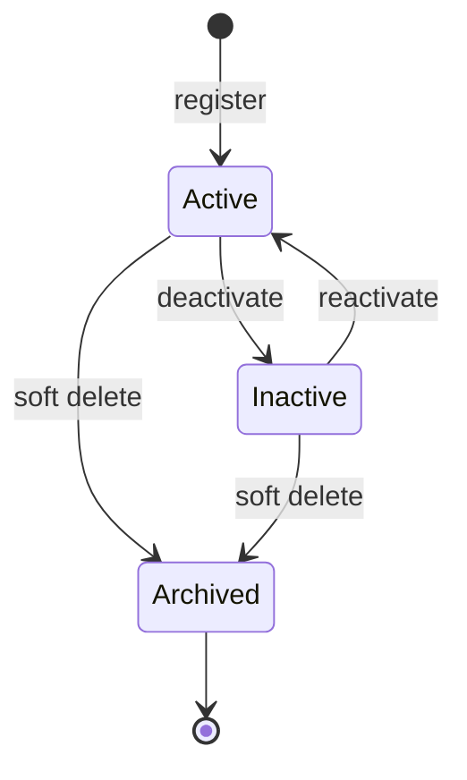
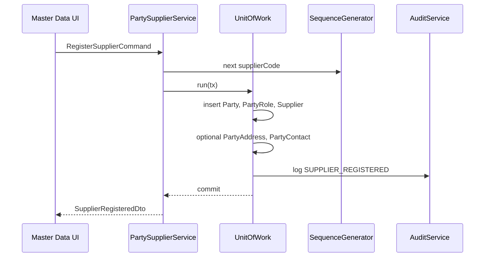
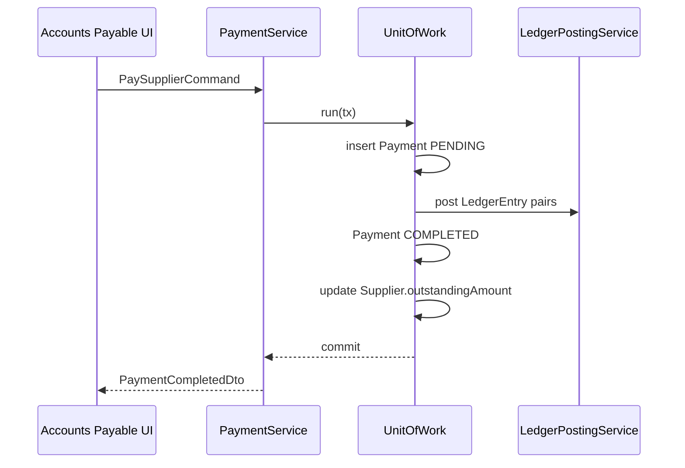
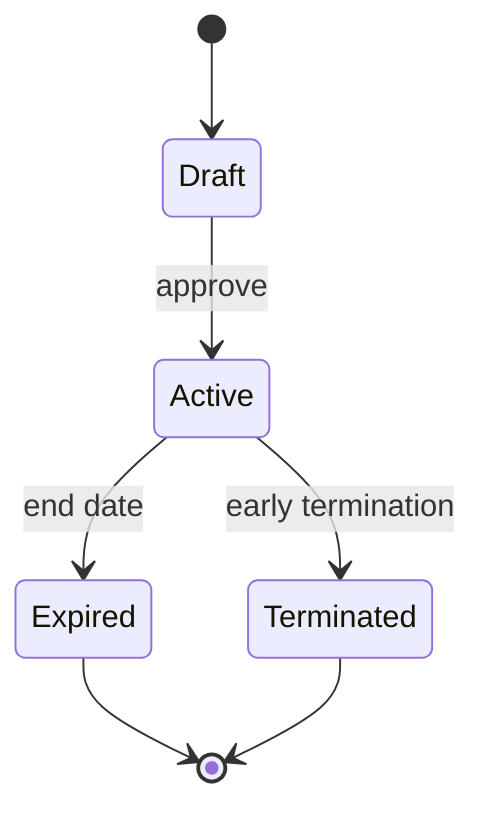

# Supplier Domain

The Supplier bounded context manages vendors, manufacturers, distributors, and wholesalers who supply medicines and goods to the pharmacy. Like Customer, it builds on the shared **Party** identity model with a **Supplier** role extension, procurement attributes, and payable balance tracking integrated with Finance payments.

**Table overview:** [party_management.md](../database/tables/party_management/party_management.md), [financial.md](../database/tables/financial/financial.md)

**Related domains:** [purchasing.md](purchasing.md), [finance.md](finance.md)

## Overview & Aggregate

### Responsibilities

- Register and maintain supplier master data via the Party aggregate.
- Enforce SUPPLIER role consistency with the Supplier detail record.
- Store statutory identifiers (GSTIN, drug license, PAN) required for pharmacy compliance.
- Track credit terms and denormalized payable outstanding linked to ledger truth.
- Provide supplier identity to Purchasing and Payment workflows.

### In scope

Party + Supplier + SUPPLIER PartyRole; PartyAddress and PartyContact; supplier type, codes, preferred flag, credit limit, payment terms; outgoing supplier payments via Finance `Payment` aggregate (cross-context).

### Out of scope

Purchase order, GRN, purchase invoice workflows ([purchasing.md](purchasing.md)); supplier contracts and rate agreements (not modeled — see Contracts below); goods receipt quality inspection (Purchasing/Inventory).

### Related entities

| Entity | Role |
|--------|------|
| Party | Aggregate root for identity |
| PartyRole | Business role assignment (`SUPPLIER`) |
| PartyAddress | Registered office, warehouse |
| PartyContact | Accounts payable contacts |
| Supplier | Supplier-specific attributes |
| Payment | Outgoing money (`paymentType = SUPPLIER_PAYMENT`) |

### Aggregate structure

```
Party (root)
├── PartyRole[]       — SUPPLIER role
├── PartyAddress[]
├── PartyContact[]
└── Supplier?         — 0..1 detail
         └── referenced by PurchaseOrder, Payment, etc.
```

| Component | Type | Notes |
|-----------|------|-------|
| Party | Root | Identity and `isActive` |
| PartyRole | Entity | `roleType = SUPPLIER` |
| PartyAddress | Entity | Registered office, warehouse |
| PartyContact | Entity | Accounts payable contacts |
| Supplier | Entity | `supplierCode`, `gstin`, `drugLicenseNumber`, credit fields |

**Consistency rule:** Supplier row must not exist without SUPPLIER PartyRole.

Payment is **not** part of the Party aggregate; linked via `referenceType` / supplier id on the Finance `Payment` aggregate.

**Operational active** requires Active Party, active SUPPLIER role, and `Supplier.isActive = true`.

Integrations: **SequenceGenerator** (`supplierCode`), **AuditService** (same transaction), **Outbox** (sync keyed on `uuid`).

## Terminology

| Term | Definition | Persistence |
|------|------------|-------------|
| **Supplier** | Party in vendor role | `Supplier` + Party |
| **Supplier Code** | Unique code (`SUP00001`) | `Supplier.supplierCode` |
| **Supplier Type** | MANUFACTURER, DISTRIBUTOR, WHOLESALER, OTHER | `Supplier.supplierType` |
| **GSTIN** | GST Identification Number (India) | `Supplier.gstin` |
| **Drug License Number** | State drug license for pharma vendors | `Supplier.drugLicenseNumber` |
| **PAN** | Permanent Account Number | `Supplier.panNumber` |
| **Preferred Supplier** | Suggested default on PO entry | `Supplier.preferredSupplier` |
| **Payable Outstanding** | Amount owed to supplier | `Supplier.outstandingAmount`; ledger-derived |
| **Payment Terms** | Credit days from supplier | `Supplier.paymentTermsDays` |
| **Supplier Payment** | Outgoing payment voucher | `Payment.paymentType = SUPPLIER_PAYMENT` |
| **Party** | Shared identity root | `Party` |

Naming conventions: use **Supplier** in purchasing screens; **Party** in unified master-data admin; **Vendor** is an acceptable UI synonym but code uses Supplier. Event names: PascalCase past tense (`SupplierRegistered`). External systems exchange **uuid** identifiers, never local numeric ids.

## Business Rules & Invariants

### Business rules

#### Identity and role

| ID | Rule | Enforcement |
|----|------|-------------|
| BR-S01 | Every Supplier references exactly one Party | DB FK |
| BR-S02 | At most one Supplier per Party | Unique `partyId` |
| BR-S03 | SUPPLIER PartyRole required before first PO | Application |
| BR-S04 | `supplierCode` unique per company | DB + sequence |

#### Statutory

| ID | Rule | Enforcement |
|----|------|-------------|
| BR-S10 | `gstin` unique when not null | DB unique |
| BR-S11 | `gstin` format validated for Indian pharmacies | Validation |
| BR-S12 | `drugLicenseNumber` recommended for MANUFACTURER/DISTRIBUTOR | Warning |
| BR-S13 | `panNumber` format validated when present | Validation |

#### Financial

| ID | Rule | Enforcement |
|----|------|-------------|
| BR-S20 | `creditLimit` ≥ 0 | Validation |
| BR-S21 | `outstandingAmount` ≥ 0 | Validation; ledger sync |
| BR-S22 | `outstandingAmount` updated from payable ledger, not manual entry | Job |
| BR-S23 | Payment amount ≤ outstanding + tolerance for advance payments | Payment service |

#### Procurement

| ID | Rule | Enforcement |
|----|------|-------------|
| BR-S30 | Inactive supplier blocked on new PO | Purchasing |
| BR-S31 | `preferredSupplier` influences sort order, not exclusivity | UI |
| BR-S32 | `supplierType` guides required fields (license for pharma) | Validation |

#### Lifecycle

| ID | Rule | Enforcement |
|----|------|-------------|
| BR-S40 | Soft delete only with history | Application |
| BR-S41 | Cannot delete supplier referenced by open PO | Purchasing guard |

Additional aggregate rules: unique `partyId` on Supplier; GSTIN validated for format when present (Indian GST 15-char pattern); multiple `preferredSupplier` allowed per company policy; statutory field edits require audit reason.

### Invariants (always true)

| ID | Invariant |
|----|-----------|
| INV-S01 | If `Supplier` exists, referenced `Party` exists and is not hard-deleted |
| INV-S02 | `Supplier.partyId` is unique |
| INV-S03 | `Supplier.uuid` and `Party.uuid` are globally unique non-empty strings |
| INV-S04 | `Supplier.version` ≥ 1 and increments on every successful update |
| INV-S05 | Non-deleted Supplier has PartyRole with `roleType = SUPPLIER` |
| INV-S06 | Operational Supplier requires active SUPPLIER PartyRole |
| INV-S07 | `Supplier.creditLimit` ≥ 0 |
| INV-S08 | `Supplier.outstandingAmount` ≥ 0 |
| INV-S09 | After reconciliation, `outstandingAmount` equals ledger-derived payable within ε |
| INV-S10 | Sync replication keys on `uuid`, never local `BigInt id` |
| INV-S11 | Soft-deleted records have `deletedAt` ≥ `createdAt` |

Invariant violations must not emit domain events; return application error.

### Validation

#### Supplier

| Field | Rules |
|-------|-------|
| `supplierType` | Required; MANUFACTURER, DISTRIBUTOR, WHOLESALER, OTHER |
| `supplierCode` | Generated on create; max 30 chars |
| `gstin` | Optional; 15 chars; pattern `^[0-9]{2}[A-Z]{5}[0-9]{4}[A-Z]{1}[1-9A-Z]{1}Z[0-9A-Z]{1}$` |
| `drugLicenseNumber` | Optional; max 50 |
| `panNumber` | Optional; 10 chars PAN pattern |
| `creditLimit` | ≥ 0 |
| `paymentTermsDays` | Integer ≥ 0 |
| `preferredSupplier` | Boolean |
| `outstandingAmount` | Read-only on API |

#### Party (supplier registration)

| Field | Rules |
|-------|-------|
| `partyType` | Usually ORGANIZATION for vendors |
| `displayName` | Required; max 200 |
| `organizationName` | Required when ORGANIZATION |

#### Cross-field

| Rule | Check |
|------|-------|
| GSTIN unique | DB lookup excluding self on update |
| Manufacturer type | Warn if `drugLicenseNumber` empty |
| Version | Required on update for optimistic lock |

Implementation: class-validator on NestJS DTOs; domain validation in PartySupplierService.

## Lifecycle & States

### Phases

1. **Onboarding** — Create Party (typically ORGANIZATION), SUPPLIER PartyRole, Supplier with `supplierCode`, type, GSTIN, drug license; optional billing address and AP contact. Event: `SupplierRegistered`.
2. **Active procurement** — Selected on purchase orders and invoices; payable increases on purchase invoice post; payments reduce outstanding via `Payment`; profile and statutory updates audited.
3. **Credit relationship** — `paymentTermsDays` drives due date on payables report; `creditLimit` may cap concurrent open PO value (future policy).
4. **Deactivation** — Set `Supplier.isActive = false`; block new POs; allow payment of remaining payables. Event: `SupplierDeactivated`.
5. **Archival** — Soft-delete Party when no open PO/payable or with override. Event: `SupplierArchived`.

Cannot archive Party with open payable above threshold without supervisor override.

### State machine

| State | Conditions |
|-------|------------|
| **Active** | Party, SUPPLIER role, and Supplier all active; not soft-deleted |
| **Inactive** | Supplier or role deactivated |
| **Archived** | `Party.deletedAt IS NOT NULL` (terminal) |



| From | To | Guard | Side effects |
|------|-----|-------|--------------|
| — | Active | Valid Party + Supplier + role | Emit `SupplierRegistered` |
| Active | Inactive | No blocking policy | Block new POs |
| Inactive | Active | Supervisor approval optional | Restore PO eligibility |
| Active/Inactive | Archived | No open PO/payable OR override | Set `deletedAt`, audit log |

`SupplierDeactivated` does not auto-cancel open POs — separate purchasing policy.

## Domain Events

Events publish **after** database commit via outbox (`UnitOfWork`). Payloads use `uuid` only for cross-device sync.

### Supplier master events

| Event | Trigger | Payload (key fields) | Consumers |
|-------|---------|----------------------|-----------|
| `SupplierRegistered` | Onboarding complete | `supplierUuid`, `partyUuid`, `supplierCode`, `supplierType`, `gstin` | Audit, outbox, search |
| `SupplierUpdated` | Profile/statutory edit | `supplierUuid`, `changedFields[]`, `version` | Audit, purchasing cache |
| `SupplierDeactivated` | `isActive` false | `supplierUuid`, `reason` | PO block list |
| `SupplierReactivated` | Reverse deactivation | `supplierUuid` | PO allow list |
| `SupplierPreferredChanged` | `preferredSupplier` toggle | `supplierUuid`, `preferred` | PO sort cache |
| `SupplierArchived` | Soft delete | `partyUuid`, `deletedAt` | Sync tombstone |

### Finance events (consumed)

| Event | Producer | Payload | Supplier impact |
|-------|----------|---------|-----------------|
| `SupplierPaymentCompleted` | Payment service | `paymentUuid`, `supplierUuid`, `amount`, `paymentNumber` | Reduce outstanding cache |
| `SupplierPaymentCancelled` | Payment reversal | `paymentUuid`, `reversalEntries` | Restore outstanding |
| `PurchaseInvoicePosted` | Purchasing | `supplierUuid`, `payableAmount` | Increase outstanding |

`PurchaseInvoicePosted` is owned by Purchasing but updates Supplier denormalized balance. Mask PAN in event payloads on sync to branch devices.

## Permissions

Format: **`MODULE:RESOURCE:ACTION`**. Seed reference: `PARTY_MANAGE` in `backend/seed/data/security/permission.json`.

| Permission code | Seeded |
|-----------------|--------|
| `PARTY:PARTY:UPDATE` | Yes (`PARTY_MANAGE`) |
| `PARTY:PARTY:READ` | Planned |
| `FINANCE:PAYMENT:CREATE` | Planned |
| `FINANCE:PAYMENT:READ` | Planned |
| `FINANCE:PAYMENT:CANCEL` | Planned |
| `PURCHASE:SUPPLIER:READ` | Planned |

| Operation | Required permission |
|-----------|---------------------|
| Register / update / deactivate supplier | `PARTY:PARTY:UPDATE` |
| View supplier on PO screen | `PURCHASE_CREATE` or `PARTY:PARTY:READ` |
| Create supplier payment | `FINANCE:PAYMENT:CREATE` |
| View supplier ledger | `FINANCE:PAYMENT:READ` or `REPORT:REPORT:READ` |
| Cancel posted payment | `FINANCE:PAYMENT:CANCEL` + supervisor |

Payment permissions are strictly separate from party edit — accounts payable clerk may pay without editing GSTIN. Statutory field edit may require manager role mapping on `PARTY:PARTY:UPDATE`. Checks run in guards and application service.

## Workflows

### WF-S01 — Register supplier



Preconditions: `PARTY:PARTY:UPDATE`; validate GSTIN uniqueness and format. Postconditions: INV-S01–S06; outbox queued.

### WF-S02 — Update supplier profile

Load aggregate by uuid; validate `version`; update statutory fields with audit diff; emit `SupplierUpdated`.

### WF-S03 — Mark preferred supplier

Toggle `preferredSupplier` flag; emit `SupplierPreferredChanged`. Multiple preferred allowed unless policy changed.

### WF-S04 — Deactivate supplier

Check open POs (Purchasing query); set inactive; emit `SupplierDeactivated`.

### WF-S05 — Pay supplier (cross-context)

See Supplier Payments below. User selects supplier and open purchase invoices; PaymentService creates `Payment` (SUPPLIER_PAYMENT); posts balanced `LedgerEntry` pair; updates `Supplier.outstandingAmount`; emit `SupplierPaymentCompleted`.

### WF-S06 — Payable reconciliation

Scheduled job sums Supplier Payable `LedgerEntry` per supplier; updates `outstandingAmount` if drift detected.

## Supplier Payments

Outgoing payments to suppliers use the Finance **Payment** aggregate. Central payment table records all outgoing money; supplier payments are one `paymentType` variant.

| paymentType | Description |
|-------------|-------------|
| `SUPPLIER_PAYMENT` | Settlement of purchase invoice payables |
| `ADVANCE` | Advance to supplier before invoice |
| `PURCHASE_REFUND` | Refund received from supplier (may pair with Receipt) |

Key fields: `paymentNumber` (unique voucher per branch); `amount` > 0; `paymentMethod` (CASH, UPI, CARD, CHEQUE, BANK_TRANSFER); `referenceType` / `referenceId` (PurchaseInvoice or Supplier); `status` PENDING → COMPLETED | FAILED | CANCELLED.

### Payment business rules

| ID | Rule |
|----|------|
| BR-PAY01 | Posted payment (`status = COMPLETED`) is immutable |
| BR-PAY02 | Completion creates balanced LedgerEntry rows |
| BR-PAY03 | Cancellation creates reversal entries, not updates |
| BR-PAY04 | Multiple payments allowed per purchase invoice (partial pay) |
| BR-PAY05 | Payment reduces `Supplier.outstandingAmount` (denormalized) |
| BR-PAY06 | Total allocated payments ≤ invoice payable + tolerance |

### Ledger posting pattern

On payment completion for supplier:

| Ledger account | Debit | Credit |
|----------------|------:|-------:|
| Supplier Payable | amount | 0 |
| Cash / Bank | 0 | amount |

`voucherType = PAYMENT`, `voucherId = Payment.id`. See [finance.md](finance.md) for double-entry invariants.

### WF-PAY-S01 — Pay supplier



Payment status is independent of supplier Active/Inactive — payables can be settled after deactivation. WF-S05 requires financial payment permission in addition to party read.

## Contracts (Not Modeled)

The Pharmacy ERP **does not** persist supplier contracts. The following are **not** in the database:

- Contract header / line entities
- Contract pricing linked to products
- Contract effective dates and renewal
- Minimum order quantity or rebate tiers
- Penalty / SLA tracking

Procurement today uses **Supplier** master, **PurchaseOrder** / **PurchaseInvoice** with spot pricing from invoice lines, and **PriceList** (branch sales pricing) — not supplier purchase contracts.

### Conceptual model (future)

| Concept | Description |
|---------|-------------|
| **SupplierContract** | Agreement between pharmacy and Supplier party |
| **ContractLine** | Product or category with negotiated rate, discount, MOQ |
| **ContractTerm** | Effective from/to, renewal, payment terms override |
| **ContractStatus** | DRAFT, ACTIVE, EXPIRED, TERMINATED |

Relationships would link `SupplierContract.supplierId → Supplier` without duplicating Party data.

### Planned rules and events

| ID | Planned rule |
|----|--------------|
| BR-CT01 | At most one ACTIVE contract per supplier per product category (policy TBD) |
| BR-CT02 | PO line price defaults from contract when ACTIVE |
| BR-CT03 | Contract changes versioned; historical PO retain snapshotted price |
| BR-CT04 | Expired contract cannot be selected on new PO |

Planned events: `SupplierContractActivated`, `SupplierContractExpired`, `SupplierContractTerminated`.



### Workaround today

1. Store informal notes in Supplier remarks (not recommended for pricing).
2. Use purchase invoice historical rates as reference in UI (read-only query).
3. Track agreements externally (spreadsheet) — not synced.

## Integrations

### Purchasing

| Direction | Mechanism |
|-----------|-----------|
| Supplier → Purchasing | FK on `PurchaseOrder`, `PurchaseInvoice` |
| Purchasing → Supplier | `PurchaseInvoicePosted` increases outstanding |
| Purchasing guard | BR-S30, BR-S41 on PO create |

### Finance

| Direction | Mechanism |
|-----------|-----------|
| PurchaseInvoice → LedgerEntry | Credits Supplier Payable |
| Payment → LedgerEntry | Debits payable; reduces outstanding |
| Finance → Supplier | Reconciliation job updates cache |

See [financial.md](../database/tables/financial/financial.md).

### Sync (offline-first)

All entities expose `uuid`; outbox publishes changes. Conflict: last-write-wins with `version` check. Tombstones via `deletedAt`.

### Audit

`AuditService.log` in same `UnitOfWork` (module `PARTY`). GSTIN and drug license are sensitive compliance data — audit all statutory field changes with before/after.

Cross-context calls must not bypass aggregate services.
