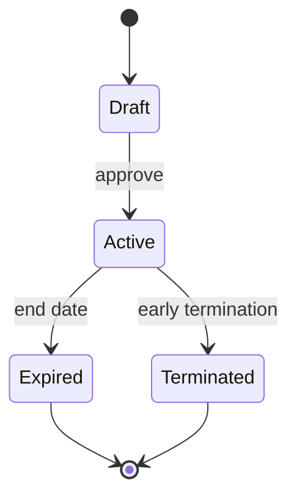

# Supplier — Contracts

## Purpose

Document the **future** supplier contracts capability and explicitly state that it is **not modeled** in the current schema or application.

## Responsibilities

- Capture business intent for contract management without implying existing tables.
- Prevent implementers from inventing ad-hoc contract storage on Supplier row.

## Scope

### In Scope

- Conceptual domain for agreements, rate contracts, SLAs.
- Gap analysis vs current model.

### Out of Scope

- Implementation, Prisma models, API endpoints (none exist today).

## Current State: NOT MODELED

The Pharmacy ERP **does not** persist supplier contracts. The following are **not** in the database:

- Contract header / line entities
- Contract pricing linked to products
- Contract effective dates and renewal
- Minimum order quantity or rebate tiers
- Penalty / SLA tracking

Procurement today uses:

- **Supplier** master — [06_supplier.md](../../database/tables/party_management/06_supplier.md)
- **PurchaseOrder** / **PurchaseInvoice** — spot pricing from invoice lines
- **PriceList** (branch sales pricing) — not supplier purchase contracts

Any documentation or UI referring to "supplier contract" describes a **planned** capability only.

## Conceptual Model (Future)

When implemented, expected bounded context elements:

| Concept | Description |
|---------|-------------|
| **SupplierContract** | Agreement between pharmacy and Supplier party |
| **ContractLine** | Product or category with negotiated rate, discount, MOQ |
| **ContractTerm** | Effective from/to, renewal, payment terms override |
| **ContractStatus** | DRAFT, ACTIVE, EXPIRED, TERMINATED |

Relationships would link `SupplierContract.supplierId → Supplier` without duplicating Party data.

## Business Rules (Planned)

| ID | Planned rule |
|----|--------------|
| BR-CT01 | At most one ACTIVE contract per supplier per product category (policy TBD) |
| BR-CT02 | PO line price defaults from contract when ACTIVE |
| BR-CT03 | Contract changes versioned; historical PO retain snapshotted price |
| BR-CT04 | Expired contract cannot be selected on new PO |

## Domain Events (Planned)

- `SupplierContractActivated`
- `SupplierContractExpired`
- `SupplierContractTerminated`

## State Model (Planned)

## Integrations (Planned)

- **Purchasing** — price default from contract on PO line entry.
- **Finance** — rebate accrual postings (future).
- **Supplier** — contract count on supplier dashboard only.

## Workaround Today

Until contracts exist:

1. Store informal notes in Supplier remarks (not recommended for pricing).
2. Use purchase invoice historical rates as reference in UI (read-only query).
3. Track agreements externally (spreadsheet) — not synced.

## Security Considerations (Planned)

- Contract view/edit permissions separate from `PARTY:PARTY:UPDATE`.
- Legal document attachments stored in secure blob storage.

## Performance Considerations (Planned)

- Index contract lines by medicineId for fast PO price lookup.

## Future Enhancements

This document **is** the placeholder. Implementation tracked under purchasing/supplier ADO backlog. See [future.md](future.md).

When modeling begins:

1. Add ADR for aggregate boundaries.
2. Add table specs under `database/tables/purchasing/`.
3. Replace this section with implemented rules and remove NOT MODELED banner.

## Related Entities

- [party_management.md](../../database/tables/party_management/party_management.md) — Supplier master only
- [financial.md](../../database/tables/financial/financial.md) — payments unaffected until rebate logic added
