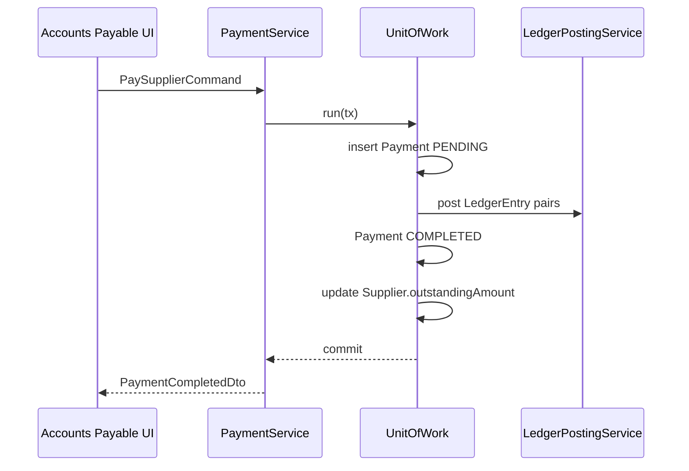

# Supplier — Payments

## Purpose

Document how outgoing payments to suppliers are modeled, processed, and integrated with payables and the general ledger.

## Responsibilities

- Explain Payment aggregate usage for supplier context.
- Describe allocation, posting, reversal, and outstanding balance updates.

## Scope

### In Scope

- `Payment` with `paymentType = SUPPLIER_PAYMENT`.
- Ledger posting pattern.
- Link to purchase invoices and supplier master.

### Out of Scope

- Customer receipts ([finance/receipt workflows](../finance/workflows.md)).
- Payroll payments.

## Related Entities

| Entity | Overview |
|--------|----------|
| Payment | [43_payment.md](../../database/tables/financial/43_payment.md) |
| LedgerEntry | [46_ledger_entry.md](../../database/tables/financial/46_ledger_entry.md) |
| Ledger | [45_ledger.md](../../database/tables/financial/45_ledger.md) |
| Supplier | [06_supplier.md](../../database/tables/party_management/06_supplier.md) |
| Financial tables | [financial.md](../../database/tables/financial/financial.md) |

## Payment Model

Central payment table records **all outgoing money**. Supplier payments are one `paymentType` variant:

| paymentType | Description |
|-------------|-------------|
| `SUPPLIER_PAYMENT` | Settlement of purchase invoice payables |
| `ADVANCE` | Advance to supplier before invoice |
| `PURCHASE_REFUND` | Refund received from supplier (may pair with Receipt) |

### Key fields

- `paymentNumber` — unique voucher number (sequence per branch).
- `amount` — must be > 0.
- `paymentMethod` — CASH, UPI, CARD, CHEQUE, BANK_TRANSFER.
- `referenceType` / `referenceId` — link to PurchaseInvoice or Supplier.
- `status` — PENDING → COMPLETED | FAILED | CANCELLED.

## Business Rules

| ID | Rule |
|----|------|
| BR-PAY01 | Posted payment (`status = COMPLETED`) is immutable |
| BR-PAY02 | Completion creates balanced LedgerEntry rows |
| BR-PAY03 | Cancellation creates reversal entries, not updates |
| BR-PAY04 | Multiple payments allowed per purchase invoice (partial pay) |
| BR-PAY05 | Payment reduces Supplier.outstandingAmount (denormalized) |
| BR-PAY06 | Total allocated payments ≤ invoice payable + tolerance |

## Ledger Posting Pattern

On payment completion for supplier:

| Ledger account | Debit | Credit |
|----------------|------:|-------:|
| Supplier Payable | amount | 0 |
| Cash / Bank | 0 | amount |

`voucherType = PAYMENT`, `voucherId = Payment.id`.

See [journal.md](../finance/journal.md) for double-entry invariants.

## Workflow WF-PAY-S01

## Domain Events

- `SupplierPaymentCompleted` — after commit.
- `SupplierPaymentCancelled` — reversal posted.

## State Model

Payment status independent of supplier Active/Inactive — payables can be settled after deactivation.

## Integrations

- **Purchasing** — invoice reference for allocation.
- **Finance** — shared Payment module with expenses and refunds.
- **Supplier** — outstanding cache refresh.

## Security Considerations

- Requires `FINANCE:PAYMENT:CREATE` (planned) + audit.
- Large payments may need approval threshold (future).

## Performance Considerations

- Index Payment by referenceType/referenceId for supplier statement queries.

## Future Enhancements

- Bank file export (NEFT/RTGS) from Payment batch.
- TDS deduction on supplier payments.
