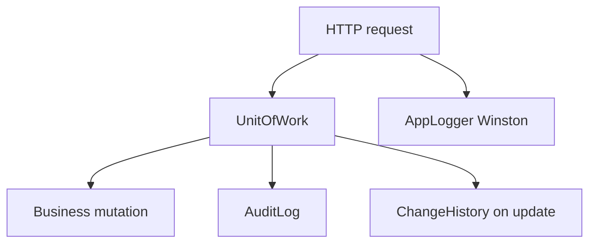
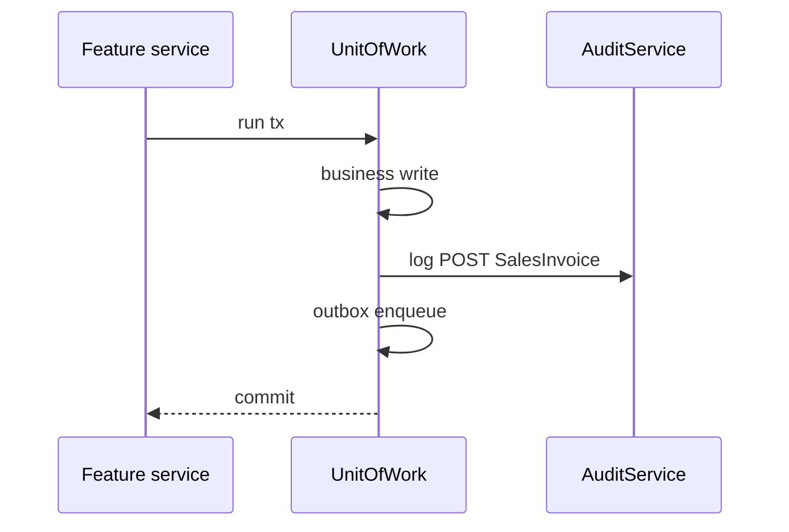

# Audit — Functional Guide

**One-line purpose:** Record who did what, when, on which business entity — separate from technical logs and separate from stock/finance ledgers.

**Parent:** [Functional overview](./functional-overview.md)

---

## What it does

Audit provides **regulatory and operational traceability** for business actions. When a user posts an invoice, changes a price, or logs in, the system writes an **AuditLog** entry inside the same database transaction as the business change. Field-level before/after values go to **ChangeHistory**.

Audit is **not** the same as:

- **Winston technical logs** — developer diagnostics, errors, request timing.
- **StockMovement** — immutable inventory quantity ledger.
- **Outbox** — sync delivery queue, not a compliance trail.

---

## Key concepts

| Term | Plain English |
|------|---------------|
| **AuditLog** | Who, what action, which entity, when, device, correlationId |
| **ChangeHistory** | Field-level old value → new value |
| **AuditAction** | CREATE, UPDATE, DELETE, LOGIN, POST, APPROVE, SYNC, etc. |
| **AuditModule** | SALES, PURCHASE, PARTY, MASTER, etc. |
| **correlationId** | Ties all logs and audit for one HTTP request |

---

## Sub-flows

### Audit on business post

`AuditService` pulls `userId`, `deviceId`, `correlationId`, `ipAddress`, `sessionId` from RequestContext automatically.

### What to audit vs not

| Audit via AuditService | Do not duplicate here |
|------------------------|----------------------|
| Invoice post, PO approve, login | Stock qty deltas → StockMovement |
| Price/settings change | Sync payloads → Outbox |
| User role change | Routine debug traces → Winston |

---

## Rules and variations

| Rule | Detail |
|------|--------|
| Same transaction | Audit in `UnitOfWork.run(tx)` with business write |
| Immutable AuditLog | Never update or delete audit rows |
| Use constants | `AuditAction` and `AuditModule` — not string literals |
| Security events | Login, permission deny — always audit |
| PII in outbox | Minimize patient data in sync payloads |

**Audited actions (examples):** user login/logout, record create/update/delete, approve/reject, sales/purchase post, stock adjustment approve, configuration change, sync events.

**ChangeHistory:** Used on UPDATE operations for important masters (medicine, party, settings).

---

## Permissions summary

Audit is **system-written** — no user permission to "create audit." Read APIs for audit trail may require admin/report permissions (TBD).

---

## Integrations

| Module | Connection |
|--------|------------|
| **All posting modules** | AuditService.log in UnitOfWork |
| **User & Security** | LOGIN/LOGOUT actions; actor userId |
| **Logging** | Shared correlationId with Winston |
| **Synchronization** | SYNC action type; separate from Outbox |

---

## Maturity & known gaps

**Status: Implemented**

Audit and change history on mutations work; search UI and retention policy are Planned. No Angular UI module yet.

See Backend / UI / UX columns: [implementation-status.md — Audit](./implementation-status.md#audit).

---

## References

- [Logging and audit](../architecture/logging-and-audit.md)
- [Audit tables](../database/tables/audit/audit.md)
