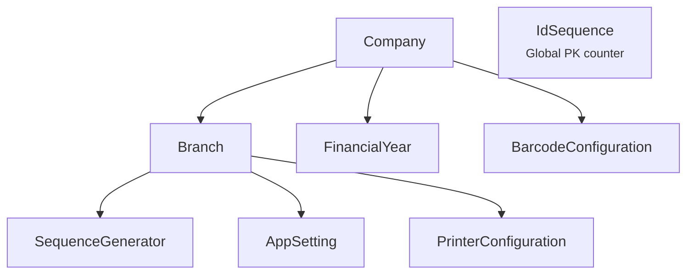
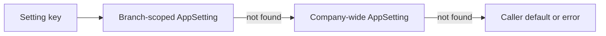

# Configuration — Functional Guide

**One-line purpose:** Org structure, document numbering, business rules, and device preferences — configurable without code changes.

**Parent:** [Functional overview](./functional-overview.md)

---

## What it does

Configuration holds **reference and runtime settings** used by almost every module. Changes are infrequent but widespread: a receipt prefix, FEFO toggle, or GST default affects sales, inventory, and reports across the branch.

Responsibilities:

- Define company and branch hierarchy (multi-store).
- Manage financial years for reporting and period close.
- Generate branch-scoped document numbers.
- Store business rules in AppSetting (read via SettingsService).
- Map printers and barcode formats per branch.

---

## Key concepts

| Term | Plain English |
|------|---------------|
| **Company** | Tenant root — legal name, GSTIN, drug license |
| **Branch** | Store location — independent stock and document numbers |
| **FinancialYear** | Accounting period — open or closed |
| **SequenceGenerator** | Next number for PO, invoice, GRN, etc. per branch |
| **IdSequence** | Global internal BIGINT PK counter (singleton row) — not user-facing, not branch-scoped; distinct from `SequenceGenerator` |
| **AppSetting** | Key-value config — branch or company scope |
| **PrinterConfiguration** | Which printer prints receipts/invoices |
| **BarcodeConfiguration** | Label format and scan rules |

`IdSequence` is infrastructure for local BIGINT primary keys (automatic via Prisma hook). It is not FK-linked to Company and is not configured through the configuration REST API. Document numbers use `SequenceGenerator`.

---

## Sub-flows

### Settings resolution

`SettingsService`: branch row → company row (`branchId` null) → error/default. Cache TTL 60s; invalidated on update.

### Document number generation

On post, inside transaction:

1. Load SequenceGenerator for `(companyId, branchId, documentType)`.
2. Apply reset policy: NEVER, YEARLY, MONTHLY.
3. Increment with optimistic lock on `version`.
4. Format number (e.g. `SI-PUNE-000123`).

---

## Rules and variations

| Rule | Detail |
|------|--------|
| One company, many branches | Typical deployment |
| Document numbers unique per branch | Not global |
| Financial year | Scopes ledger date filters |
| System settings | Some keys not editable (`DEFAULT_CURRENCY`) |
| Optimistic lock on settings | PUT requires `version` |
| Audit config changes | When exposed in admin UI |

**Seeded AppSetting examples:**

| Key | Purpose |
|-----|---------|
| `FEFO_ENABLED` | Batch selection at sale |
| `PRESCRIPTION_MANDATORY_SCHEDULE_H` | Rx required for Schedule H |
| `NEAR_EXPIRY_DAYS` | Expiry alert window (90) |
| `SYNC_INTERVAL_MINUTES` | Background sync interval |
| `DEFAULT_PAYMENT_MODE` | Billing default (CASH) |
| `LOYALTY_POINTS_RATIO` | Points per rupee |
| `BRANCH_RECEIPT_PREFIX` | Per-branch receipt prefix |

**Variations:**

- Branch-scoped vs company-wide settings.
- Printer mapping JSON in `printer.receipt_mapping`.
- `FinancialYear.isCurrent` may be branch-scoped (see ADR-239).

---

## Permissions summary

| Permission | Use |
|------------|-----|
| `CONFIGURATION:APP_SETTING:READ` | View settings |
| `CONFIGURATION:APP_SETTING:CREATE` | Add setting |
| `CONFIGURATION:APP_SETTING:UPDATE` | Change value (requires version) |
| `CONFIGURATION:APP_SETTING:DELETE` | Remove setting |
| Company/Branch CRUD | Admin permissions (TBD) |

---

## Integrations

| Module | Connection |
|--------|------------|
| **Sales** | Receipt prefix, default payment, Rx mandatory |
| **Inventory** | FEFO, near-expiry days |
| **Synchronization** | Sync interval, device id |
| **Financial** | FinancialYear for posting period |
| **All documents** | SequenceGenerator for numbers |
| **Audit** | Log settings changes |

---

## Maturity & known gaps

**Status: Implemented**

Org, branch, FY, sequences, and settings work; closed FY does not block all paths yet.

See Backend / UI / UX columns: [implementation-status.md — Configuration](./implementation-status.md#configuration).

---

## References

- [Early foundations — settings](../architecture/early-foundations.md#configuration-driven-settings-appsetting)
- [Configuration tables](../database/tables/configuration/configuration.md)
