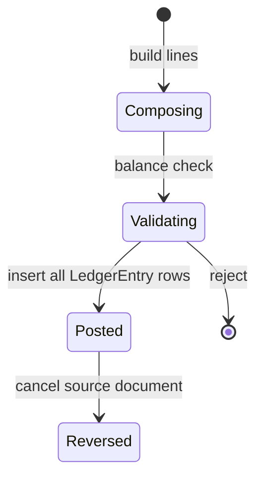
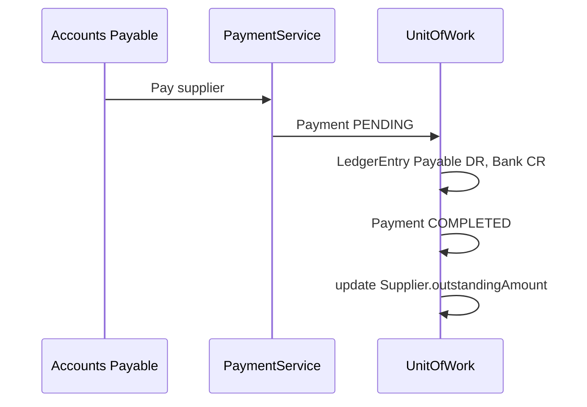

# Financial — Functional Guide

**One-line purpose:** Record every rupee through double-entry accounting — chart of accounts, journal lines, payments, receipts, and reconciliation.

**Parent:** [Functional overview](./functional-overview.md)

---

## What it does

Finance is the **monetary truth** of the pharmacy. Every sale, purchase, payment, and receipt produces balanced journal entries. The system never stores account balances on the Ledger row itself — balances are **derived** from immutable `LedgerEntry` lines.

Responsibilities:

- Maintain chart of accounts (Ledger hierarchy).
- Post double-entry vouchers for all financial events.
- Record outgoing Payments (supplier, expense) and incoming Receipts (customer).
- Support tax master data (with Pricing module).
- Enable trial balance, P&L, balance sheet, and GST reports (**Planned** — party reports only today; see [Reporting](./reporting.md)).
- Reconcile denormalized outstanding balances on Customer/Supplier.

---

## Key concepts

| Term | Plain English |
|------|---------------|
| **Ledger** | One account in the chart (Cash, Sales, Supplier Payable) |
| **LedgerEntry** | Single debit or credit line — append-only |
| **Voucher** | Group of balanced entries sharing voucherType + voucherId |
| **Payment** | Outgoing money (supplier, expense, advance) |
| **Receipt** | Incoming money (customer payment, refund received) |
| **Normal balance** | Side that increases the account (DEBIT for assets) |
| **Reversal** | Opposite entries to cancel — never edit posted rows |

**Account types:** ASSET, LIABILITY, INCOME, EXPENSE, EQUITY.

---

## Sub-flows

### Voucher posting

Invariant per voucher: **Σ debits = Σ credits**.

### Supplier payment

### Customer receipt

Debit Cash/Bank; credit Customer Receivable; update customer outstanding cache.

### Sales invoice accounting (integration)

On invoice post (from Sales module): revenue, GST output, receivable or cash, COGS/inventory entries via `LedgerPostingService`.

---

## Rules and variations

| Rule | Detail |
|------|--------|
| Balanced vouchers | Σ debit = Σ credit per voucher |
| Immutable posted entries | Cancel = reversal voucher |
| Payment amount > 0 | DB enforced |
| COMPLETED has entries | Payment/receipt and ledger atomic |
| System ledgers | Cannot delete seeded accounts |
| Tax rate history | New effective row; do not mutate used rates |
| Expense | Via Payment `paymentType = EXPENSE` (no Expense table yet) |

**Example postings:**

| Event | Debit | Credit |
|-------|-------|--------|
| Cash sale | Cash, COGS | Sales, GST Output, Inventory |
| Purchase invoice | Purchase, GST Input | Supplier Payable |
| Customer receipt | Cash | Receivable |
| Supplier payment | Payable | Cash/Bank |

**Reconciliation (nightly):**

- Customer `outstandingAmount` vs receivable ledger sum.
- Supplier `outstandingAmount` vs payable ledger sum.
- Cash drawer vs Cash ledger (manual journal for variance) — **Planned** automation.

**Month-end / period lock (Planned):** No `ClosingService`, pre-close wizard, or full block of mutations in closed financial year yet. `FINANCIAL_YEAR_CLOSED` guards some inventory/purchase paths only.

**voucherType values:** SALES, PURCHASE, RECEIPT, PAYMENT, JOURNAL, OPENING.

---

## Permissions summary

| Permission | Status |
|------------|--------|
| `FINANCE:PAYMENT:CREATE` | Planned |
| `FINANCE:RECEIPT:CREATE` | Planned |
| `FINANCE:LEDGER:READ` | Planned |
| `FINANCE:JOURNAL:CREATE` | Planned (manual entries) |
| `REPORT:REPORT:READ` | Seeded — view reports |

Payment permissions separate from party edit.

---

## Integrations

| Module | Connection |
|--------|------------|
| **Sales** | Invoice post handler → ledger entries |
| **Purchase** | Purchase invoice → Supplier Payable |
| **Party Management** | Receipt/payment update outstanding cache |
| **Pricing** | Tax master on invoice lines |
| **Inventory** | COGS from movement costs; adjustment journals (policy) |
| **Configuration** | FinancialYear scopes report periods |

---

## Maturity & known gaps

**Status: Partial**

Payments, receipts, and ledger posting work; month-end close, trial balance/GST reports, and customer advance on overpayment are Planned.

See Backend / UI / UX columns: [implementation-status.md — Financial](./implementation-status.md#financial).

---

## References

- [Finance domain](../domain/finance.md)
- [Financial tables](../database/tables/financial/financial.md)
- [Payment workflow](../workflows/payment-flow.md)
