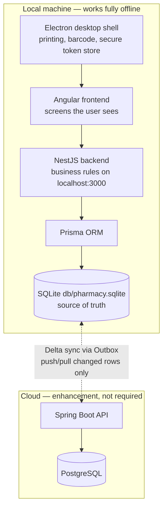
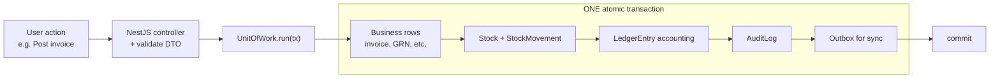
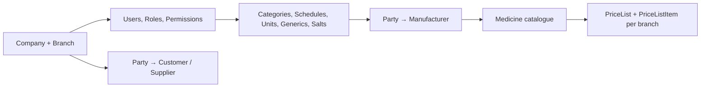
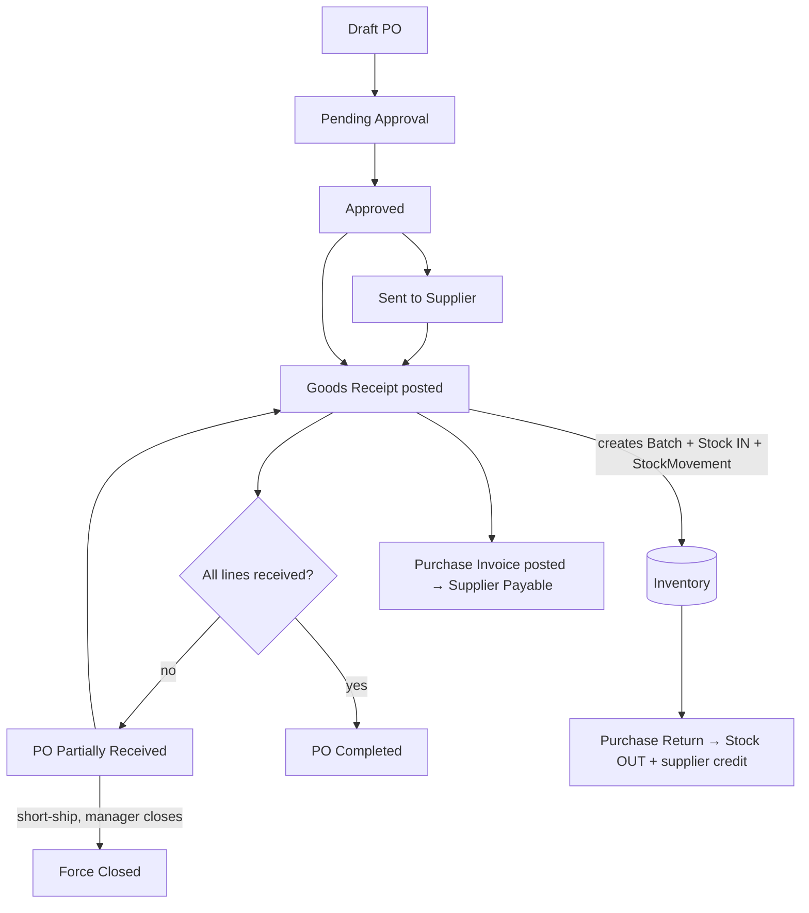
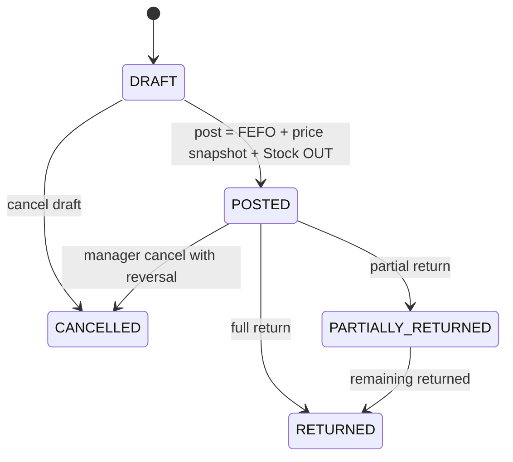
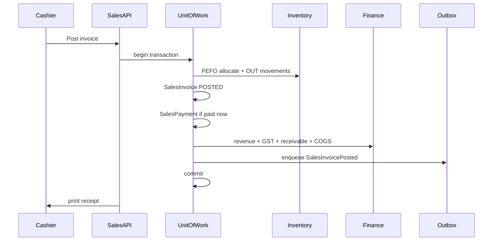
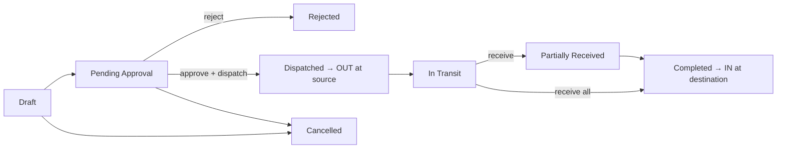
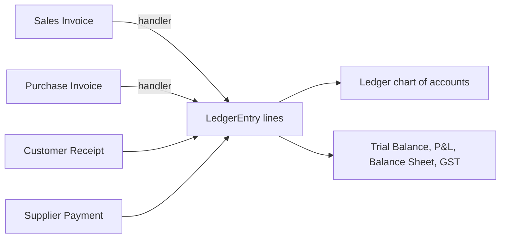
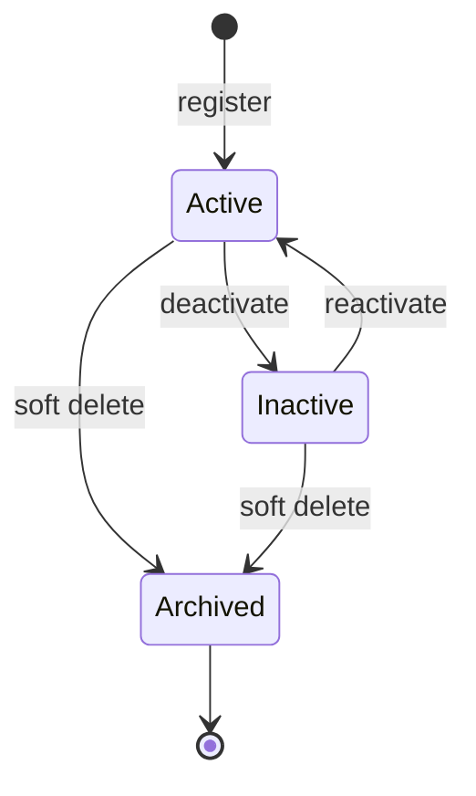
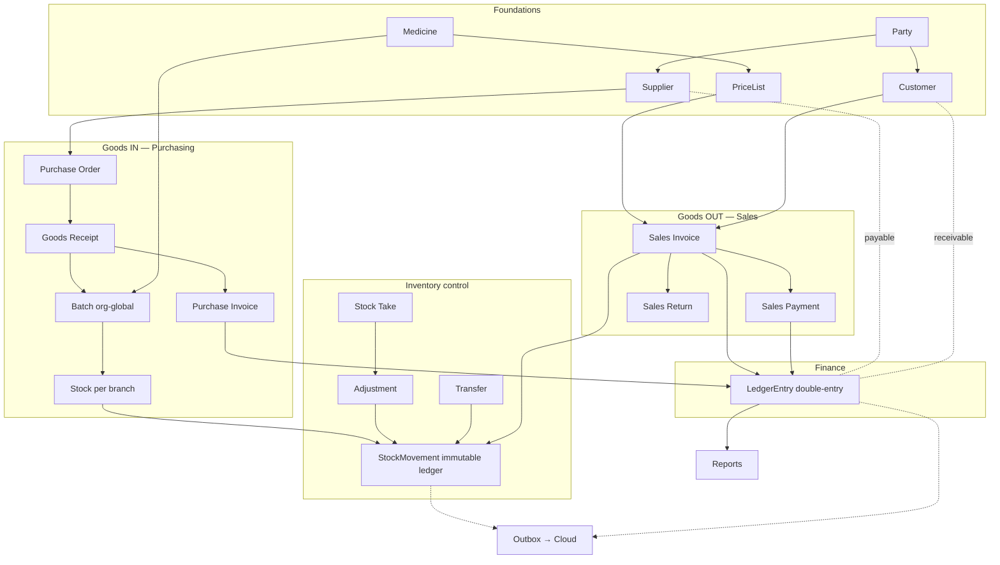

# Pharmacy ERP — Functional Overview (Plain English)

End-to-end functional understanding of the Pharmacy ERP: what the software does, how the pieces fit together, and how business flows work with their variations.

**Audience:** Product owners, new developers, pharmacists, and anyone who needs the full picture without reading every domain doc.

**Related:** [Workflow handbook](../workflows/README.md) (step-level flows), [Domain layer](../domain/README.md) (bounded-context detail), [Architecture overview](../architecture/overview.md).

---

## 1. What this software is

The Pharmacy ERP is a **desktop pharmacy management system** for a single pharmacy or a chain of branches. It covers the full business cycle:

- Buying medicines from suppliers
- Storing and tracking stock by batch and branch
- Selling at the counter (cash, credit, prescription)
- Handling returns, transfers, and adjustments
- Recording money in double-entry accounting
- Reporting and (eventually) syncing to the cloud

The guiding idea from [overview.md](../architecture/overview.md) is: **fast, offline-first, keyboard-friendly, multi-store ready.** The software should disappear into the workflow — the pharmacist thinks about medicines, not about software.

**Offline-first:** The local SQLite database on the machine is the source of truth during daily operation. Internet is an enhancement for backup and consolidation, not a requirement. See [data-and-sync.md](../architecture/data-and-sync.md).

---

## 2. Big-picture architecture

Everything runs on the pharmacist's machine. A cloud copy exists for backup and multi-branch consolidation via background sync.

| Layer | Technology | Role |
|-------|------------|------|
| Desktop shell | Electron | Native printing, barcode, file system, auto-update |
| Frontend | Angular 19 | UI only — no business logic in components |
| Backend | NestJS 11 | Controllers → DTO validation → Services → Prisma |
| ORM | Prisma 7 | Type-safe database access |
| Local DB | SQLite | Zero-config, single file, perfect offline |
| Cloud | Spring Boot + PostgreSQL | Enterprise backup and consolidation |

**Important detail:** The Angular app talks to the local NestJS backend over **HTTP on `localhost:3000`**, not over Electron IPC. IPC is used only for device identity and secure token storage. See [application-architecture.md](../architecture/application-architecture.md) and [early-foundations.md](../architecture/early-foundations.md).

---

## 3. Core building blocks (vocabulary)

These concepts recur in every flow. Sources: [ANCHOR_FACTS.md](../domain/ANCHOR_FACTS.md), [database_overview.md](../database/database_overview.md), [persistence-patterns.md](../database/persistence-patterns.md).

| Concept | Plain English | Where it lives |
|---------|---------------|----------------|
| **Party** | One master record for any person or organization | `Party` + roles |
| **Customer / Supplier** | Party wearing a business role | `Customer`, `Supplier` |
| **Medicine** | Product catalogue entry (brand, salts, schedule, HSN) — **no stock, no price** | Medicine master |
| **Batch** | A specific lot (batch number, expiry, purchase cost, statutory MRP) — **org-global** | `Batch` |
| **Stock** | How many units of a Batch are at one Branch | `Stock` per `(branchId, batchId)` |
| **StockMovement** | Immutable ledger line — every IN/OUT, never edited | `StockMovement` |
| **Branch** | A store location; document numbers unique **per branch** | `Branch` |
| **PriceList / PriceListItem** | Branch-scoped **selling price**; snapshotted on invoice lines | Pricing tables |
| **Dual ID** | Local `BigInt id` for fast joins + `uuid` for cloud sync | All syncable entities |
| **Soft delete + version** | `deletedAt` hides rows; `version` prevents concurrent edit conflicts | Most masters and documents |

**Sale price is never on Batch.** Batch carries `purchaseRate` (cost) and `mrp` (statutory ceiling). Selling price comes from `PriceListItem` and is frozen on the invoice line at post time.

### Engine services (every posting uses these)

| Service | Job |
|---------|-----|
| **UnitOfWork** | Runs business write + audit + outbox in **one atomic SQLite transaction** |
| **SequenceGenerator** | Hands out branch-scoped document numbers (e.g. `SI-PUNE-000123`) |
| **InventoryLedgerService** | The **only** path that may change Stock and write StockMovement |
| **LedgerPostingService** | Posts balanced double-entry accounting vouchers |
| **OutboxService** | Queues the change for cloud sync in the same transaction |
| **AuditService** | Records who did what, when, in the same transaction |

### The golden rule — one transaction

If any step fails, everything rolls back. You never get stock reduced without an invoice, or money posted without an audit trail.

---

## 4. The 14 functional modules

From [database_overview.md](../database/database_overview.md):

| # | Module | What it does |
|---|--------|--------------|
| 1 | [**Party Management**](./party-management.md) | People and organizations; Customer, Supplier, Doctor, Employee roles |
| 2 | [**User & Security**](./user-security.md) | Login, roles, permissions, sessions |
| 3 | [**Medicine Master**](./medicine-master.md) | Medicine catalogue, generics, salts, schedules, manufacturers, units |
| 4 | [**Inventory**](./inventory.md) | Batch, Stock, StockMovement, adjustments, transfers, stock takes |
| 5 | [**Purchase**](./purchase.md) | PO → Goods Receipt → Purchase Invoice → Purchase Return |
| 6 | [**Sales**](./sales.md) | Sales Invoice, Payment, Return (invoice-first; no order/quote) |
| 7 | [**Financial**](./financial.md) | Double-entry Ledger, LedgerEntry, Payment, Receipt |
| 8 | [**Pricing**](./pricing.md) | PriceList, PriceListItem, Tax, DiscountRule |
| 9 | [**Loyalty**](./loyalty.md) | Points earn/redeem programs |
| 10 | [**Prescription**](./prescription.md) | Prescription + items (Schedule H / Rx sales) |
| 11 | [**Synchronization**](./synchronization.md) | Outbox, SyncLog, SyncConflict |
| 12 | [**Audit**](./audit.md) | AuditLog + ChangeHistory |
| 13 | [**Configuration**](./configuration.md) | Company, Branch, FinancialYear, SequenceGenerator, AppSetting, Printer/Barcode |
| 14 | [**Masters**](./masters.md) | Country, State, City, Area reference data |

---

## 5. End-to-end business flows (with variations)

### 5.0 Master-data setup (prerequisite)

Before any transaction, foundations must exist. See [product.md](../domain/product.md) (WF-M01).

Creating a Medicine does **not** create stock or price. Stock arrives via purchasing; price is set up separately per branch.

---

### 5.1 Procure-to-Stock (Purchasing)

**How medicines come IN.** Source: [purchasing.md](../domain/purchasing.md).

Chain: **Purchase Order → Goods Receipt (GRN) → Purchase Invoice → (Purchase Return)**. Stock changes **only** when a GRN is posted — not on the PO or purchase invoice alone.

**Happy path:**

1. Buyer creates **DRAFT** PO with supplier and lines → submit → manager **approves** → optionally mark **sent to supplier**.
2. Goods arrive → create **DRAFT** GRN linked to PO; enter batch number, expiry, qty, purchase rate, MRP.
3. **Post GRN** → creates/updates **Batch**, increases branch **Stock**, writes **IN StockMovement**, updates PO received qty, writes audit + outbox.
4. Supplier bill arrives → enter **Purchase Invoice**, match to GRN, post → records **accounts payable** in Finance.

**Variations and exceptions:**

| Variation | What happens |
|-----------|--------------|
| **Partial delivery** | Multiple GRNs per PO; PO stays `PARTIALLY_RECEIVED` until fully received, then `COMPLETED` |
| **Force close** | Manager closes PO with open qty (`FORCE_CLOSED`); no further GRNs |
| **GRN without PO** | Allowed only if `ALLOW_GRN_WITHOUT_PO` setting is on |
| **Purchase return** | Stock OUT to supplier; supplier credit in Finance |
| **Three-way match** | When enabled: invoice qty ≤ GRN received; cost variance needs approver |
| **Segregation of duties** | When enabled: approver ≠ creator |

PO statuses: `DRAFT`, `PENDING_APPROVAL`, `APPROVED`, `SENT_TO_SUPPLIER`, `PARTIALLY_RECEIVED`, `COMPLETED`, `FORCE_CLOSED`, `CANCELLED`.

---

### 5.2 Sell-to-Cash (Sales)

**How medicines go OUT and money comes in.** Source: [sales.md](../domain/sales.md). There is **no sales order or quotation** — billing starts on `SalesInvoice`.

**Document `status`** and **`paymentStatus`** evolve independently:

| paymentStatus | Meaning |
|---------------|---------|
| `UNPAID` | No payment recorded |
| `PARTIALLY_PAID` | Some payment, balance remains |
| `PAID` | Fully collected |
| `REFUNDED` | Net refunds match or exceed collections |

**What "Post" does (all in one transaction):**

1. For each line, pick batch by **FEFO** (First Expiry First Out) at the branch.
2. **Snapshot** selling price, MRP, and tax on the line (from `PriceListItem`).
3. Write **OUT StockMovement** and decrement **Stock**.
4. Assign branch-scoped **invoice number**.
5. Set initial `paymentStatus` (UNPAID unless paid immediately).
6. Post accounting entries (revenue, GST, receivable/cash, COGS).
7. Write audit + outbox; optionally print receipt.

**Workflow variations:**

| # | Scenario | Key difference |
|---|----------|----------------|
| 1 | **OTC counter sale** | Standard walk-in; cash/UPI at post |
| 2 | **Prescription sale** | Links `prescriptionId`; Schedule H / controlled-drug rules (`PRESCRIPTION_MANDATORY_SCHEDULE_H`) |
| 3 | **Credit sale** | Posts `UNPAID`; customer pays later; blocked if over credit limit |
| 4 | **Partial return** | IN StockMovement; invoice `PARTIALLY_RETURNED`; refund adjusts payment |
| 5 | **Cancel draft** | No stock or finance impact |
| 6 | **Cancel posted** | Manager-gated; reverses stock and payments; mandatory audit reason |
| — | **Mixed/partial payments** | Multiple `SalesPayment` rows; cash + UPI + card |
| — | **Loyalty** | Earn/redeem points on post for enrolled customers |
| — | **MRP cap** | If `ENFORCE_MRP_CAP`: selling price above batch MRP blocked |
| — | **Expired stock** | Cannot sell expired batch unless `ALLOW_EXPIRED_SALE` override |

---

### 5.3 Inventory operations

**Keeping quantities honest.** Source: [inventory.md](../domain/inventory.md). You **never edit Stock directly** — every change goes through `InventoryLedgerService` and creates an immutable `StockMovement`.

| Document | Purpose | Movement type |
|----------|---------|---------------|
| **StockAdjustment** | Damage, expiry, theft, opening stock, count variance, samples | `ADJUSTMENT_GAIN` / `ADJUSTMENT_LOSS` |
| **StockTransfer** | Move batch between branches | `TRANSFER_OUT` at source, `TRANSFER_IN` at destination |
| **StockTake** | Physical count | Generates StockAdjustment for variances |

**Stock transfer lifecycle:**

**Costing:** Cost from `Batch.purchaseRate` and per-movement `unitCost` snapshots. Sales COGS = sum of OUT quantity × unitCost. Transfers do not re-cost — same batchId, same unit cost.

**Stock quantity buckets:** available, reserved, damaged, expired, in-transit. **Expired batches cannot be sold** (default). Near-expiry warnings use `NEAR_EXPIRY_DAYS` (default 90).

---

### 5.4 Finance

**The money truth.** Source: [finance.md](../domain/finance.md). Every monetary event posts **balanced** `LedgerEntry` rows: Σ debits = Σ credits. Posted rows are **immutable** — corrections use reversal vouchers.

**Example postings (simplified):**

| Event | Debit | Credit |
|-------|-------|--------|
| Cash sale | Cash, COGS | Sales Revenue, GST Output, Inventory |
| Purchase invoice | Purchase/Inventory, GST Input | Supplier Payable |
| Customer receipt | Cash/Bank | Customer Receivable |
| Supplier payment | Supplier Payable | Cash/Bank |

**Payments and Receipts:** `PENDING → COMPLETED → (CANCELLED/REVERSED)`. Ledger entries created on `COMPLETED`.

**Outstanding balances** on Customer/Supplier are **derived from the ledger**, with a denormalized cache reconciled nightly if drift exceeds tolerance.

**Tax:** Central `Tax` master with effective dates (GST 0/5/12/18/28%). Rates **snapshotted** on invoice lines — changing a rate never alters history.

---

### 5.5 Customer and Supplier lifecycle

Sources: [customer.md](../domain/customer.md), [supplier.md](../domain/supplier.md).

Both use **Party + role**:

| Role | Types | Financial attributes |
|------|-------|----------------------|
| **Customer** | RETAIL, WHOLESALE, CORPORATE | Credit limit, payment terms, loyalty points, outstanding (receivable) |
| **Supplier** | MANUFACTURER, DISTRIBUTOR, WHOLESALER, OTHER | GSTIN, drug license, PAN, payment terms, outstanding (payable) |

- **Walk-in customer** is seeded as default for anonymous retail sales.
- **Credit sales** blocked when outstanding + new invoice > credit limit.
- **Supplier contracts** are **not modeled** — procurement uses spot pricing on PO/invoice lines.
- **Supplier payments** use Finance `Payment` with `paymentType = SUPPLIER_PAYMENT`.

---

## 6. Cross-cutting concerns

Present in every flow. See linked docs for implementation detail.

| Concern | How it works | Reference |
|---------|--------------|-----------|
| **Authentication** | JWT access (15 min) + refresh session (7 days); bcrypt; lockout after 5 fails | [early-foundations.md](../architecture/early-foundations.md), [security.md](../architecture/security.md) |
| **RBAC** | `MODULE:RESOURCE:ACTION` permissions; roles: Admin, Pharmacist, Cashier, Manager, Procurement | [security.md](../architecture/security.md) |
| **Tenant scoping** | `companyId` + `branchId` from JWT; never trust client headers in production | [persistence-patterns.md](../database/persistence-patterns.md) |
| **Settings** | GST, printers, FEFO, prefixes via `SettingsService` (branch → company fallback) | [early-foundations.md](../architecture/early-foundations.md) |
| **Logging** | Winston structured logs, correlation IDs, rotating files | [logging-and-audit.md](../architecture/logging-and-audit.md) |
| **Audit** | `AuditLog` + `ChangeHistory` in same transaction as business write | [logging-and-audit.md](../architecture/logging-and-audit.md) |
| **Sync** | Outbox pattern; delta push/pull; idempotent via UUID + operationId | [data-and-sync.md](../architecture/data-and-sync.md) |
| **Sequences** | Branch-scoped document numbers; reset policy never/yearly/monthly | [persistence-patterns.md](../database/persistence-patterns.md) |
| **Reporting** | Read-only registry; JSON/CSV/XLSX/PDF; party reports implemented | [reporting.md](../architecture/reporting.md) |

**Sync conflict rules (by entity type):**

| Entity | Rule |
|--------|------|
| Inventory / stock | Transaction-based; never overwrite stock blindly |
| Customer details | Last write wins may be acceptable |
| Medicine master | Prefer server authority |

---

## 7. Master diagram — how it all connects

---

## 8. Variations summary (quick reference)

| Area | Standard path | Variations and exceptions |
|------|---------------|---------------------------|
| **Purchasing** | PO → approve → GRN → invoice | Partial delivery, force-close, GRN-without-PO, purchase return, three-way match, segregation of duties |
| **Sales** | OTC cash sale | Prescription/Schedule H, credit sale, mixed/partial payments, loyalty, MRP cap, expired override, partial/full return, cancel draft, cancel posted |
| **Inventory** | GRN in / sale out | Adjustment, inter-branch transfer, stock take, reservations (planned), near-expiry audits |
| **Finance** | Post on completion | Reversals, expense via Payment, tax rate change with effective dating, nightly reconciliation, cash-drawer variance |
| **Customer/Supplier** | Active | Inactive, archived, credit-limit block, walk-in default; supplier contracts not modeled |
| **Sync** | Background delta | Idempotent retries, per-entity conflict rules; worker deferred |

---

## 9. Reference index

### Implementation maturity

| Document | Purpose |
|----------|---------|
| [Implementation status](./implementation-status.md) | Per-module **Backend**, **UI**, and **UX** status with summary matrix and gap lists |
| [Workflow gap index](../workflows/workflow-gap-index.md) | Engineering gap IDs tied to backend files |

Each module guide includes a **Maturity & known gaps** section linking to the central status doc.

### Functional module guides

| Module | Guide |
|--------|-------|
| Party Management | [party-management.md](./party-management.md) |
| User & Security | [user-security.md](./user-security.md) |
| Medicine Master | [medicine-master.md](./medicine-master.md) |
| Inventory | [inventory.md](./inventory.md) |
| Purchase | [purchase.md](./purchase.md) |
| Sales | [sales.md](./sales.md) |
| Financial | [financial.md](./financial.md) |
| Pricing | [pricing.md](./pricing.md) |
| Loyalty | [loyalty.md](./loyalty.md) |
| Prescription | [prescription.md](./prescription.md) |
| Synchronization | [synchronization.md](./synchronization.md) |
| Audit | [audit.md](./audit.md) |
| Configuration | [configuration.md](./configuration.md) |
| Masters | [masters.md](./masters.md) |

### Cross-cutting functional references

| Topic | Document |
|-------|----------|
| Reporting | [reporting.md](./reporting.md) |
| Glossary | [glossary.md](./glossary.md) |
| Roles and permissions | [roles-and-permissions.md](./roles-and-permissions.md) |
| Error codes | [error-codes.md](./error-codes.md) |
| Integrations and devices | [integrations-and-devices.md](./integrations-and-devices.md) |
| User experience | [user-experience.md](./user-experience.md) |
| Functional folder index | [README.md](./README.md) |

### Architecture and domain

| Topic | Document |
|-------|----------|
| Vision, principles, stack | [architecture/overview.md](../architecture/overview.md) |
| Angular / Electron / NestJS layout | [architecture/application-architecture.md](../architecture/application-architecture.md) |
| Auth, settings, request context, client | [architecture/early-foundations.md](../architecture/early-foundations.md) |
| Offline-first and sync | [architecture/data-and-sync.md](../architecture/data-and-sync.md) |
| Security and RBAC | [architecture/security.md](../architecture/security.md) |
| Logging and audit | [architecture/logging-and-audit.md](../architecture/logging-and-audit.md) |
| Reporting | [architecture/reporting.md](../architecture/reporting.md) |
| Domain anchor facts | [domain/ANCHOR_FACTS.md](../domain/ANCHOR_FACTS.md) |
| Sales | [domain/sales.md](../domain/sales.md) |
| Purchasing | [domain/purchasing.md](../domain/purchasing.md) |
| Inventory | [domain/inventory.md](../domain/inventory.md) |
| Medicine master | [domain/product.md](../domain/product.md) |
| Customer | [domain/customer.md](../domain/customer.md) |
| Supplier | [domain/supplier.md](../domain/supplier.md) |
| Finance | [domain/finance.md](../domain/finance.md) |
| Persistence engine | [database/persistence-patterns.md](../database/persistence-patterns.md) |
| Database modules | [database/database_overview.md](../database/database_overview.md) |
| Workflow handbook | [workflows/README.md](../workflows/README.md) |
| Step-level sales flow | [workflows/sales-flow.md](../workflows/sales-flow.md) |
| Step-level purchase flow | [workflows/purchase-flow.md](../workflows/purchase-flow.md) |

---

## 10. Three-sentence summary

Medicines come **in** through Purchasing (PO → Goods Receipt creates Batches and increases branch Stock), go **out** through Sales (posting an invoice picks batches by FEFO, snapshots price and tax, and reduces Stock), and every quantity change is recorded as an immutable StockMovement while every money event is recorded as balanced double-entry LedgerEntries.

All of this happens in **one atomic transaction** that also writes the audit trail and a sync outbox record, so the local SQLite database stays consistent and the cloud copy catches up in the background.

Everything is scoped to a branch, guarded by role permissions, and driven by configuration rather than hardcoded values.
