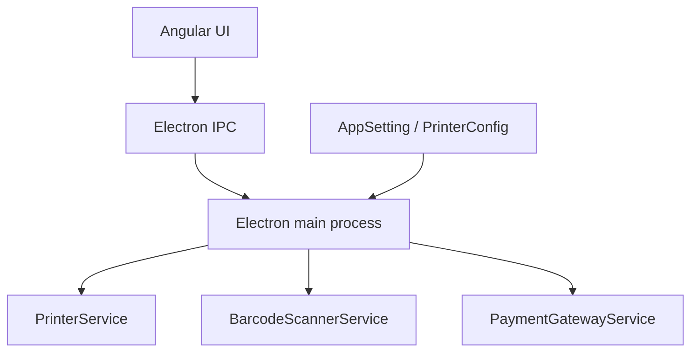

# Integrations and Devices — Functional Guide

**One-line purpose:** Connect the pharmacy counter to printers, barcode scanners, and payment devices — without baking vendor details into business logic.

**Parent:** [Functional overview](./functional-overview.md)

---

## What it does

Day-to-day pharmacy work depends on hardware: print a receipt, scan a medicine barcode, take card/UPI payment. Integrations hide vendor-specific drivers behind **service interfaces** so sales and inventory rules stay unchanged when hardware changes.

Responsibilities (target):

- Route print jobs to the right printer (thermal receipt, A4 invoice, labels).
- Accept barcode input from USB HID scanners or manual entry.
- Initiate payment terminal flows (Planned).
- Store device mappings in configuration (`AppSetting`, printer configuration tables).

**Status: Partial** — architecture and configuration schema exist; full Electron IPC wiring is Planned.

---

## Key concepts

| Term | Plain English |
|------|---------------|
| **PrinterService** | Abstraction for send-to-print |
| **BarcodeScannerService** | Reads scan events into the UI |
| **PaymentGatewayService** | Card/UPI terminal integration (Planned) |
| **Printer configuration** | Which printer handles receipts vs labels |
| **Thermal vs A4** | Receipt roll vs full-page invoice |
| **Label / barcode label** | Batch or shelf labels for inventory |

---

## Sub-flows

### Print receipt after sale

1. Sales invoice posts successfully.
2. UI requests print with invoice id and template key.
3. Main process resolves printer from configuration.
4. Template renders line items, taxes, totals.
5. Job sent to thermal or A4 printer.

### Scan medicine at counter

1. Scanner sends HID keyboard wedge or serial event.
2. BarcodeScannerService normalizes code.
3. UI searches medicine by barcode.
4. User confirms quantity and adds line.

### Payment terminal (Planned)

1. Cashier selects CARD/UPI and amount.
2. PaymentGatewayService opens terminal session.
3. On success, SalesPayment recorded with reference number.

---

## Printing

Supported targets (product design):

- Thermal printers — counter receipts
- A4 — tax invoices and statements
- Labels — shelf and batch labels
- Barcode labels — inventory labeling

Templates should be **configurable** (layout, logo, footer). Printer mappings live in `AppSetting` and `PrinterConfiguration` — see [Configuration](./configuration.md).

---

## Barcode

Supported inputs:

- USB HID scanners (keyboard wedge)
- Manual barcode entry
- Barcode generation for new batches (Planned UI)
- Label printing linked to batch/medicine

Medicine master enforces unique barcodes where configured (`MEDICINE_BARCODE_ALREADY_EXISTS`).

---

## Payment devices

Planned integration with card/UPI terminals via `PaymentGatewayService`. Until then, cashiers record payment mode manually on `SalesPayment` after post.

---

## Rules and variations

| Rule | Detail |
|------|--------|
| Business logic in NestJS | Hardware only in Electron main + thin Angular services |
| Offline-first | Print and scan work without cloud |
| Config-driven | No hardcoded printer names in code |
| Fail gracefully | Print failure does not roll back posted invoice |

---

## Permissions summary

| Permission | Use |
|------------|-----|
| `CONFIGURATION:PRINTER_CONFIGURATION:UPDATE` | Map printers (when seeded) |
| `SALES:SALES_INVOICE:CREATE` | Trigger receipt print |
| `SETTINGS_UPDATE` | App-level device defaults |

---

## Integrations

| Module | Connection |
|--------|------------|
| **Sales** | Receipt and invoice print after post |
| **Inventory** | Batch label print |
| **Configuration** | Printer and barcode configuration CRUD |
| **Reporting** | Export PDF (server-side; separate from physical print) |

---

## Maturity & known gaps

**Status: Partial** — printer/barcode config screens exist; hardware print/scan/payment UX Planned.

See Backend / UI / UX columns: [implementation-status.md — Integrations & devices](./implementation-status.md#integrations-and-devices).

---

## References

- [Integrations architecture](../architecture/integrations.md)
- [Application architecture — Electron](../architecture/application-architecture.md)
- [Early foundations — IPC](../architecture/early-foundations.md)
- [Configuration module](./configuration.md)
