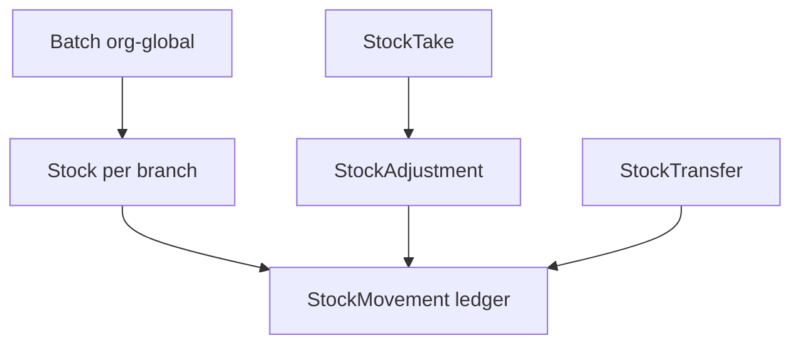
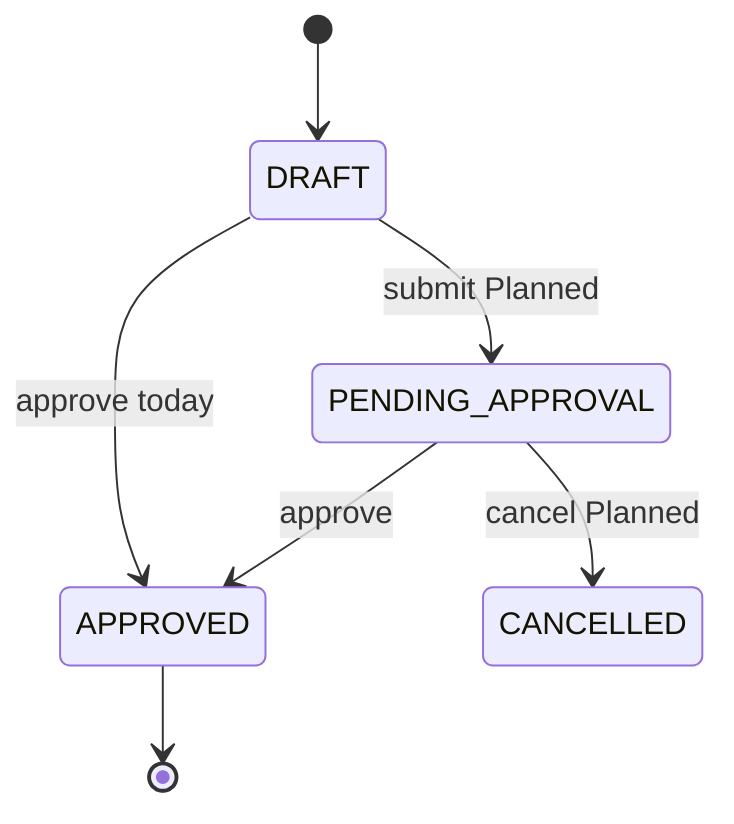
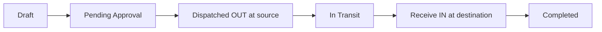

# Inventory — Functional Guide

**One-line purpose:** Track medicine lots, branch quantities, and every stock change through an immutable ledger — answering what lot, where, how much, and why.

**Parent:** [Functional overview](./functional-overview.md)

---

## What it does

Inventory answers three operational questions:

1. **What lot?** — Batch (batch number, expiry, cost, MRP)
2. **Where and how much?** — Stock per `(branchId, batchId)`
3. **Why did quantity change?** — StockMovement (immutable ledger)

Responsibilities:

- Maintain org-global Batch identity and branch-scoped Stock balances.
- Record every IN/OUT via StockMovement — never edit balances directly.
- Support adjustments, inter-branch transfers, and physical stock takes.
- Enforce FEFO (First Expiry First Out) for dispensing.
- Guard against negative available stock (default).
- Provide unit cost snapshots for COGS and valuation.

**Sale pricing is not here** — see [Pricing](./pricing.md).

---

## Key concepts

| Term | Plain English |
|------|---------------|
| **Batch** | Org-global lot: `(medicineId, batchNumber)` unique; purchaseRate + mrp |
| **Stock** | Balance per branch + batch: available, reserved, damaged, expired, in-transit |
| **StockMovement** | Immutable ledger line — direction IN/OUT, quantity, unitCost, balanceAfter |
| **FEFO** | Allocate earliest expiry among eligible batches at a branch |
| **StockAdjustment** | Manual correction document (damage, expiry, count variance) |
| **StockTransfer** | Move stock between branches |
| **StockTake** | Physical count → generates adjustment for variances |
| **Free stock** | `availableQuantity - reservedQuantity` |

---

## Sub-flows

### Stock change path (golden rule)

All quantity changes go through `InventoryLedgerService.applyMovement` inside `UnitOfWork` — same transaction as the originating document (GRN, sale, return, adjustment, transfer).

### Stock adjustment

Positive line qty → `ADJUSTMENT_GAIN` (IN); negative → `ADJUSTMENT_LOSS` (OUT).

**Today:** DRAFT → approve directly (no submit step). Cancel/reversal endpoint **Planned**.

### Stock transfer

**Implemented today:** On approve, stock moves **directly** from source branch OUT to destination branch IN in one step.

**Target lifecycle (Planned):**

`inTransitQuantity` and IN_TRANSIT status are not implemented yet. Partial receive and post-dispatch cancel are **Planned**.

### Stock take

`DRAFT` → `IN_PROGRESS` → `COUNTED` → `RECONCILED` (creates StockAdjustment for non-matched lines). StockTake does **not** update Stock directly.

---

## Rules and variations

| Rule | Detail |
|------|--------|
| Batch org-global | Same lot can exist at multiple branches via separate Stock rows |
| StockMovement append-only | Never update or delete |
| OUT guard | `availableQuantity >= 0` unless policy override |
| Expired batches | Cannot be sold (default) |
| Costing | `Batch.purchaseRate` + movement `unitCost` snapshot |
| Transfer | Same batchId at source OUT and destination IN; no re-cost |
| Reservation | `reservedQuantity` planned; separate from ledger OUT |

**Movement types:** `PURCHASE_GRN`, `SALES_INVOICE`, `SALES_RETURN`, `PURCHASE_RETURN`, `TRANSFER_IN`, `TRANSFER_OUT`, `ADJUSTMENT_GAIN`, `ADJUSTMENT_LOSS`.

**Settings:** `FEFO_ENABLED`, `NEAR_EXPIRY_DAYS`, `ALLOW_EXPIRED_SALE` (sales path).

**Count types:** `FULL_AUDIT`, `CYCLE_COUNT`, `SCHEDULE_H_AUDIT`, `COLD_CHAIN_AUDIT`, `NEAR_EXPIRY_AUDIT`.

---

## Permissions summary

| Permission | Use |
|------------|-----|
| `INVENTORY:STOCK:READ` | View balances and movement history |
| `INVENTORY:STOCK_ADJUSTMENT:CREATE` | Create and submit adjustments |
| Transfer dispatch/receive | Elevated permissions (TBD) |
| Stock take reconcile | Approve permission (TBD) |

---

## Integrations

| Module | Direction | Mechanism |
|--------|-----------|-----------|
| **Purchase** | IN | GRN post creates Batch + Stock |
| **Sales** | OUT / IN | Invoice post OUT; return IN |
| **Purchase return** | OUT | Return approve |
| **Pricing** | Read-only | No price on Batch |
| **Finance** | Future | COGS from movement costs; adjustment journals |
| **Configuration** | Read | Branch scope, FEFO settings |

---

## Maturity & known gaps

**Status: Partial**

Ledger, adjustments, transfers, and stock take exist; transfer in-transit model and adjustment cancel/reversal are Planned.

See Backend / UI / UX columns: [implementation-status.md — Inventory](./implementation-status.md#inventory).

---

## References

- [Inventory domain](../domain/inventory.md)
- [Inventory tables](../database/tables/inventory/inventory.md)
- [Inventory workflow](../workflows/inventory-flow.md)
