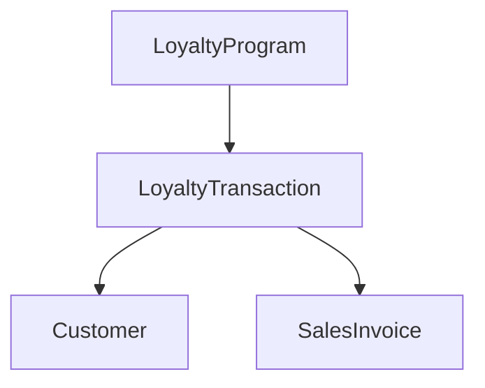
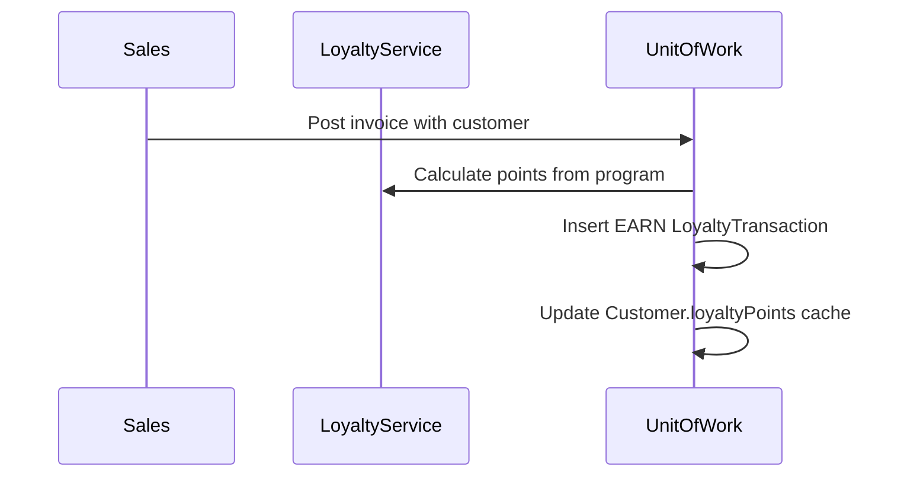

# Loyalty — Functional Guide

**One-line purpose:** Reward repeat customers with points earned on purchases and redeemed for discounts — with a full immutable transaction history.

**Parent:** [Functional overview](./functional-overview.md)

---

## What it does

Loyalty manages **customer reward programs**. When a customer buys medicines, they may earn points; at checkout they may redeem points for a discount. Every point movement is recorded as an immutable **LoyaltyTransaction** — the balance is derived from the sum of transactions, not a single editable counter.

Responsibilities:

- Configure programs: earn ratio, redemption rules, validity dates.
- Record earn, redeem, adjustment, expiry, and reversal transactions.
- Update customer points cache after each posted transaction.
- Integrate with Sales at invoice post time.

---

## Key concepts

| Term | Plain English |
|------|---------------|
| **LoyaltyProgram** | Rules for earning and redeeming (e.g. 1 point per rupee) |
| **LoyaltyTransaction** | Immutable points movement — EARN, REDEEM, ADJUSTMENT, REVERSAL |
| **Points balance** | Sum of posted transactions; `Customer.loyaltyPoints` is cache |
| **Default program** | One default program when multiple exist |

---

## Sub-flows

### Earn on sale

### Redeem on sale

Before post: validate balance ≥ redeem points. Insert REDEEM transaction; apply monetary discount on invoice.

### Manual adjustment

Supervisor enters delta and reason → ADJUSTMENT transaction with audit of authorized user.

---

## Rules and variations

| Rule | Detail |
|------|--------|
| Active program only | Within effective dates |
| Redemption cap | Cannot exceed available points |
| Immutable transactions | Reversal via REVERSAL type, not edit |
| Active customer only | Inactive customers do not earn |
| One default program | Policy when multiple programs |
| Setting | `LOYALTY_POINTS_RATIO` — points per rupee (seeded) |

**Transaction types:** EARN, REDEEM, ADJUSTMENT, EXPIRY, REVERSAL, PROMOTIONAL_BONUS.

**Variations:**

- Multiple programs for seasonal or corporate campaigns.
- Returns may reverse earned points (via REVERSAL).
- Reconciliation job: cache vs sum of transactions (see Finance REC-05).

---

## Permissions summary

| Permission | Use |
|------------|-----|
| `LOYALTY:TRANSACTION:CREATE` | Manual adjustment (planned) |
| `SALES:SALES_INVOICE:CREATE` | Earn/redeem at invoice post |
| `SALES:SALES_INVOICE:READ` | View loyalty history |

---

## Integrations

| Module | Connection |
|--------|------------|
| **Party Management** | Customer enrollment; points cache on Customer |
| **Sales** | Invoice post triggers earn/redeem |
| **Financial** | Redemption discount posts to sales discount accounts |
| **Configuration** | `LOYALTY_POINTS_RATIO` in AppSetting |

---

## Maturity & known gaps

**Status: Partial**

Schema and settings exist; end-to-end earn/redeem at invoice post may be incomplete. No Angular UI module yet.

See Backend / UI / UX columns: [implementation-status.md — Loyalty](./implementation-status.md#loyalty).

---

## References

- [Customer domain — loyalty](../domain/customer.md)
- [Loyalty tables](../database/tables/loyalty/loyalty.md)
