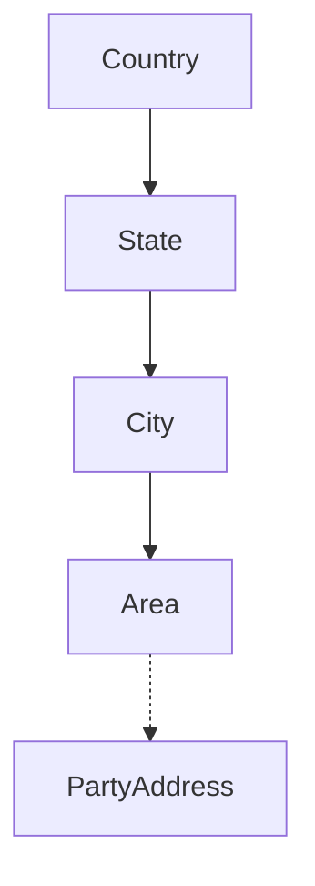

# Geographic Masters — Functional Guide

**One-line purpose:** Standardized country, state, city, and area reference data for addresses, GST compliance, and consistent reporting.

**Parent:** [Functional overview](./functional-overview.md)

---

## What it does

Geographic Masters (Lookup / Masters) provides a **hierarchical location catalogue** used wherever addresses appear: party addresses, company, branch, and supplier records. Storing lookup IDs instead of free-text city names keeps spelling consistent and supports GST state-code reporting.

Hierarchy: **Country → State → City → Area**

Responsibilities:

- Maintain geographic reference data with ISO and GST metadata.
- Support inactive flags without breaking historical references.
- Enable search and filtering by standardized geography.

---

## Key concepts

| Term | Plain English |
|------|---------------|
| **Country** | Root — ISO codes, currency |
| **State** | Province/state — GST state code (India) |
| **City** | City within a state |
| **Area** | Locality or postal zone within a city |
| **PartyAddress** | Consumer — stores geographic FKs |

---

## Sub-flows

### Address capture

When registering a party or branch:

1. User selects Country → State → City → Area from dropdowns.
2. Address line stores structured IDs + free-text line1/line2.
3. GST reports can group by state code from State master.

No document lifecycle — masters are **reference data** with active/inactive flag only.

---

## Rules and variations

| Rule | Detail |
|------|--------|
| Strict hierarchy | State belongs to Country; City to State; Area to City |
| Unique codes | Country code, state code per conventions |
| Inactive | Cannot select for new records; existing refs remain valid |
| Rarely changed | Admin maintenance; sync as masters |
| Soft delete | `deletedAt` where applicable |
| No circular refs | Parent-child only |

**Variations:**

- Area optional where postal code alone suffices.
- Future lookup tables (currency, dosage form) follow same pattern.
- Deleting Area with references may be blocked (orphan guard — see ADR-127).

**India-specific:** State carries GST state code for intra-state CGST/SGST vs inter-state IGST logic on invoices.

---

## Permissions summary

| Permission | Use |
|------------|-----|
| Admin / master data | CRUD on geographic masters (TBD) |
| `PARTY:PARTY:UPDATE` | Uses masters when entering addresses |

Typically restricted to administrators — not counter staff.

---

## Integrations

| Module | Connection |
|--------|------------|
| **Party Management** | PartyAddress references City/State/Country/Area |
| **Configuration** | Company and Branch addresses |
| **Financial** | GST reporting by state |
| **Synchronization** | Master data sync; server authority for geo |

---

## Maturity & known gaps

**Status: Implemented**

Geographic CRUD works; bulk import from external sources is Planned.

See Backend / UI / UX columns: [implementation-status.md — Masters](./implementation-status.md#masters-geographic).

---

## References

- [Masters tables](../database/tables/masters/masters.md)
- [Party management — addresses](../database/tables/party_management/party_management.md)
