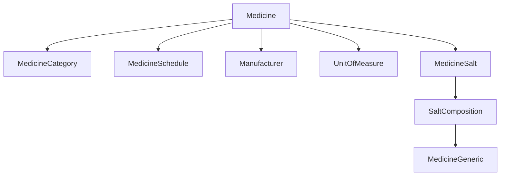
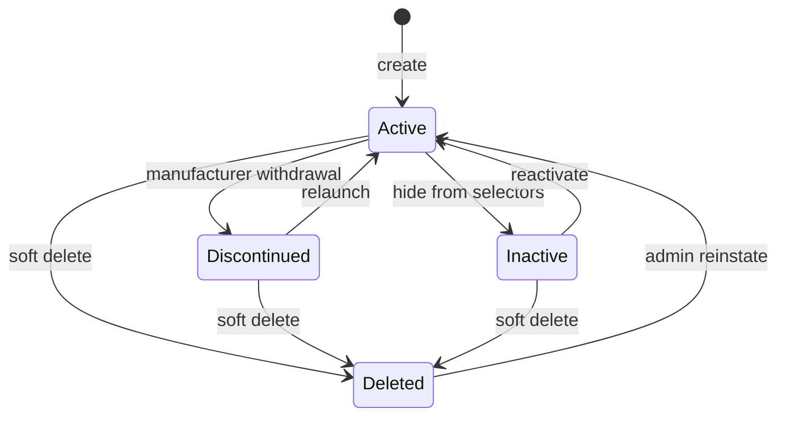

# Medicine Master — Functional Guide

**One-line purpose:** The product catalogue — what medicines exist, how they are classified, and who makes them — without storing stock quantities or selling prices.

**Parent:** [Functional overview](./functional-overview.md)

---

## What it does

Medicine Master defines **what can be bought, stocked, priced, and sold**. It is org-global reference data: the same medicine record is shared across all branches. Inventory quantities and branch sale prices live in other modules.

Responsibilities:

- Maintain branded medicine records (code, name, dosage form, pack, HSN, barcode).
- Classify by category and regulatory schedule (OTC, Schedule H, H1, X).
- Model chemical composition via generics, salts, and strengths.
- Link each medicine to a manufacturer and unit of measure.
- Enforce prescription, narcotic, and refrigerated flags for sales compliance.
- Publish master changes for sync via outbox.

**Important:** Creating a medicine does **not** create stock or set a sale price.

---

## Key concepts

| Term | Plain English |
|------|---------------|
| **Medicine** | Branded sellable SKU (e.g. Crocin 500 Tablet) |
| **MedicineGeneric** | Active ingredient name independent of brand |
| **SaltComposition** | Standardized strength (e.g. Paracetamol 500 mg) |
| **MedicineSalt** | Links medicine to one or more salt compositions |
| **MedicineCategory** | Business class: Antibiotics, Tablets, Surgical |
| **MedicineSchedule** | Regulatory schedule — drives Rx and register rules |
| **Manufacturer** | Pharma company on the pack; links to Party |
| **UnitOfMeasure** | Tablet, strip, bottle — used on invoices and stock |

---

## Sub-flows

### Create medicine (happy path)

1. Prerequisites: manufacturer, category, UOM, optional schedule and salt compositions.
2. Enter identity: code, name, brand, dosage form, pack, HSN, barcode.
3. Set flags: prescription required, narcotic, refrigerated.
4. Add MedicineSalt rows for multi-ingredient products.
5. Save → `MedicineCreated` + outbox.
6. **Separate tasks:** branch PriceListItem setup; first purchase creates Batch + Stock.

### Medicine lifecycle

| State | New batches? | Sell existing stock? |
|-------|--------------|----------------------|
| Active | Yes | Yes |
| Discontinued | No (policy) | Yes |
| Inactive | No | Policy-dependent |
| Deleted | No | No (historical only) |

---

## Rules and variations

| Rule | Detail |
|------|--------|
| `medicineCode` unique | Org-wide |
| No sale rate on Medicine | Price in Pricing module |
| No quantities on Medicine | Stock in Inventory module |
| Composition | Multi-ingredient via MedicineSalt, not strength field alone |
| Schedule compliance | Orthogonal to lifecycle — Schedule H still needs Rx at sale |
| Soft delete | Prefer discontinue when history exists |
| Barcode | Unique when provided; used for scan-at-counter |

**Variations:**

- Scheduled medicines should have at least one salt row (recommended, not hard DB rule).
- Inactive or deleted medicines blocked on new PO lines and sales selectors.
- Expired **batches** cannot be sold; medicine may remain active.

---

## Permissions summary

| Permission | Use |
|------------|-----|
| `MASTER:MEDICINE:UPDATE` | Create, update, discontinue, soft delete, composition |
| `MASTER:MEDICINE:READ` | List/search (planned) |
| `INVENTORY:STOCK:READ` | View stock for a medicine (separate module) |

---

## Integrations

| Module | Connection |
|--------|------------|
| **Inventory** | Medicine → many Batches → Stock per branch |
| **Pricing** | PriceListItem per medicine per branch list |
| **Purchasing** | PO/GRN lines reference `medicineId` |
| **Sales** | Invoice lines; schedule flags validated at post |
| **Prescription** | PrescriptionItem references medicine |
| **Party Management** | Manufacturer → Party |

---

## Maturity & known gaps

**Status: Implemented**

Product catalog CRUD works; Schedule-H enforcement at sale is handled in Sales/Prescription (Planned).

See Backend / UI / UX columns: [implementation-status.md — Medicine Master](./implementation-status.md#medicine-master).

---

## References

- [Product domain (Medicine)](../domain/product.md)
- [Medicine master tables](../database/tables/medicine_master/medicine_master.md)
