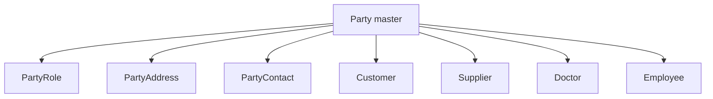
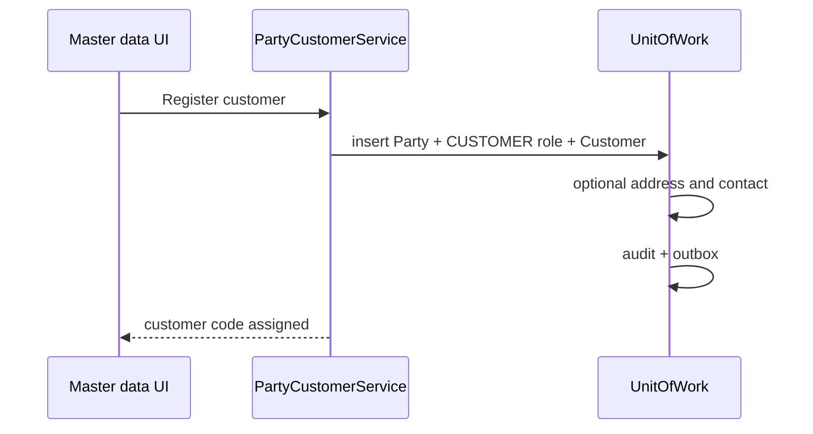
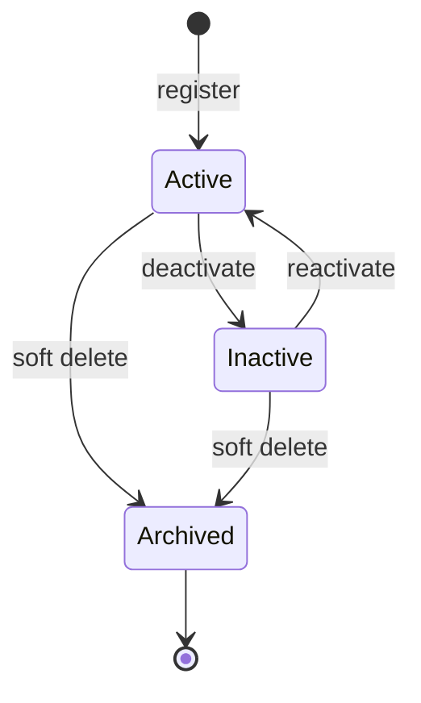

# Party Management — Functional Guide

**One-line purpose:** One shared identity for every person and organization in the pharmacy — customers, suppliers, doctors, and employees — without duplicating names and addresses.

**Parent:** [Functional overview](./functional-overview.md)

---

## What it does

Party Management is the **master-data foundation for people and organizations**. Instead of maintaining separate name/address records for each business function, the system stores common identity once in **Party** and attaches **roles** and **role-specific details** as needed.

Responsibilities:

- Register and maintain persons and organizations (retail customers, wholesalers, suppliers, prescribing doctors, staff).
- Assign one or more business roles (`CUSTOMER`, `SUPPLIER`, `DOCTOR`, `EMPLOYEE`) to a single Party.
- Store addresses and contacts shared across roles.
- Hold commercial attributes: customer credit limits, supplier GSTIN and drug license, doctor registration, employee job details.
- Expose stable identity (`uuid`) to Sales, Purchasing, Finance, and Prescription modules.

---

## Key concepts

| Term | Plain English |
|------|---------------|
| **Party** | Master record for a person or organization — name, type, active status |
| **PartyRole** | Business hat worn by a Party (e.g. CUSTOMER, SUPPLIER) |
| **PartyAddress** | Home, work, billing, or shipping address |
| **PartyContact** | Phone, email, WhatsApp |
| **Customer** | Party acting as a buyer — credit limit, payment terms, loyalty cache |
| **Supplier** | Party acting as a vendor — GSTIN, drug license, payable outstanding |
| **Doctor** | Prescribing practitioner — registration, specialty |
| **Employee** | Staff member — links to User account for login |
| **Walk-in customer** | Seeded default customer for anonymous retail sales |

---

## Sub-flows

### Register a customer

### Register a supplier

Same pattern: Party (usually ORGANIZATION) + SUPPLIER role + Supplier row with statutory fields (GSTIN, drug license, PAN).

### Party lifecycle

**Operational active** requires Party, role, and detail record (Customer/Supplier) all active and not soft-deleted.

---

## Rules and variations

| Rule | Detail |
|------|--------|
| One Party, one Customer | At most one Customer row per Party |
| One Party, one Supplier | At most one Supplier row per Party |
| Multiple roles | Same person can be DOCTOR and EMPLOYEE |
| Role consistency | CUSTOMER role must exist before first sale to that customer |
| Credit sales | Blocked when outstanding + new invoice exceeds `creditLimit` |
| GSTIN uniqueness | Supplier GSTIN unique when present |
| Soft delete only | Never hard-delete parties with transaction history |
| Outstanding balances | Denormalized on Customer/Supplier; ledger is source of truth |

**Variations:**

- **RETAIL / WHOLESALE / CORPORATE** customer types — wholesale/corporate may require credit limit before credit sale.
- **Supplier types** — MANUFACTURER, DISTRIBUTOR, WHOLESALER, OTHER; drug license recommended for pharma vendors.
- **Preferred supplier** — sort hint on PO screens, not exclusivity.
- **Supplier contracts** — not modeled; spot pricing on PO/invoice only.

---

## Permissions summary

| Permission | Use |
|------------|-----|
| `PARTY:PARTY:UPDATE` | Register, update, deactivate, archive party and role details |
| `PARTY:PARTY:READ` | View party master (planned) |
| `SALES:SALES_INVOICE:READ` | View customer on sales screens |

Credit limit changes may require supervisor approval (policy TBD).

---

## Integrations

| Module | Connection |
|--------|------------|
| **Sales** | `SalesInvoice.customerId`; credit check; walk-in default |
| **Purchasing** | `PurchaseOrder.supplierId`; inactive supplier blocked |
| **Finance** | Receivable/payable ledger updates outstanding cache |
| **Loyalty** | Points tied to Customer |
| **Prescription** | Patient = Customer; prescriber = Doctor |
| **Medicine Master** | Manufacturer links Party → Manufacturer |
| **User & Security** | Employee links to User login account |

---

## Maturity & known gaps

**Status: Implemented**

Party CRUD and role extensions work; credit-limit enforcement at sale and supplier contracts are gaps.

See Backend / UI / UX columns: [implementation-status.md — Party Management](./implementation-status.md#party-management).

---

## References

- [Customer domain](../domain/customer.md)
- [Supplier domain](../domain/supplier.md)
- [Party management tables](../database/tables/party_management/party_management.md)
