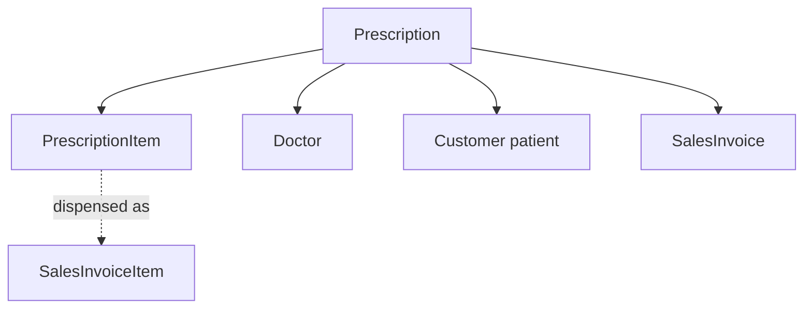
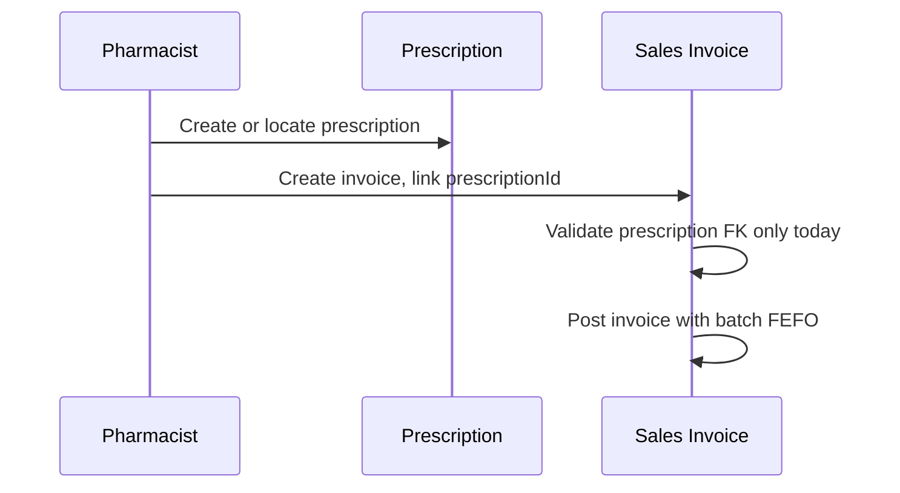
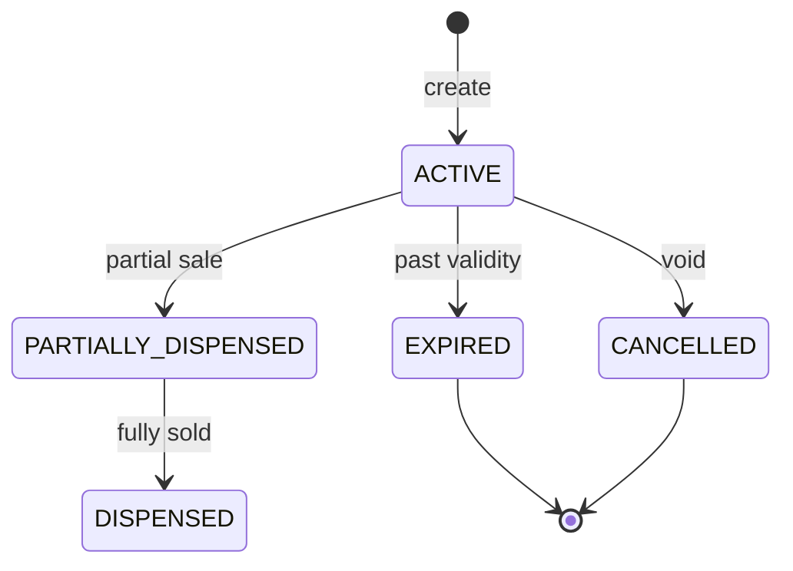

# Prescription — Functional Guide

**One-line purpose:** Store doctor-issued medication orders for patients and link them to sales for Schedule H and controlled-drug compliance.

**Parent:** [Functional overview](./functional-overview.md)

---

## What it does

Prescription captures the **clinical document** behind regulated sales. A prescription records who prescribed, for which patient, which medicines, dosage, and validity. Pharmacists use it to guide dispensing; approved items convert into sales invoice lines while retaining the prescription reference.

Responsibilities:

- Record prescription header: doctor, patient (customer), date, validity, diagnosis.
- Store line items: medicine, dosage, frequency, duration, substitution rules.
- Enforce prescription requirement for Schedule H and controlled medicines at sale (**Planned** — storage and FK link only today).
- Support manual entry or future import from scanned/electronic sources.

---

## Key concepts

| Term | Plain English |
|------|---------------|
| **Prescription** | Header — doctor, patient, prescription number, status |
| **PrescriptionItem** | One prescribed medicine with dosing instructions |
| **Patient** | Customer record in Party Management |
| **Prescriber** | Doctor record in Party Management |
| **Schedule H** | Medicines requiring valid prescription to sell |

---

## Sub-flows

### Prescription to sale

### Prescription status (typical)

Exact status strings follow schema; expired/cancelled prescriptions cannot be billed without override.

---

## Rules and variations

| Rule | Detail |
|------|--------|
| Unique prescription number | Per policy |
| Patient + doctor required | FK to Customer and Doctor |
| At least one item | Before use |
| Expired Rx | Block sale unless authorized override |
| Controlled medicines | Valid prescription mandatory |
| One Rx, many invoices | Partial dispensing allowed |
| Setting | `PRESCRIPTION_MANDATORY_SCHEDULE_H` (seeded true) |

**Sales integration today:** Optional `prescriptionId` on SalesInvoice; system validates the prescription exists. It does **not** update Rx status to PARTIALLY_DISPENSED/DISPENSED or match invoice lines to prescription lines.

**Planned:** Schedule-H block at post, line-level dispense, expired-Rx override workflow.

**Variations:**

- Capture prescriber and patient detail fields on invoice header when configured.
- Substitution rules on PrescriptionItem (if allowed by policy).
- Schedule register maintenance flag on MedicineSchedule.

---

## Permissions summary

| Permission | Use |
|------------|-----|
| `SALES:SALES_INVOICE:CREATE` | Link prescription to sale |
| Prescription CRUD | Dedicated permissions when seeded (TBD) |
| Override expired Rx | Supervisor permission (TBD) |

---

## Integrations

| Module | Connection |
|--------|------------|
| **Party Management** | Patient = Customer; prescriber = Doctor |
| **Sales** | `SalesInvoice.prescriptionId`; Schedule H validation **Planned** |
| **Medicine Master** | MedicineSchedule drives Rx requirement |
| **Inventory** | Dispensing reduces stock via normal sales post |

---

## Maturity & known gaps

**Status: Partial**

Prescription CRUD and invoice FK link work; dispense workflow and Schedule-H enforcement are Planned.

See Backend / UI / UX columns: [implementation-status.md — Prescription](./implementation-status.md#prescription).

---

## References

- [Sales domain — prescription workflow](../domain/sales.md)
- [Prescription tables](../database/tables/prescription/prescription.md)
