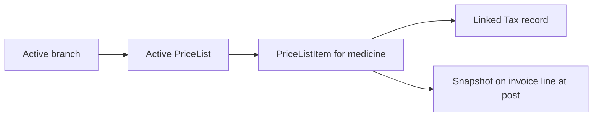

# Pricing — Functional Guide

**One-line purpose:** Define what the customer pays at the counter — branch sale prices, tax rates, and discount rules — separate from lot cost on Batch.

**Parent:** [Functional overview](./functional-overview.md)

---

## What it does

Pricing answers **"what is the selling price?"** for each medicine at each branch. It does not store purchase cost (that is on Batch from GRN) and does not store quantities (Inventory).

Responsibilities:

- Maintain branch-scoped price lists and per-medicine selling prices.
- Define GST/tax rates with effective date ranges.
- Configure reusable discount rules (category, quantity, campaign).
- Supply prices to Sales at invoice post time — then **snapshot** on lines forever.

**Golden rule:** Billing uses `PriceListItem.sellingPrice` at transaction time; historical invoices never change when master prices change.

---

## Key concepts

| Term | Plain English |
|------|---------------|
| **PriceList** | Named scheme: Retail, Wholesale, Hospital, Promotional |
| **PriceListItem** | Selling price (+ optional MRP, discount) per medicine in a list |
| **Tax** | GST rate master — code, rate %, effective from/to |
| **DiscountRule** | Reusable promo or category discount policy |
| **Snapshot** | `unitPrice`, tax % copied to SalesInvoiceItem at post |

**Where price lives:**

| Location | Field | Meaning |
|----------|-------|---------|
| Batch | purchaseRate, mrp | Cost and statutory pack MRP |
| PriceListItem | sellingPrice, mrp | Branch counter rate |
| SalesInvoiceItem | unitPrice, taxRate | Frozen at post time |

---

## Sub-flows

### Price resolution at sale

Resolution order: branch PriceList → active PriceListItem for medicine → optional company default list.

### Tax rate change

1. End-date current Tax row (`effectiveTo`).
2. Insert new row with new rate and `effectiveFrom`.
3. Invalidate pricing cache.
4. Historical invoice lines unchanged.

---

## Rules and variations

| Rule | Detail |
|------|--------|
| One item per medicine per list | Unique `(priceListId, medicineId)` |
| Inactive/expired item | Cannot use on new posts |
| Tax 0–100% | Validated |
| Inactive tax | Not selectable on new lines |
| MRP cap | Sales may enforce selling ≤ batch MRP via setting |
| Branch scope | PriceList may be branch-specific |
| Default list | One default per branch when configured |

**Typical GST rates (India):** 0%, 5%, 12%, 18%, 28% — split CGST/SGST intra-state or IGST inter-state at invoice post.

**Variations:**

- Customer `isTaxExempt` may zero tax on eligible sales.
- Header vs line discount distribution — fixed per implementation.
- Discontinued medicine — may deactivate branch PriceListItems.

---

## Permissions summary

| Permission | Use |
|------------|-----|
| Price list admin | Typically admin/manager (dedicated codes TBD) |
| `MASTER:MEDICINE:UPDATE` | Medicine master — not price lists |
| Counter staff | Read resolved price at sale only |

---

## Integrations

| Module | Connection |
|--------|------------|
| **Sales** | Resolves PriceListItem at post; snapshots on lines |
| **Medicine Master** | PriceListItem references medicineId |
| **Financial** | Tax definitions; GST reports from line snapshots |
| **Configuration** | `DEFAULT_TAX_INCLUSIVE`, GST default rate settings |
| **Party Management** | Customer tax exempt flag |

---

## Maturity & known gaps

**Status: Implemented**

Price lists, tax, and discount rules work; promotional campaigns beyond discount rules are Planned.

See Backend / UI / UX columns: [implementation-status.md — Pricing](./implementation-status.md#pricing).

---

## References

- [Finance domain — taxation](../domain/finance.md#taxation)
- [Pricing tables](../database/tables/pricing/pricing.md)
