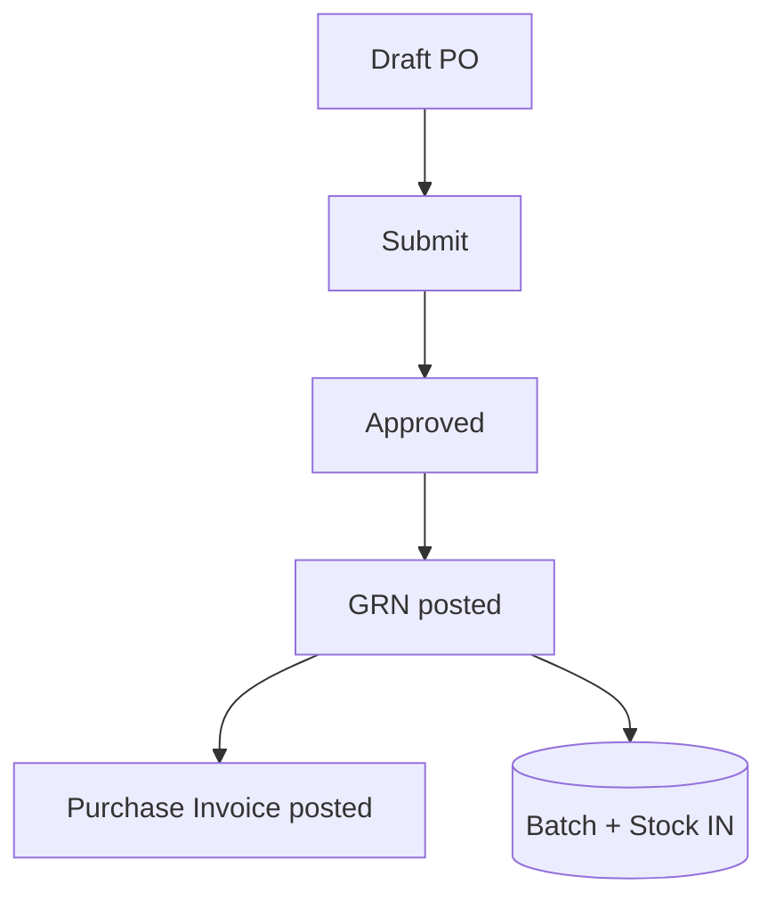
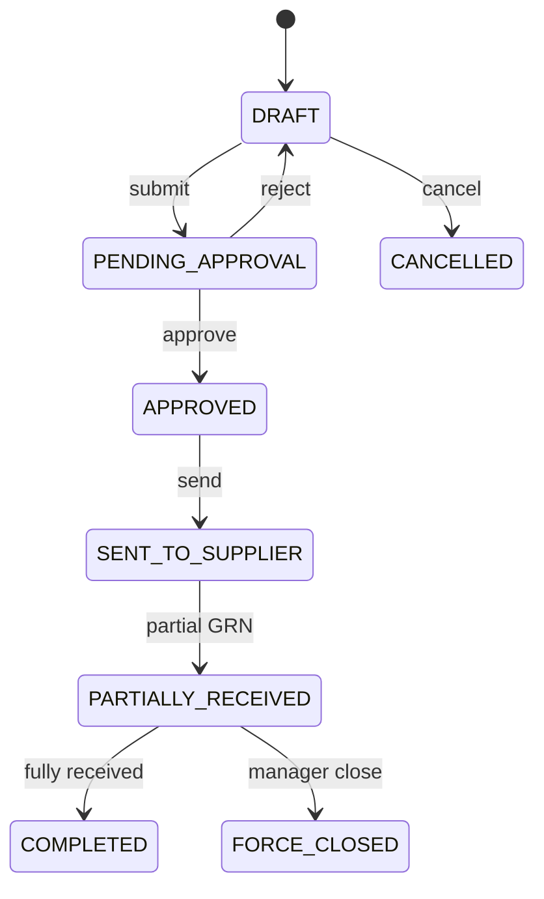

# Purchase — Functional Guide

**One-line purpose:** Buy medicines from suppliers — from purchase order through goods receipt into stock, supplier invoicing, and returns.

**Parent:** [Functional overview](./functional-overview.md)

---

## What it does

Purchase is the **inbound supply chain**. It manages the documents that bring stock into the pharmacy. Critical rule: **only posting a Goods Receipt (GRN) increases inventory** — a PO or purchase invoice alone does not.

Document chain:

**Purchase Order → Goods Receipt → Purchase Invoice → Purchase Return**

Responsibilities:

- Raise and approve purchase orders to suppliers.
- Record physical receipt of goods with batch, expiry, and cost.
- Register supplier bills and accounts payable.
- Return defective or excess stock to suppliers.
- Track PO fulfillment across partial deliveries.

---

## Key concepts

| Term | Plain English |
|------|---------------|
| **PurchaseOrder** | Formal request to supplier — no stock impact |
| **PurchaseOrderItem** | Ordered medicine and quantity |
| **GoodsReceipt (GRN)** | Physical receipt — **creates Batch + Stock IN** |
| **GoodsReceiptItem** | Received line with batch no, expiry, rates |
| **PurchaseInvoice** | Supplier bill — AP only, no stock change |
| **PurchaseReturn** | Send stock back — **Stock OUT** |

| Document | Inventory impact |
|----------|------------------|
| Purchase Order | None |
| Goods Receipt (posted) | **IN** — Batch + Stock |
| Purchase Invoice | None (finance only) |
| Purchase Return (posted) | **OUT** |

---

## Sub-flows

### Standard procure-to-stock

### Purchase order lifecycle

### GRN post (inventory moment)

On post, per line:

1. Resolve or create Batch for `(medicineId, batchNumber)`.
2. Upsert Stock for `(branchId, batchId)`.
3. Create IN StockMovement.
4. Update PO line `receivedQuantity` if PO-linked.
5. Audit + outbox in same transaction.

---

## Rules and variations

| Rule | Detail |
|------|--------|
| PO needs lines | At least one before submit/approve |
| GRN batch + expiry | Mandatory for pharma lines |
| Multiple GRNs per PO | Partial delivery supported |
| Posted GRN immutable | Cancel/reversal workflow only |
| Invoice vs GRN | Invoice records AP; stock already on GRN |
| Terminal PO states | COMPLETED, FORCE_CLOSED, CANCELLED block new GRNs |

**Variations:**

- **Partial delivery** — repeat GRN until PO complete or force-closed.
- **GRN without PO** — if `ALLOW_GRN_WITHOUT_PO` setting enabled.
- **Three-way match** — invoice qty ≤ GRN received; cost variance tolerance.
- **Segregation of duties** — approver ≠ creator when configured.
- **Over-receipt tolerance** — configurable cap above ordered qty.
- **Purchase return** — qty ≤ branch available; may require supplier RMA. Stock OUT on approve is **Implemented**; supplier ledger / outstanding update on purchase return is **Planned** (GAP-RET-4).

---

## Permissions summary

| Permission | Use |
|------------|-----|
| `PURCHASE:PURCHASE_ORDER:CREATE` | Create/edit draft PO |
| GRN post, invoice, return | Elevated permissions when seeded (TBD) |
| PO approve / force close | Manager permissions (TBD) |

All documents branch-scoped.

---

## Integrations

| Module | Connection |
|--------|------------|
| **Party Management** | Supplier on PO, GRN, invoice, return |
| **Inventory** | GRN IN; return OUT; Batch creation |
| **Medicine Master** | Lines reference medicineId |
| **Financial** | Purchase invoice → Supplier Payable; payment clears AP |
| **Configuration** | SequenceGenerator for PO/GRN/invoice numbers |

---

## Maturity & known gaps

**Status: Partial**

PO → GRN → invoice chain works; purchase return finance integration and automated tests are gaps.

See Backend / UI / UX columns: [implementation-status.md — Purchase](./implementation-status.md#purchase).

---

## References

- [Purchasing domain](../domain/purchasing.md)
- [Purchase tables](../database/tables/purchase/purchase.md)
- [Purchase workflow](../workflows/purchase-flow.md)
