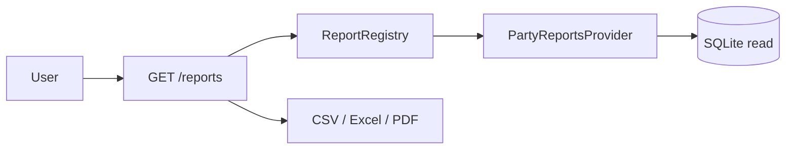

# Reporting — Functional Guide

**One-line purpose:** Let staff run read-only business reports and export them — without changing any data.

**Parent:** [Functional overview](./functional-overview.md)

---

## What it does

Reporting answers operational questions from existing data: who owes money, which customers are active, supplier lists, and (in future) sales registers, stock on hand, and trial balance. Reports are **read-only** — they never post stock or ledger entries.

Responsibilities:

- List reports the current user is allowed to run.
- Execute a report with filters (date range, search, branch, pagination).
- Export results as JSON, CSV, Excel, or PDF.
- Hide reports the user lacks permission for.

---

## Key concepts

| Term | Plain English |
|------|---------------|
| **Report registry** | Catalog of all report definitions registered at startup |
| **Report id** | Namespaced identifier, e.g. `party.customer-list` |
| **Report provider** | Module that registers one or more reports (e.g. party reports) |
| **Permission gate** | Route permission (`REPORT_VIEW`) plus per-report permission |
| **Export format** | `json`, `csv`, `xlsx`, or `pdf` |

---

## Sub-flows

### Run a report

1. User opens report list (`GET /reports`).
2. User picks a report and sets filters (dates, search, page).
3. System checks `REPORT_VIEW` and report-specific permission.
4. Provider queries database (read-only, soft-delete filtered).
5. Results return as JSON or file download.

### Export

Same URL as run, with `format=csv|xlsx|pdf`. Browser or Electron saves the attachment.

---

## Implemented today

| Report id | Name | Permission |
|-----------|------|------------|
| `party.customer-list` | Customer List | `REPORT_PARTY_VIEW` |
| `party.supplier-list` | Supplier List | `REPORT_PARTY_VIEW` |
| `party.customer-outstanding` | Customer Outstanding | `REPORT_PARTY_VIEW` |

Seeded **Administrator** role has `REPORT_VIEW` and `REPORT_PARTY_VIEW`.

---

## Planned coverage

Aligns with product roadmap and [integrations doc](../architecture/integrations.md#reporting):

- Sales — daily summary, register, GST
- Purchase — PO status, purchase register
- Inventory — stock on hand, expiry, movement
- Finance — day book, trial balance, GST summary
- Month-end — archived close reports

Angular/Electron report picker UI is Planned.

---

## Rules and variations

| Rule | Detail |
|------|--------|
| Read-only | No UnitOfWork, outbox, or audit on report run |
| Tenant scope | Company and branch from JWT context |
| Soft delete | Rows with `deletedAt` excluded |
| Pagination | Tabular reports default page size 20 (max 100) |
| Date range | `fromDate` must be ≤ `toDate` |

---

## Permissions summary

| Permission | Use |
|------------|-----|
| `REPORT:REPORT:READ` (`REPORT_VIEW`) | Access `/reports` endpoints |
| `REPORT:PARTY_REPORT:READ` (`REPORT_PARTY_VIEW`) | Run `party.*` reports |
| Future `REPORT_SALES_VIEW`, etc. | Per-category report access |

---

## Integrations

| Module | Connection |
|--------|------------|
| **Party Management** | Customer/supplier list and outstanding reports |
| **Financial** | Future trial balance, GST (Planned) |
| **Sales / Purchase / Inventory** | Future transactional reports (Planned) |
| **User & Security** | Permission checks on every run |

---

## Maturity & known gaps

**Status: Partial** — backend registry and party reports Implemented; report list/runner UI exists; broader report catalog Planned.

See Backend / UI / UX columns: [implementation-status.md — Reporting](./implementation-status.md#reporting).

---

## References

- [Reporting architecture](../architecture/reporting.md) — API, extension guide, curl examples
- [Integrations](../architecture/integrations.md)
- [Roles and permissions](./roles-and-permissions.md)
