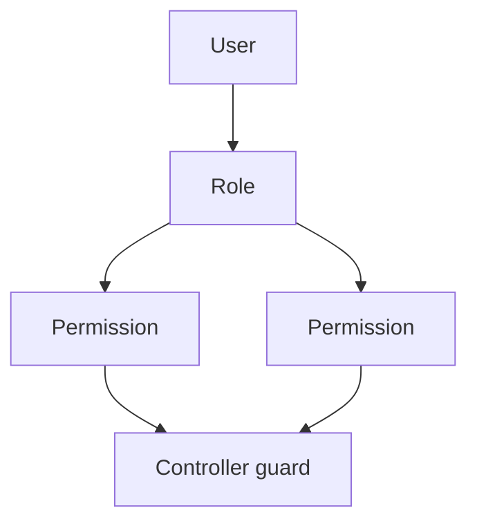

# Roles and Permissions — Functional Guide

**One-line purpose:** Control who can do what — through seeded roles and fine-grained permission codes checked on every API call.

**Parent:** [Functional overview](./functional-overview.md)

---

## What it does

User & Security assigns each login a **role** (e.g. Cashier, Pharmacist). Each role holds a set of **permissions**. Controllers declare required permissions; missing permission returns `AUTH_PERMISSION_DENIED`.

Permissions follow the pattern:

```text
MODULE:RESOURCE:ACTION
```

Example: `SALES:SALES_INVOICE:CREATE` — create and post sales invoices.

Seed data: `backend/seed/data/security/role.json`, `permission.json`, `role-permission.json`.

---

## Seeded roles

| Role code | Name | Typical use |
|-----------|------|-------------|
| `ADMIN` | Administrator | Full access; all seeded permissions |
| `PHARMACIST` | Pharmacist | Dispensing, inventory view, medicine read |
| `CASHIER` | Cashier | Sales invoice create/read |
| `PROCUREMENT` | Procurement | Purchase orders, GRN, supplier flows |
| `MANAGER` | Branch Manager | Approvals, overrides, broader read |

Exact permission sets are in seed JSON; Administrator receives the full catalog (~100 permissions).

---

## Permission model

Each permission row has:

- **permissionCode** — string checked at runtime (may match `MODULE:RESOURCE:ACTION` or a legacy short code like `REPORT_VIEW`)
- **module** — bounded context (SALES, PURCHASE, PARTY, …)
- **resource** — entity or feature (SALES_INVOICE, STOCK_ADJUSTMENT, …)
- **action** — CREATE, READ, UPDATE, DELETE, EXECUTE, …



---

## Permissions by module (representative)

### Party (`PARTY`)

- `PARTY:PARTY:CREATE` — register parties
- `PARTY:PARTY:READ` — view party master
- `PARTY:PARTY:UPDATE` — edit party and roles
- `PARTY:PARTY:DELETE` — soft-delete party
- `PARTY:CUSTOMER:READ` / `CREATE` / `UPDATE` — customer-specific CRUD
- `PARTY:SUPPLIER:READ` / `CREATE` / `UPDATE` — supplier-specific CRUD

### Sales (`SALES`)

- `SALES:SALES_INVOICE:CREATE` — draft, edit lines, post, record payment
- `SALES:SALES_INVOICE:READ` — view invoices, payments, returns
- `SALES:SALES_RETURN:CREATE` — create return documents (approve may need manager — TBD)

### Purchase (`PURCHASE`)

- `PURCHASE:PURCHASE_ORDER:CREATE` — create and edit draft PO
- `PURCHASE:GOODS_RECEIPT:CREATE` — post GRN
- `PURCHASE:PURCHASE_INVOICE:CREATE` — supplier bill
- `PURCHASE:PURCHASE_RETURN:CREATE` — return stock to supplier

### Inventory (`INVENTORY`)

- `INVENTORY:STOCK:READ` — balances and movement history
- `INVENTORY:STOCK_ADJUSTMENT:CREATE` — adjustments
- `INVENTORY:STOCK_TRANSFER:CREATE` — inter-branch transfers (elevated — check seed)
- `INVENTORY:STOCK_TAKE:CREATE` — physical counts

### Medicine (`MEDICINE`)

- `MEDICINE:MEDICINE:CREATE` / `READ` / `UPDATE` — product catalog
- Related: manufacturer, category, schedule, generic permissions

### Finance (`FINANCE`)

- `FINANCE:PAYMENT:CREATE` — supplier payments
- `FINANCE:RECEIPT:CREATE` — customer receipts
- `FINANCE:LEDGER:READ` — chart and entries
- `FINANCE:JOURNAL:CREATE` — manual journals (when seeded)

### Pricing (`PRICING`)

- `PRICING:PRICE_LIST:CREATE` / `UPDATE` — selling prices
- `PRICING:TAX:CREATE` / `UPDATE` — tax master

### Report (`REPORT`)

- `REPORT:REPORT:READ` (`REPORT_VIEW`) — list and run reports
- `REPORT:PARTY_REPORT:READ` (`REPORT_PARTY_VIEW`) — party report category

### Configuration (`CONFIGURATION`)

- `CONFIGURATION:APP_SETTING:READ` / `UPDATE` — settings
- `CONFIGURATION:COMPANY:CREATE` — org setup
- `CONFIGURATION:BRANCH:CREATE` — branch setup
- `CONFIGURATION:FINANCIAL_YEAR:CREATE` — FY management

### Sync (`SYNC`)

- `SYNC:SYNC:EXECUTE` (`SYNC_RUN`) — trigger or manage sync

### Security (`SECURITY`)

- `SECURITY:USER:CREATE` / `READ` / `UPDATE` — user admin
- `SECURITY:ROLE:CREATE` — role management

---

## Role → permission matrix (summary)

Nested bullets show typical access; Administrator has all.

- **Administrator**
  - All modules: full CREATE/READ/UPDATE/DELETE where seeded
- **Pharmacist**
  - Medicine: READ (and related master read)
  - Inventory: STOCK READ, adjustments as seeded
  - Sales: invoice READ; may lack broad purchase write
- **Cashier**
  - Sales: SALES_INVOICE CREATE and READ
  - Party: CUSTOMER READ (walk-in and lookup)
  - Inventory: STOCK READ for availability checks
- **Procurement**
  - Purchase: PO, GRN, invoice, return as seeded
  - Party: SUPPLIER READ/UPDATE
  - Inventory: STOCK READ
- **Branch Manager**
  - Broader read across modules; approve actions as seeded (adjustments, transfers — verify role-permission.json)

For exact mappings, diff `role-permission.json` against `permission.json` in seed data.

---

## Rules and variations

| Rule | Detail |
|------|--------|
| JWT required | All business APIs except login/health |
| Branch scope | User must belong to document branch (RequestContext) |
| Permission denied | HTTP 403, code `AUTH_PERMISSION_DENIED` |
| System permissions | `isSystemPermission: true` — do not delete in production |
| Custom roles | Planned via SECURITY:ROLE APIs |

---

## Integrations

| Module | Connection |
|--------|------------|
| **All modules** | `@RequirePermissions` on controllers |
| **Reporting** | Per-report permission in addition to `REPORT_VIEW` |
| **Audit** | User id on AuditLog from JWT |

---

## Maturity & known gaps

**Status: Implemented** for core RBAC; some approve/override permissions still marked TBD in module guides.

See Backend / UI / UX columns: [implementation-status.md — User & Security](./implementation-status.md#user--security).

---

## References

- [User & Security module](./user-security.md)
- [Security architecture](../architecture/security.md)
- [Error codes — AUTH_*](./error-codes.md)
- Seed: `backend/seed/data/security/`
