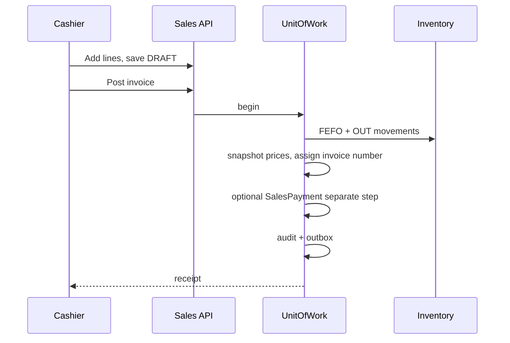
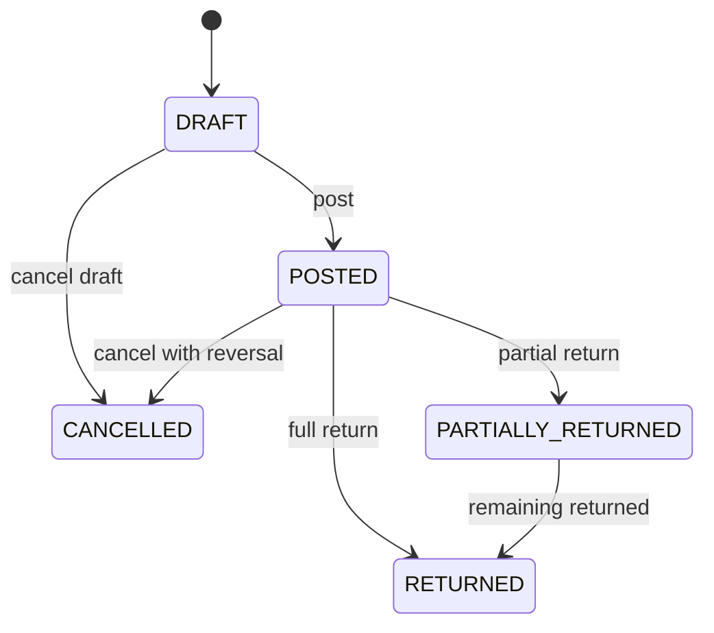
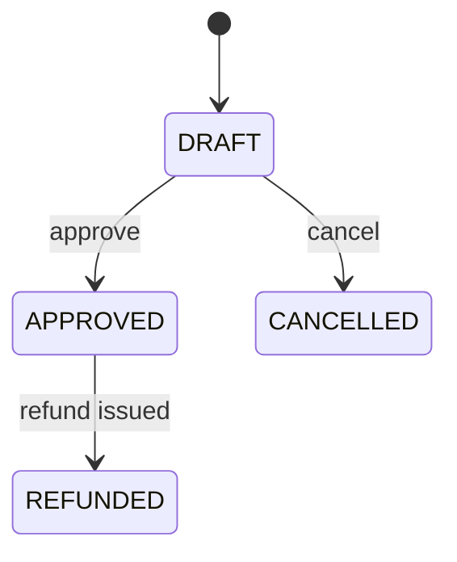

# Sales — Functional Guide

**One-line purpose:** Bill customers at the counter, collect payment, reduce stock by batch, and handle returns — the retail face of the pharmacy.

**Parent:** [Functional overview](./functional-overview.md)

---

## What it does

Sales is the **retail counter module**. There is no sales order or quotation in v1 — billing starts directly on `SalesInvoice`. Posting an invoice is the moment stock leaves the branch and revenue is recognized.

Responsibilities:

- Create and post customer invoices with batch traceability.
- Resolve branch selling prices and snapshot them on lines.
- Allocate stock using FEFO at the selling branch.
- Record payments and track settlement status.
- Process customer returns linked to original invoices.
- Support OTC, prescription-linked, cash, credit, and mixed payments.

---

## Key concepts

| Term | Plain English |
|------|---------------|
| **SalesInvoice** | Customer bill — header totals, status, payment summary |
| **SalesInvoiceItem** | Line with batch, qty, snapshotted price and tax |
| **SalesPayment** | Money received against an invoice |
| **SalesReturn** | Return header referencing a posted invoice |
| **Post** | DRAFT → POSTED; triggers stock OUT and price snapshot |
| **FEFO** | First Expiry First Out batch allocation |
| **Price snapshot** | Line price/tax frozen at post — never re-read from master |

**Two independent state dimensions:**

- **Document `status`:** DRAFT, POSTED, PARTIALLY_RETURNED, RETURNED, CANCELLED
- **`paymentStatus`:** UNPAID, PARTIALLY_PAID, PAID, REFUNDED

---

## Sub-flows

### Counter sale (OTC)

### Invoice document states

### Sales return

On approve: IN StockMovement, update invoice status, adjust payment/refund.

---

## Rules and variations

| Rule | Detail |
|------|--------|
| Post requires lines | At least one item |
| Posted immutable | Corrections via return or controlled cancel |
| FEFO at post | Not at draft add-line |
| Price from PriceListItem | Snapshot on post |
| MRP cap | If `ENFORCE_MRP_CAP`: unitPrice ≤ batch MRP |
| Schedule H | **Planned:** block post when schedule requires Rx and none linked; today only optional `prescriptionId` FK |
| Return qty cap | Cannot exceed sold minus prior returns |
| Expired return | Rejected unless `ALLOW_EXPIRED_CUSTOMER_RETURN` |

**Workflow variations:**

| Scenario | Key behavior |
|----------|--------------|
| OTC cash sale | Payment via separate SalesPayment after post (invoice may stay UNPAID until paid) |
| Prescription sale | Link prescription FK; Schedule H enforcement **Planned** |
| Credit sale | Post UNPAID; pay later via SalesPayment |
| Mixed payment | Cash + UPI + card on same invoice |
| Loyalty | Earn/redeem on post (see Loyalty module) |
| Exchange | Return + new invoice (two operations) |
| Cancel posted | Manager reversal of stock and payments |

**Payment methods:** CASH, CARD, UPI, CHEQUE, BANK, CREDIT, MIXED.

**Implemented vs Planned (sales-specific):**

- **Implemented:** Draft/post invoice, FEFO stock OUT, price snapshot, SalesPayment, sales return with **RESTOCK only**, refund via return when `refundMode` set.
- **Planned:** Round-off at finalise, payment captured automatically at post, Schedule-H / controlled-drug check, prescription dispense status update, quarantine/expired return disposition, standalone invoice refund, cash-drawer reconciliation.

---

## Permissions summary

| Permission | Use |
|------------|-----|
| `SALES:SALES_INVOICE:CREATE` | Draft, edit, post, record payment |
| `SALES:SALES_INVOICE:READ` | View invoices, lines, payments, returns |
| Return approve | Manager permission (future) |
| Price list edit | Pricing admin — not counter staff |

Branch isolation: user must belong to invoice branch.

---

## Integrations

| Module | Connection |
|--------|------------|
| **Inventory** | OUT on post; IN on return approve; FEFO |
| **Pricing** | PriceListItem + Tax at post; snapshot on lines |
| **Finance** | Revenue, GST, receivable/cash, COGS on post |
| **Party Management** | Optional customerId; credit check |
| **Prescription** | Optional prescriptionId for Rx sales |
| **Loyalty** | Points on post |
| **Configuration** | Receipt prefix, printer, default payment mode |

---

## Maturity & known gaps

**Status: Partial**

Core billing and returns work; compliance and payment polish gaps remain. Admin invoice screens exist; counter/POS UX is Planned.

See Backend / UI / UX columns: [implementation-status.md — Sales](./implementation-status.md#sales).

---

## References

- [Sales domain](../domain/sales.md)
- [Sales tables](../database/tables/sales/sales.md)
- [Sales workflow](../workflows/sales-flow.md)
