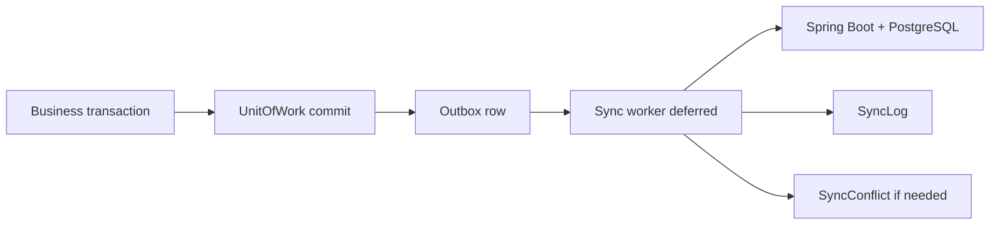
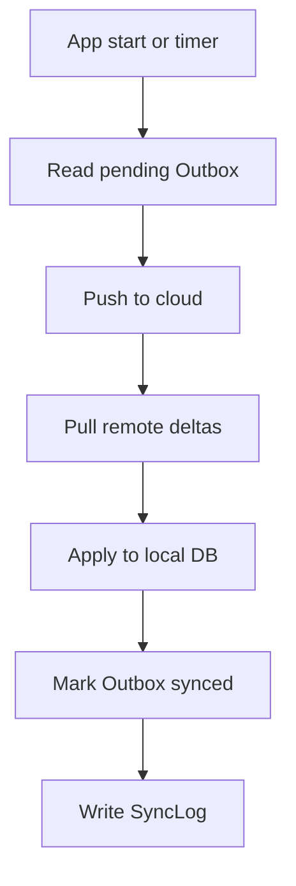

# Synchronization — Functional Guide

**One-line purpose:** Keep the local pharmacy database in sync with the cloud using reliable delta sync — so branches work offline and changes upload when connectivity returns.

**Parent:** [Functional overview](./functional-overview.md)

---

## What it does

Synchronization enables **offline-first operation**. During daily work, SQLite on the desktop is the source of truth. Every business mutation also writes an **Outbox** row in the same transaction. A background worker (deferred in v1) will push those changes to the cloud and pull updates from other branches.

Responsibilities:

- Queue local CREATE/UPDATE/DELETE with idempotent operation identity.
- Order events per device via `sequenceNo`.
- Log sync sessions and failures.
- Capture and resolve conflicts when the same entity changed locally and remotely.

---

## Key concepts

| Term | Plain English |
|------|---------------|
| **Outbox** | Pending change queue — written atomically with business write |
| **entityUuid** | Cross-device identity (never local BigInt id) |
| **operationId** | Idempotency key for retry safety |
| **sequenceNo** | Per-device ordering of outbox events |
| **SyncLog** | History of sync sessions (counts, errors, duration) |
| **SyncConflict** | Same entityUuid modified in two places before sync |
| **Delta sync** | Send only changed records — never full DB upload |

---

## Sub-flows

### Outbox write (every post)

Inside `UnitOfWork.run(tx)`:

1. Business rows committed.
2. `OutboxService.enqueue(tx, { entityType, entityUuid, operation, payload })`.
3. Payload includes `entityVersion` for conflict detection.
4. `deviceId` + `sequenceNo` allocated in same transaction.

### Sync cycle (planned)

Triggers: app start, interval (`SYNC_INTERVAL_MINUTES` default 15), manual sync, network reconnect.

---

## Rules and variations

| Rule | Detail |
|------|--------|
| Atomic outbox | Business + outbox same transaction |
| UUID identity | Sync keys on `uuid` / `entityUuid` |
| Idempotent replay | Same `operationId` safe on retry |
| Ordered per device | `sequenceNo` on outbox |
| Never delete outbox immediately | Mark completed; retention policy |

**Conflict resolution by entity type:**

| Entity | Rule |
|--------|------|
| Inventory / stock | Transaction-based; never blind overwrite |
| Customer details | Last write wins may be acceptable |
| Medicine master | Prefer server authority |
| Masters generally | Version check; optimistic lock |

**Worker status:** Sync drain worker is **deferred** — outbox contract is implemented; background processor not yet shipped.

---

## Permissions summary

Sync is a **system process**, not a user-facing permission. Admin may trigger manual sync when UI exists. Configuration via `SYNC_INTERVAL_MINUTES` setting.

---

## Integrations

| Module | Connection |
|--------|------------|
| **All posting modules** | Every post enqueues outbox |
| **Configuration** | `deviceId`, sync interval |
| **Audit** | SYNC action in AuditLog; outbox is not audit |
| **User & Security** | Device id in request context |

---

## Maturity & known gaps

**Status: Partial**

Outbox and conflict entities exist; production sync worker and conflict UI are Planned. No Angular UI module yet.

See Backend / UI / UX columns: [implementation-status.md — Synchronization](./implementation-status.md#synchronization).

---

## References

- [Data and sync](../architecture/data-and-sync.md)
- [Early foundations — outbox contract](../architecture/early-foundations.md#outbox-sync-contract)
- [Synchronization tables](../database/tables/synchronization/synchronization.md)
- [Persistence patterns — outbox](../database/persistence-patterns.md#outbox)
