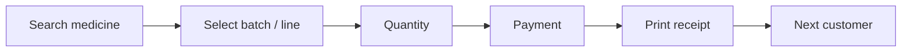

# User Experience — Functional Guide

**One-line purpose:** Design screens around how pharmacists actually work — fast keyboard billing, clear feedback, minimum clicks.

**Parent:** [Functional overview](./functional-overview.md)

---

## What it does

The ERP is a **desktop-first** tool for high-volume counter work. UX priorities:

- Minimum clicks to complete a sale
- Large touch targets where touch screens are used
- Consistent layouts across modules
- Clear validation messages (linked to [error codes](./error-codes.md))
- Fast medicine and customer search
- Undo or cancel where safe (draft documents)

Guiding principle:

> Design around the pharmacist's workflow, not the database schema.

---

## Key concepts

| Term | Plain English |
|------|---------------|
| **Keyboard-first** | Core flows work without a mouse |
| **Workflow-driven UI** | Screens follow task order, not menu taxonomy |
| **Cashier flow** | Search → select → qty → payment → print → next customer |
| **Placeholder shortcuts** | F-keys mapped in early foundations; full binding Planned |

---

## Cashier flow (target)

Avoid forcing users to leave the billing screen for routine steps (customer lookup, payment, print).

---

## Keyboard shortcuts (placeholders)

Documented in [early foundations](../architecture/early-foundations.md#keyboard-shortcuts-placeholders):

| Key | Intended action |
|-----|-----------------|
| F2 | New sale |
| F4 | Search medicine |
| F8 | Payment |
| Ctrl+S | Save draft |
| Esc | Cancel / back |

Full shortcut map and Angular command palette are **Planned**.

---

## UX goals

- **Speed** — sub-second search on local SQLite
- **Clarity** — show batch expiry and stock at selection time
- **Resilience** — offline operation; sync is background
- **Confidence** — confirm destructive actions (post, approve, cancel posted)
- **Accessibility** — readable fonts, focus order for keyboard users

---

## Module-specific UX notes

### Sales

- Default to walk-in customer; optional customer attach.
- Show MRP, selling price, and Schedule H flag on line entry.
- Payment screen supports mixed modes (cash + UPI).
- After post: print prompt; invoice stays editable only via return/cancel policy.

### Purchase

- PO → GRN wizard reduces free-text batch entry errors.
- GRN line requires batch number and expiry before post.

### Inventory

- Stock inquiry by medicine name, code, or barcode scan.
- Adjustment and transfer use document states visible in header.

### Reporting

- Report picker grouped by category (party, sales, …).
- Export button duplicates run with `format=pdf|xlsx`.

---

## Rules and variations

| Rule | Detail |
|------|--------|
| Angular 19 SPA | Rendered inside Electron webview |
| API envelope | UI handles `{ success, data }` and error codes consistently |
| Branch context | User's active branch filters lists |
| i18n | Structure ready; English primary in v1 |

---

## Integrations

| Area | Connection |
|------|------------|
| **Integrations and devices** | Print and scan from billing screen |
| **User & Security** | Role hides menu entries user cannot access |
| **Configuration** | Receipt template and printer from settings |

---

## Maturity & known gaps

**Platform UX: Partial** — Admin list/detail screens exist across most modules (**UI Implemented**); dedicated cashier/POS flow, wired keyboard shortcuts, and print/scan integration remain **UX Planned**.

See Backend / UI / UX columns in [implementation-status.md](./implementation-status.md#platform-shell) and [Sales](./implementation-status.md#sales) for billing UX gaps.

---

## References

- [Product & UX architecture](../architecture/product-ux.md)
- [Application architecture](../architecture/application-architecture.md)
- [Sales module](./sales.md)
- [Integrations and devices](./integrations-and-devices.md)
