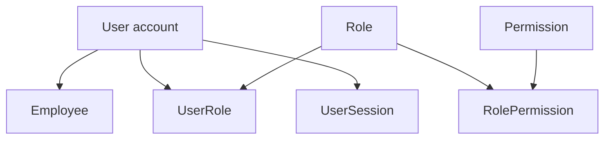
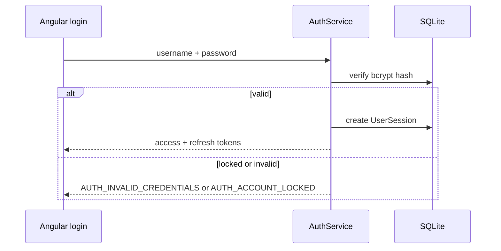

# User & Security — Functional Guide

**One-line purpose:** Control who can log in, what they can do, and how sessions are tracked — with permissions enforced in the backend, not only in the UI.

**Parent:** [Functional overview](./functional-overview.md)

---

## What it does

User & Security governs **authentication** (proving identity) and **authorization** (what actions are allowed). Every staff member who uses the ERP has a **User** account linked to an **Employee** record. Access is granted through **Roles** that bundle fine-grained **Permissions**.

Responsibilities:

- Login with username/password; issue JWT access and refresh tokens.
- Lock accounts after repeated failed attempts.
- Track active sessions per device.
- Enforce `MODULE:RESOURCE:ACTION` permissions on every protected API call.
- Scope operations to the user's company and branch from JWT claims.

---

## Key concepts

| Term | Plain English |
|------|---------------|
| **User** | Login account — username, hashed password, lockout state |
| **Employee** | Staff master (Party Management) — one User per Employee max |
| **Role** | Named bundle: Administrator, Pharmacist, Cashier, Manager, Procurement |
| **Permission** | Single allowed action, e.g. `SALES:SALES_INVOICE:CREATE` |
| **UserRole** | Which roles a user holds (may be multiple) |
| **RolePermission** | Which permissions each role includes |
| **UserSession** | Active login — refresh token, device id, expiry |
| **JWT** | Short-lived access token (15 min) carrying user, branch, permissions |

---

## Sub-flows

### Login

Optional `branchId` on login selects working branch; default is head office.

### Request authorization

Every HTTP request (except login/refresh):

1. `JwtAuthGuard` validates Bearer token.
2. `ContextEnrichInterceptor` sets `userId`, `companyId`, `branchId` from JWT.
3. `PermissionsGuard` checks `@RequirePermissions()` on the handler.

**Production rule:** Never trust client `x-branch-id` headers — branch comes from JWT only.

### Session refresh

Refresh token (7-day session) exchanges for new access + refresh tokens without re-entering password.

---

## Rules and variations

| Rule | Detail |
|------|--------|
| Password storage | bcrypt (10 rounds); never plain text |
| Lockout | 5 failed attempts → 15-minute lock |
| Permission format | `MODULE:RESOURCE:ACTION` |
| Backend enforcement | UI hiding buttons is supplementary only |
| One User per Employee | Not every employee needs system access |
| System permissions | Seeded permissions cannot be deleted by tenant admin |
| Token cache | Permissions in JWT until access token expires (15 min) |

**Seeded demo roles:** Administrator, Pharmacist, Cashier, Manager, Procurement. Demo password `admin123` after seed.

**Variations:**

- User may hold multiple roles — permissions union across roles.
- Role changes require re-login or refresh to pick up new permissions in JWT.
- Electron stores tokens via `secureStore` (encrypted when available).

---

## Permissions summary (examples)

| Permission | Typical role |
|------------|--------------|
| `SALES:SALES_INVOICE:CREATE` | Cashier, Pharmacist |
| `SALES:SALES_INVOICE:READ` | All counter staff |
| `PURCHASE:PURCHASE_ORDER:CREATE` | Procurement, Manager |
| `INVENTORY:STOCK:READ` | Pharmacist |
| `PARTY:PARTY:UPDATE` | Admin, master data clerk |
| `CONFIGURATION:APP_SETTING:READ` | Admin |
| `REPORT:REPORT:READ` | Manager, Admin |

Full permission list lives in seed data and grows per module.

---

## Integrations

| Module | Connection |
|--------|------------|
| **Party Management** | User → Employee → Party |
| **All transactional modules** | Branch scope from JWT; permission gates on post/approve |
| **Audit** | Login/logout and security events audited |
| **Configuration** | Settings API requires `CONFIGURATION:APP_SETTING:*` |
| **Angular client** | `authInterceptor` attaches Bearer + `x-device-id` |

---

## Maturity & known gaps

**Status: Implemented**

JWT, RBAC, and user admin work; some approve-level permissions and MFA are Planned.

See Backend / UI / UX columns: [implementation-status.md — User & Security](./implementation-status.md#user--security).

---

## References

- [Security](../architecture/security.md)
- [Early foundations — authentication](../architecture/early-foundations.md#authentication-configuration)
- [User & security tables](../database/tables/user_and_security/user_and_security.md)
