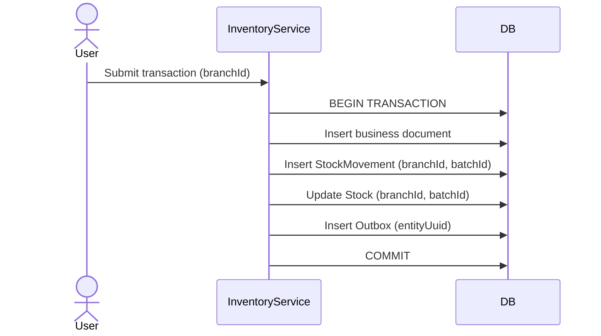

# Inventory Flow

## Business Objective

Track inventory changes through an immutable ledger while maintaining branch-scoped stock balances.

## Data Model (corrected)

- **Batch** — org-global lot identity (no branchId, no saleRate)
- **Stock** — one balance row per `(branchId, batchId)`
- **StockMovement** — append-only ledger at branch level
- **PriceListItem** — branch sale pricing (not Batch)

```text
Batch (org-global)
   └── Stock (per branch)
         └── updated by StockMovement (per branch)
```

## Business Owner

- Pharmacy Manager
- Store Manager
- Inventory Team

## Actors

- User
- Inventory Service
- ERP System

## Trigger

Purchase receipt, sale, return, adjustment, transfer, or stock take.

## Preconditions

- User authenticated with branch selected
- Batch exists (org-global) or is created on GRN
- Stock row exists or is created for `(branchId, batchId)`

## Main Flow

1. Validate branch context and permissions.
2. Resolve Batch (org-global) and branch Stock balance.
3. Validate business rules (FEFO, expiry, available quantity).
4. Begin database transaction.
5. Create business document (invoice, adjustment, etc.).
6. Create **StockMovement** (branchId, batchId, IN/OUT).
7. Update **Stock** quantities for that branch.
8. Write **Outbox** record with `entityUuid` in same transaction.
9. Commit transaction.
10. Write audit trail.

## Alternate Flows

- Insufficient stock at branch → reject or partial fulfil
- Expired batch → block sale
- Adjustment requires approval

## Exception Handling

- Rollback entire transaction (document + movement + stock + outbox)
- Log error; no partial stock update

## Business Rules

- Never update Stock directly — always via StockMovement.
- StockMovement records are immutable.
- Batch 1:N Stock (one balance per branch per lot).
- Document numbers are branch-scoped.

## Database Tables

- Batch, Stock, StockMovement
- StockAdjustment, StockTransfer, StockTake (+ items)
- Outbox, AuditLog

## Permissions

- View stock, Create movement, Approve adjustment/transfer

## Mermaid Sequence



## Future Improvements

- Predictive replenishment per branch
- Automated FEFO allocation
