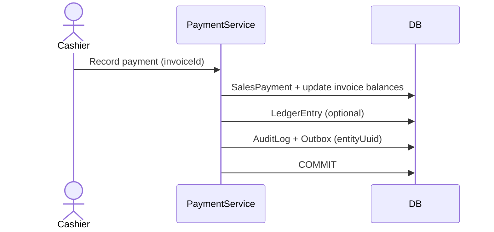

# Payment Flow

## Business Objective

Record customer receipts and supplier payments, update invoice balances, and post ledger entries without breaking inventory integrity.

## Data Model

- **SalesPayment** — payments against `SalesInvoice` (Cash, UPI, Card, Credit, Split)
- **Receipt** — formal incoming money document (finance)
- **Payment** — outgoing money to suppliers (finance)
- **LedgerEntry** — double-entry journal lines from posted payments/receipts
- **SalesInvoice.paymentStatus** — `UNPAID`, `PARTIALLY_PAID`, `PAID`, `REFUNDED`

## Business Owner

- Finance
- Store Manager
- Cashier

## Actors

- Cashier / Accountant
- FinanceService
- UnitOfWork

## Trigger

Customer pays at sale, partial payment on credit invoice, supplier payment against purchase invoice, or refund on return.

## Preconditions

- User authenticated with branch context
- Source invoice posted and not cancelled
- Permission for payment create (finance / sales as applicable)

## Main Flow (customer receipt at sale)

1. Post or open `SalesInvoice` with `paymentStatus` default.
2. Create `SalesPayment` row(s) for each mode (Cash + UPI split).
3. Update `SalesInvoice.paidAmount`, `balanceAmount`, `paymentStatus`.
4. Optional: create `Receipt` + `LedgerEntry` pair for accounting.
5. `AuditService.log` + `Outbox` with `entityUuid` in same transaction.
6. Commit.

## Main Flow (supplier payment)

1. Select posted `PurchaseInvoice` with outstanding balance.
2. Create `Payment` with mode, amount, reference.
3. Post `LedgerEntry` (supplier account credit, bank/cash debit).
4. Audit + outbox atomically.

## Alternate Flows

- Partial payment → `PARTIALLY_PAID` until balance zero
- Overpayment → reject or store as advance (policy)
- Refund on sales return → `REFUNDED` or offset against new payment

## Exception Handling

- Rollback entire transaction — no partial payment without invoice update
- Idempotent payment reference where gateway provides transaction id

## Business Rules

- Payment amounts cannot exceed invoice balance without approval
- Mixed modes sum to payment total
- Financial posting must balance (debit = credit) in `LedgerEntry`
- Never adjust stock in payment flow

## Database Tables

- SalesPayment, SalesInvoice
- Payment, Receipt, Ledger, LedgerEntry
- AuditLog, Outbox

## Permissions

- Sales payment at counter — `SALES:SALES_INVOICE:CREATE`
- Finance payment/receipt — finance permissions (seed expanding)

## Mermaid Sequence

## Related

- [Sales flow](./sales-flow.md)
- [Finance domain](../domain/finance/README.md)
