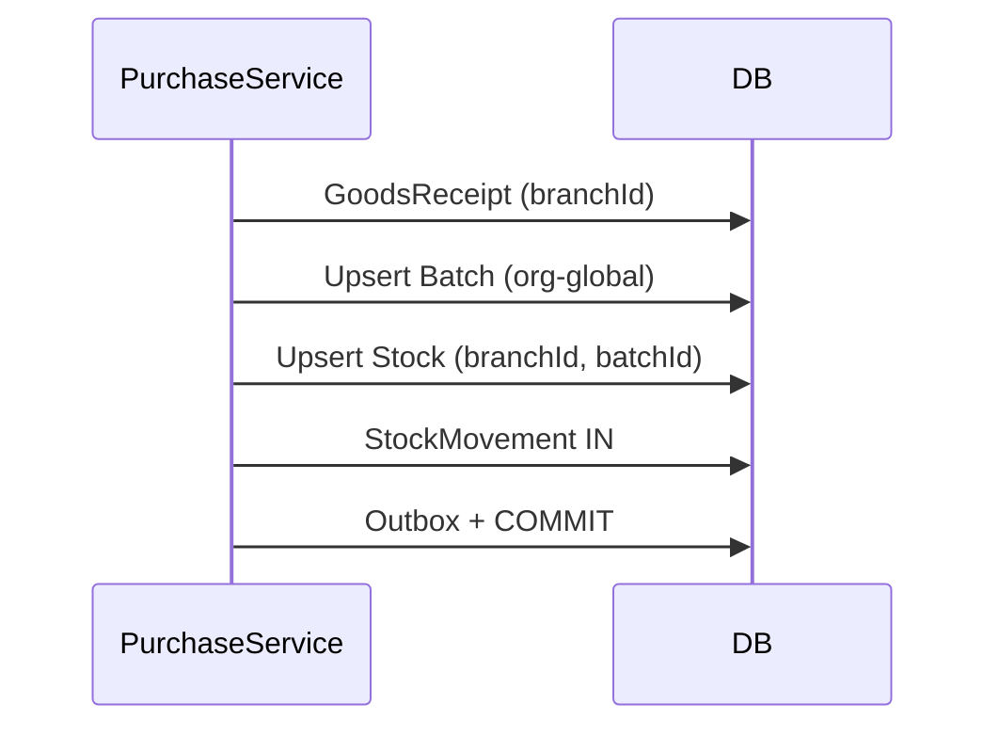

# Purchase Flow

## Business Objective

Procure medicines, create or match org-global Batch records, and increase branch Stock on receipt.

## Data Model

- **Batch** — created or matched org-globally on GRN (`@@unique([medicineId, batchNumber])`)
- **Stock** — created/updated at receiving `(branchId, batchId)`
- **Batch.purchaseRate** — lot cost snapshot at receipt (not sale price)

## Business Owner

- Pharmacy Manager
- Store Manager
- Finance

## Main Flow

1. Create PurchaseOrder (branchId).
2. Receive goods (GoodsReceipt at branch).
3. For each line: find or create **Batch** (org-global).
4. Create or update **Stock** at `(branchId, batchId)`.
5. Create StockMovement IN (branchId, batchId, unitCost from purchase).
6. Post PurchaseInvoice; link to GRN.
7. Write Outbox atomically.

## Business Rules

- GRN and invoice are branch-scoped.
- Batch is shared org-wide; Stock is per branch.
- Same batch received at another branch later adds/updates that branch's Stock row.
- Document numbers (PO, GRN, invoice) unique per branch.

## Database Tables

- PurchaseOrder, GoodsReceipt, PurchaseInvoice (+ items)
- Batch, Stock, StockMovement
- Branch, Outbox

## Mermaid Sequence



## Chain

```text
PurchaseOrder (branch)
    → GoodsReceipt (branch)
        → Batch (org-global, purchaseRate)
        → Stock (branchId + batchId)
        → StockMovement IN
    → PurchaseInvoice (branch)
```
