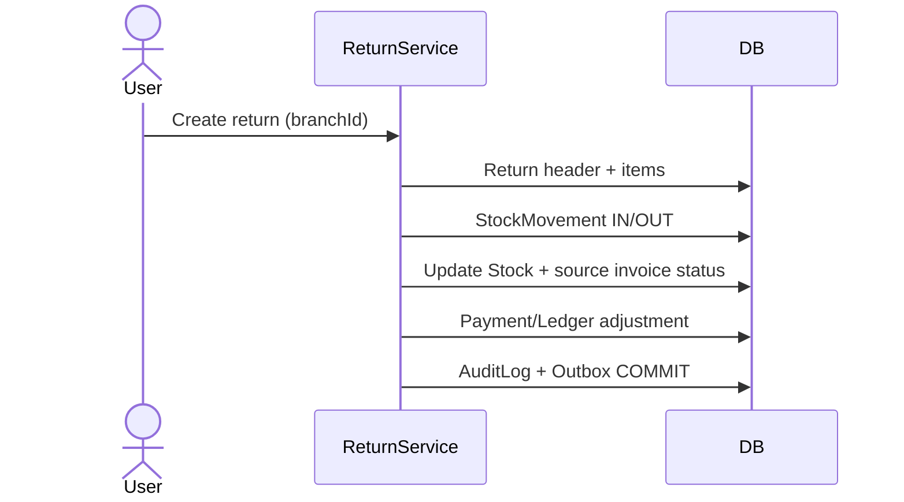

# Return Flow

## Business Objective

Handle sales and purchase returns with correct stock reversal, financial adjustment, and audit trail while preserving original transaction snapshots.

## Data Model

- **SalesReturn** + **SalesReturnItem** — customer return against `SalesInvoice`
- **PurchaseReturn** + **PurchaseReturnItem** — return to supplier against `PurchaseInvoice`
- **StockMovement** — IN for sales return (restockable), OUT for purchase return
- **Stock** — updated at `(branchId, batchId)`
- Original line items retain historical price — return lines reference original batch/qty

## Business Owner

- Store Manager
- Finance
- Pharmacist (approval for Schedule H)

## Actors

- Cashier
- Purchase clerk
- ReturnService / UnitOfWork

## Trigger

Customer brings goods back, or pharmacy returns stock to supplier (expiry, damage, recall).

## Preconditions

- Original invoice posted and within return policy window
- Batch not blocked (recall rules)
- User has return create permission
- Branch context matches original sale/purchase

## Main Flow (sales return)

1. Load original `SalesInvoice` and items.
2. Create `SalesReturn` linked to invoice; set reason and approval if required.
3. Add `SalesReturnItem` lines (batchId, qty ≤ sold qty).
4. For restockable lines: `StockMovement` IN at branch; increase `Stock`.
5. Update invoice status → `PARTIALLY_RETURNED` or `RETURNED`.
6. Process refund via `SalesPayment` negative or new payment with `REFUNDED` status.
7. Optional loyalty point reversal via `LoyaltyTransaction`.
8. Audit + Outbox (`entityUuid`) in same transaction.

## Main Flow (purchase return)

1. Load `PurchaseInvoice` and items.
2. Create `PurchaseReturn` + items with batch and qty.
3. `StockMovement` OUT at branch; decrease `Stock`.
4. Supplier credit note / adjust supplier balance in ledger.
5. Audit + Outbox atomically.

## Business Rules

- Cannot return more than sold/received quantity per line
- Expired goods may be non-restockable (movement to quarantine/expired bucket — policy)
- Return document numbers unique per branch
- Price/tax on return lines snapshot from original or policy rate
- Schedule H returns may require pharmacist approval

## Database Tables

- SalesReturn, SalesReturnItem / PurchaseReturn, PurchaseReturnItem
- SalesInvoice, PurchaseInvoice
- Stock, StockMovement, Batch
- SalesPayment, LedgerEntry
- AuditLog, Outbox

## Permissions

- Sales return — `SALES:SALES_INVOICE:CREATE` (extend with RETURN action when seeded)
- Purchase return — `PURCHASE:PURCHASE_ORDER:CREATE` or dedicated return permission

## Mermaid Sequence

## Related

- [Sales flow](./sales-flow.md)
- [Purchase flow](./purchase-flow.md)
