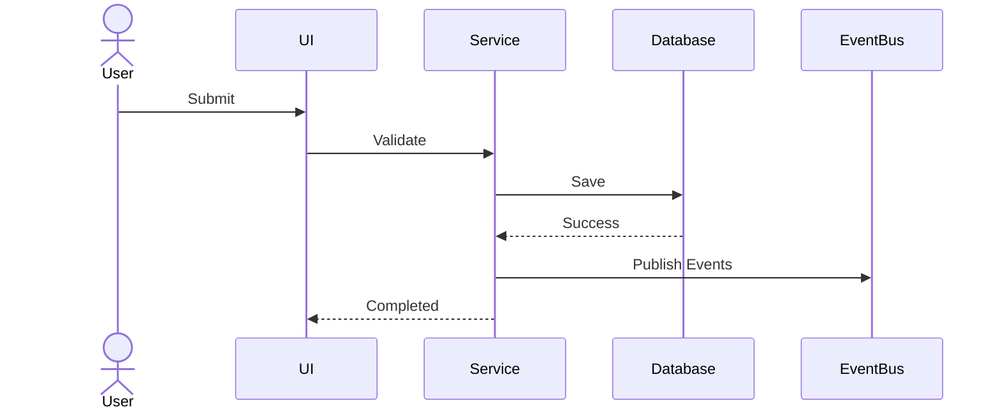

# Return Flow

## Business Objective
Sales and purchase return handling.

## Business Owner
- Pharmacy Manager
- Store Manager
- Finance
- Inventory Team

## Actors
- User
- ERP System
- Inventory Service
- Finance Service
- Reporting Service

## Trigger
Business action initiates this workflow.

## Preconditions
- User authenticated
- Permissions validated
- Master data exists
- Company and branch selected

## Main Flow
1. Validate request.
2. Load master data.
3. Validate business rules.
4. Execute transaction.
5. Persist database changes.
6. Publish domain events.
7. Update reports and dashboards.
8. Write audit trail.
9. Notify dependent modules.

## Alternate Flows
- Validation failure
- Duplicate transaction
- Stock unavailable
- Approval rejected

## Exception Handling
- Rollback transaction
- Log technical error
- Create audit record
- Display user-friendly message

## Business Rules
- Soft delete only.
- Every transaction is auditable.
- No direct stock manipulation outside approved workflows.
- Financial impact must be traceable.

## Database Tables
- Product
- Stock
- Batch
- User
- AuditLog
- Transaction specific tables

## Domain Events
- WorkflowStarted
- ValidationCompleted
- TransactionCommitted
- NotificationPublished

## Permissions
- View
- Create
- Edit
- Approve
- Cancel

## KPIs
- Processing time
- Error rate
- Approval time
- Throughput

## Mermaid Sequence

## Future Improvements
- AI recommendations
- Predictive analytics
- Automation
- Offline synchronization
