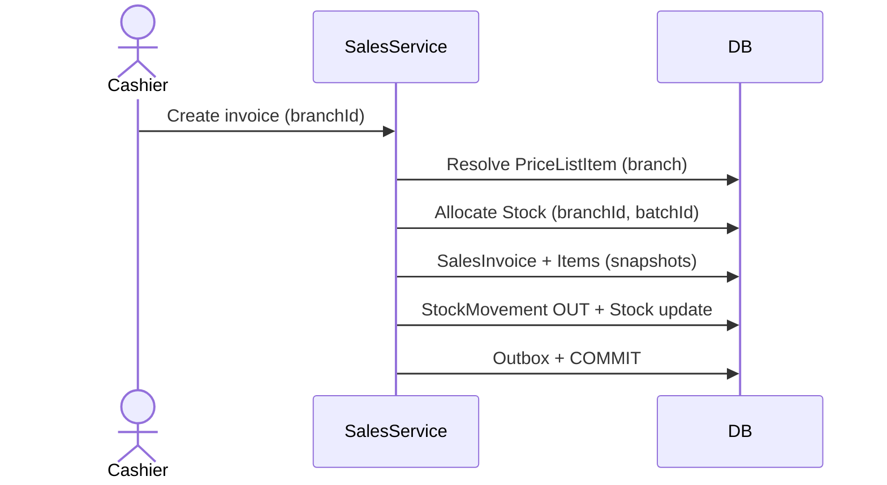

# Sales Flow

## Business Objective

Bill customers, allocate branch stock by batch (FEFO), and snapshot prices at sale time.

## Data Model

- **Stock** — check `(branchId, batchId).availableQuantity`
- **PriceListItem** — branch sale price (not Batch.saleRate)
- **Batch** — expiry, statutory MRP, lot cost only
- **SalesInvoiceItem** — snapshots rate, MRP, tax at sale

## Business Owner

- Pharmacy Manager
- Store Manager
- Finance

## Main Flow

1. Select branch and customer.
2. Resolve branch PriceList → PriceListItem.sellingPrice per medicine.
3. Allocate batches at branch (FEFO from Stock + Batch.expiryDate).
4. Validate branch stock availability.
5. Begin transaction: SalesInvoice + items (price snapshots).
6. Create StockMovement OUT per line (branchId, batchId).
7. Update branch Stock balances.
8. Record SalesPayment if applicable.
9. Write Outbox (entityUuid) atomically.
10. Commit.

## Business Rules

- Sales consume branch Stock — not org-global Batch quantity.
- Selling price from PriceListItem; Batch has no saleRate.
- Line items snapshot prices for audit/history.
- invoiceNumber unique per branch.

## Database Tables

- SalesInvoice, SalesInvoiceItem, SalesPayment
- Stock, StockMovement, Batch
- PriceList, PriceListItem
- Outbox, AuditLog

## Mermaid Sequence

