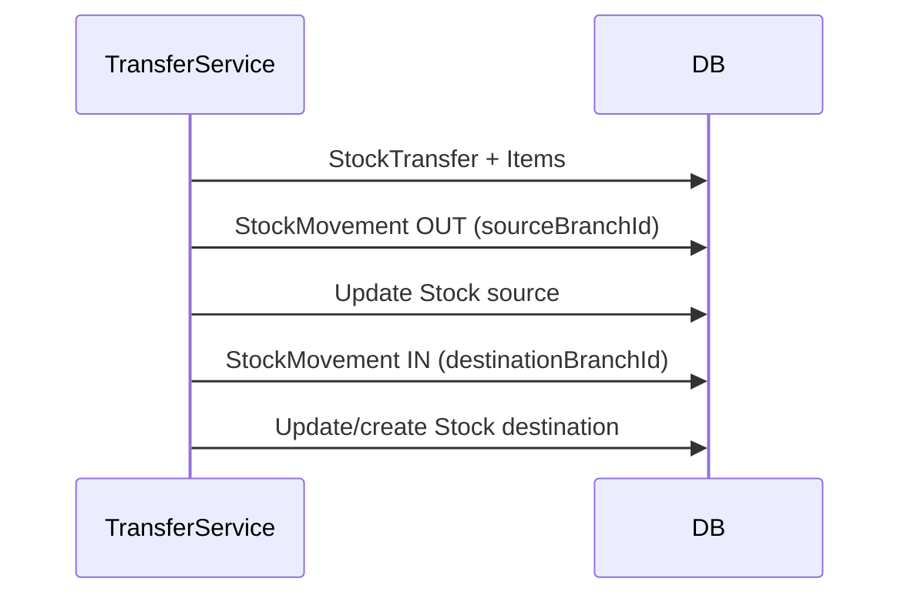

# Stock Transfer

## Business Objective

Move inventory between branches while preserving org-global Batch identity and separate branch Stock balances.

## Data Model

- **Batch** — org-global (same lot at both branches)
- **Stock** — `(sourceBranchId, batchId)` decreases; `(destinationBranchId, batchId)` increases
- **transferNumber** — unique per source branch: `@@unique([sourceBranchId, transferNumber])`

## Business Owner

- Pharmacy Manager
- Store Manager
- Inventory Team

## Main Flow

1. Create StockTransfer (sourceBranchId, destinationBranchId).
2. Add StockTransferItems (batchId, sentQuantity).
3. Validate source branch Stock.availableQuantity.
4. Approve transfer.
5. **Dispatch:** create StockMovement OUT at source branch; reduce source Stock; optionally increase `inTransitQuantity`.
6. **Receipt:** create StockMovement IN at destination branch; create or update destination Stock row.
7. Write Outbox records atomically.

## Business Rules

- Source and destination branches must differ.
- Cannot transfer more than source branch available stock.
- Same Batch can have Stock at both branches simultaneously.
- Cancelled transfers create no movements.

## Database Tables

- StockTransfer, StockTransferItem
- Stock, StockMovement, Batch, Branch
- Outbox

## Status Lifecycle (String fields)

DRAFT → PENDING_APPROVAL → DISPATCHED → IN_TRANSIT → COMPLETED (or REJECTED / CANCELLED)

## Mermaid Sequence

