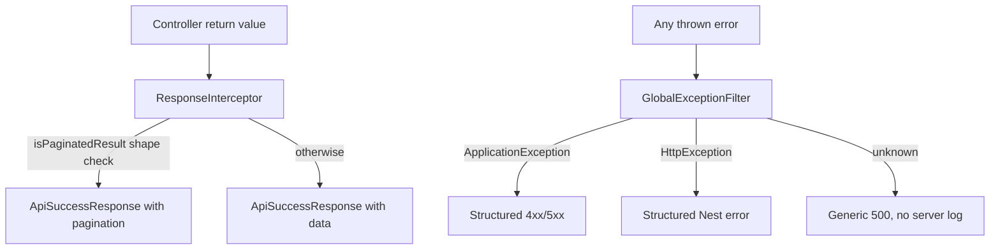

# Common Module Hardening Plan

Based on the review of [`backend/src/common`](backend/src/common), three changes are worth implementing. The `ErrorCode` value/type naming is intentional and needs no change.

## Current flow



## 1. Log unexpected 500 errors

**Problem:** Tier 3 in [`global-exception.filter.ts`](backend/src/common/exceptions/global-exception.filter.ts) returns a generic client message but never logs the underlying exception, making production debugging difficult.

**Change:**
- Inject Nest `Logger` into `GlobalExceptionFilter`.
- In the unknown-exception branch, call `this.logger.error(...)` with the exception and stack trace.
- Keep the client response unchanged (`INTERNAL_SERVER_ERROR`, generic message, `details: null`) to avoid leaking internals.

**Suggested log shape:**
```ts
this.logger.error(
  'Unhandled exception',
  exception instanceof Error ? exception.stack : String(exception),
);
```

## 2. Register filter/interceptor via DI

**Problem:** [`main.ts`](backend/src/main.ts) currently does `new GlobalExceptionFilter()` and `new ResponseInterceptor()`, which blocks dependency injection (required for `Logger`).

**Change:**
- Register globals in [`app.module.ts`](backend/src/app.module.ts) using Nest providers:

```ts
{ provide: APP_FILTER, useClass: GlobalExceptionFilter },
{ provide: APP_INTERCEPTOR, useClass: ResponseInterceptor },
```

- Remove the corresponding `app.useGlobalFilters(...)` / `app.useGlobalInterceptors(...)` calls from `main.ts`.
- Keep `ValidationPipe` registration in `main.ts` (unchanged).

This is the standard NestJS pattern and keeps bootstrap minimal.

## 3. Replace paginated shape heuristic with explicit marker

**Problem:** [`isPaginatedResult`](backend/src/common/response/paginated-result.ts) treats any `{ data: array, pagination: object }` as paginated, which could misfire if a controller returns an unrelated object with the same shape.

**Change in [`paginated-result.ts`](backend/src/common/response/paginated-result.ts):**
- Convert `PaginatedResult<T>` from a plain interface into a small class:

```ts
export class PaginatedResult<T> {
  constructor(
    readonly data: T[],
    readonly pagination: Pagination,
  ) {}

  static of<T>(data: T[], pagination: Pagination): PaginatedResult<T> {
    return new PaginatedResult(data, pagination);
  }
}
```

- Update `isPaginatedResult` to use `value instanceof PaginatedResult`.
- Keep exporting the same public shape so [`response.interceptor.ts`](backend/src/common/interceptors/response.interceptor.ts) needs only the import/type-guard update, not logic changes.

**Usage convention (for future list endpoints):**
```ts
return PaginatedResult.of(items, { page, pageSize, total, totalPages });
```

No existing controllers use pagination yet, so this is a forward-looking change with zero migration cost today.

## 4. Add focused unit tests

There are no tests under `backend/src/common` today. Add lightweight specs to lock in behavior:

| File | Cases |
|------|-------|
| `global-exception.filter.spec.ts` | `ApplicationException`, `HttpException` (string + validation array), unknown error returns 500 + logs |
| `paginated-result.spec.ts` | `PaginatedResult.of` + `isPaginatedResult` true/false for plain objects |
| `response.interceptor.spec.ts` | Wraps plain data; unwraps `PaginatedResult` with pagination |

Use `@nestjs/testing` + mock `ArgumentsHost` / `CallHandler` (same style as existing specs in [`backend/src/app.controller.spec.ts`](backend/src/app.controller.spec.ts)).

## Optional small follow-up (out of scope unless you want it)

- Type `ApplicationException.code` as `ErrorCode` instead of `string` in [`application.exception.ts`](backend/src/common/exceptions/application.exception.ts) for stronger compile-time checks against [`error-code.ts`](backend/src/common/exceptions/error-code.ts).

## Files to touch

- [`backend/src/common/exceptions/global-exception.filter.ts`](backend/src/common/exceptions/global-exception.filter.ts) — add `Logger`, log tier-3 errors
- [`backend/src/app.module.ts`](backend/src/app.module.ts) — register `APP_FILTER` / `APP_INTERCEPTOR`
- [`backend/src/main.ts`](backend/src/main.ts) — remove manual `new ...()` registrations
- [`backend/src/common/response/paginated-result.ts`](backend/src/common/response/paginated-result.ts) — class + `instanceof` guard
- New: `backend/src/common/exceptions/global-exception.filter.spec.ts`
- New: `backend/src/common/response/paginated-result.spec.ts`
- New: `backend/src/common/interceptors/response.interceptor.spec.ts`

## Verification

- Run `npm test` in `backend/` — new unit specs pass
- Run `npm run build` — no type errors from `PaginatedResult` class change
- Manual smoke: hit a known route and confirm success envelope unchanged; trigger a thrown `Error` and confirm 500 response + server log output
