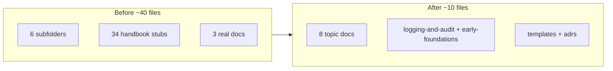

# Consolidate the architecture docs

## Goal
Reduce `docs/pharmacy_erp_architecture_docs/architecture/` from ~40 files (mostly 10-20 line verbatim handbook stubs) to ~8 consolidated topic docs plus the implementation-backed docs. Flatten the six single-purpose subfolders. Keep the consolidated topic docs as the source of truth; mark the monolithic `docs/pharmacy_erp_architecture_handbook.md` as a legacy archive (not deleted).

## Why
Almost every file is a one-section slice of the handbook (`> Source: Original Architecture Handbook`), so the same content is fragmented across dozens of tiny files and also duplicated whole in the handbook. Only `logging-and-audit.md`, `engineering/early-foundations.md`, and `multi-store.md` carry real, implemented detail.

## Target structure (architecture/)
- `README.md` — NEW index for this folder (single entry point)
- `overview.md` — vision, product goals, system diagram, tech stack, design principles, DDD, event-driven
- `application-architecture.md` — Angular, Electron, NestJS layering, API design
- `product-ux.md` — UX guidelines, keyboard-first, workflow-driven UI
- `data-and-sync.md` — offline-first, synchronization strategy, multi-store (enriched content preserved)
- `integrations.md` — hardware, printing, barcode, reporting
- `engineering-standards.md` — coding standards, testing, CI/CD, error handling, performance, observability, telemetry, feature flags, backup/recovery, release checklist
- `security.md` — Electron security hardening + auth summary (cross-links to early-foundations)
- `logging-and-audit.md` — KEEP as-is (implemented)
- `early-foundations.md` — MOVE up from `engineering/` (implemented; anchors unchanged)
- `templates/` and `adrs/` — KEEP unchanged

Deletes the ~28 stub files and the now-empty `engineering/`, `guidelines/`, `integrations/`, `security/`, `sync/` folders.

## Content merge map (target <- sources)
- `overview.md` <- `guidelines/vision.md`, `system-overview.md`, `technology-stack.md`, `engineering/design-principles.md`, `domain-driven-design.md`, `event-driven.md`
- `application-architecture.md` <- `angular-architecture.md`, `electron-architecture.md`, `nestjs-architecture.md`, `api-design.md`
- `product-ux.md` <- `guidelines/ux-guidelines.md`, `guidelines/keyboard-first.md`, `guidelines/workflow-driven-ui.md`
- `data-and-sync.md` <- `sync/offline-first.md`, `sync/synchronization.md`, `multi-store.md`
- `integrations.md` <- `integrations/hardware.md`, `integrations/printing.md`, `integrations/barcode.md`, `integrations/reporting.md`
- `engineering-standards.md` <- `engineering/coding-standards.md`, `engineering/testing.md`, `engineering/ci-cd.md`, `engineering/error-handling.md`, `engineering/performance.md`, `engineering/observability.md`, `engineering/telemetry.md`, `engineering/feature-flags.md`, `engineering/backup-recovery.md`, `engineering/engineering-checklist.md`
- `security.md` <- `security/security.md`, `security/authentication.md`
- `engineering/audit-logging.md` -> folds into existing `logging-and-audit.md` (stub deleted; content already covered there)

Content is preserved (deduped, with tightened prose and section headers), not rewritten from scratch. The `> Source: Original Architecture Handbook` banners are dropped since the handbook is now the archive.

## Inbound link fixes (outside architecture/)
- `backend/AGENTS.md` — update `early-foundations` path (was `.../architecture/engineering/early-foundations.md` -> `.../architecture/early-foundations.md`)
- `.cursor/rules/00-project-context.mdc` — update `early-foundations` reference path
- `docs/pharmacy_erp_architecture_docs/database/tables/configuration/64_app_setting.md` — update `early-foundations` path
- `docs/pharmacy_erp_architecture_docs/database/architecture-review.md` — update any architecture/* links it uses
- `docs/pharmacy_erp_architecture_docs/README.md` — rewrite the index to point at the new consolidated files (currently broken)
- `docs/pharmacy_erp_architecture_handbook.md` — add a short "Legacy / archived — see architecture/README.md" note at the top

Historical artifacts under `discussion/` and `plans/` are left untouched.

## Before / after

## Out of scope
- No changes to backend/frontend source code.
- Handbook content is not expanded, only re-pointed and archived.