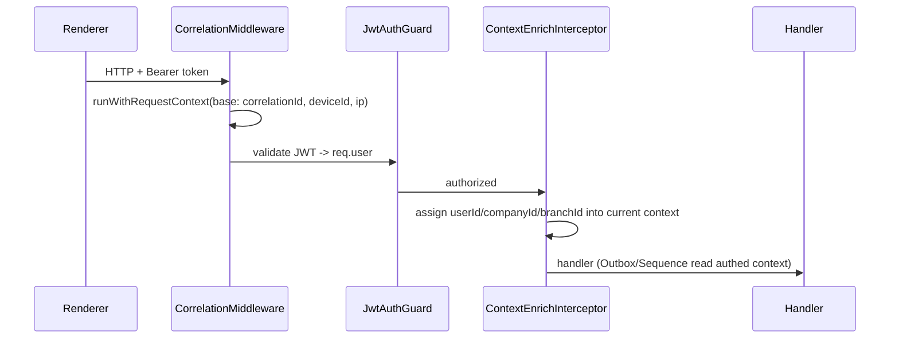

## Early Foundations (Handbook §11, §12, §18, §20, §29, §36, §38)

Transport stays HTTP: Angular renderer calls `http://localhost:3000` (Nest). Everything below is additive per the repo's additive-only policy.

### Assumed defaults (adjustable on confirm)
- Password hashing: `bcrypt` (well-supported; `argon2` optional).
- Token storage in renderer: Electron `safeStorage` via IPC, in-memory fallback for `ng serve`.
- i18n: `@ngx-translate/core` for runtime language switching (Angular built-in i18n is compile-time only).
- Auth is the trusted identity source; `x-user-id`/`x-company-id`/`x-branch-id` headers become dev-only fallbacks.

---

## Phase 1 — Backend security core

### 1a. Auth + RBAC (`backend/src/auth/`)
Add deps: `@nestjs/jwt`, `@nestjs/passport`, `passport`, `passport-jwt`, `bcrypt` (+ `@types/passport-jwt`, `@types/bcrypt`).

- `auth.module.ts`, `auth.controller.ts` (`POST /auth/login`, `/auth/refresh`, `/auth/logout`, `GET /auth/me`), `auth.service.ts`.
- `auth.service.ts`: verify credentials against `User.passwordHash` (bcrypt); enforce lockout via `failedLoginAttempts`/`lockedUntil`; on success reset counters, set `lastLoginAt`, create `UserSession` (store `sessionToken`, `refreshToken`, `expiresAt`, device info); issue JWT with claims `{ sub: userId, companyId, branchId, sessionId, roles, permissions }`.
- `jwt.strategy.ts` (passport-jwt) validating token + active session.
- Guards: `JwtAuthGuard` registered globally via `APP_GUARD` with a `@Public()` decorator to opt-out (login/health); `PermissionsGuard` + `@RequirePermissions('module:resource:action')` matched against `Permission` rows (`module`/`resource`/`action`).
- `password.service.ts` (hash/verify).
- Extend [error-code.ts](backend/src/common/exceptions/error-code.ts): `AUTH_INVALID_CREDENTIALS`, `AUTH_ACCOUNT_LOCKED`, `AUTH_SESSION_EXPIRED`, `AUTH_PERMISSION_DENIED`.
- All DTOs use class-validator; controllers thin (per nestjs-rules).

### 1b. Auth-driven RequestContext
`CorrelationMiddleware` already opens the AsyncLocalStorage scope from headers. Add a context-enrichment step (interceptor running after `JwtAuthGuard`) that mutates the current context object with `userId`/`companyId`/`branchId`/`sessionId` from `req.user`, so downstream `OutboxService`/`SequenceGenerator` use authenticated identity, not client headers.

### 1c. SettingsService (`backend/src/settings/`, Handbook §20)
- `settings.service.ts`: read `AppSetting` by `(companyId, branchId, settingKey)` with branch→company fallback; typed getters `getString/getNumber/getBoolean/getJson` driven by `dataType`; short-lived cache; decrypt when `isEncrypted`.
- `settings.controller.ts`: `GET /settings?category=`, `PUT /settings/:key` (guarded, `isEditable` only).
- `setting-keys.constants.ts` for known keys (GST rate, invoice template id, barcode format, printer mapping) — features read these instead of hardcoding.

### 1d. Security hardening ([main.ts](backend/src/main.ts), §29)
Enable already-present `helmet`; add CORS limited to `http://localhost:4200`; keep existing global `ValidationPipe`.

---

## Phase 2 — Angular core/shared data + auth layer (`src/app/`)

Establish structure: `core/` (services, interceptors, guards, models), `shared/`, `features/`.

- `app.config.ts`: add `provideHttpClient(withInterceptors([authInterceptor, errorInterceptor]))`.
- `core/services/api.service.ts`: wraps `HttpClient` with base URL; unwraps backend envelope (`{success,data}` → `data`; `{success,error}` → throw typed error). Mirror [api-response.types.ts](backend/src/common/response/api-response.types.ts) in `core/models/`.
- `core/interceptors/auth.interceptor.ts`: attach `Authorization: Bearer` + `x-device-id`.
- `core/interceptors/error.interceptor.ts`: map error envelope to `ToastrService`; on `401`/`AUTH_SESSION_EXPIRED` clear session + route to login.
- `core/services/auth.service.ts`: login/logout/refresh, current-user signal, token storage abstraction.
- `core/guards/auth.guard.ts` + `permission.guard.ts`; update [app.routes.ts](src/app/app.routes.ts) to protect `dashboard` and add a `login` route.

---

## Phase 3 — Cross-cutting conventions

### 3a. Branch scoping (§36)
No feature repos exist yet, so establish the convention now: a small helper to derive `branchId`/`companyId` from `RequestContextService` for feature queries, plus a short note in `prisma-persistence-rules.mdc`. Prevents unscoped queries once features land.

### 3b. Outbox contract (§13)
Contract already exists in [outbox.service.ts](backend/src/persistence/outbox/outbox.service.ts) (`payloadVersion`, `operationId`, `sequenceNo`). Add `entity-type.constants.ts` + a payload-envelope interface and document the versioning rule; no infra change.

### 3c. Keyboard shortcut registry (§18)
`core/services/keyboard-shortcut.service.ts`: register/unregister handlers, global `keydown` listener that ignores typing in inputs, and a help overlay. Seed placeholders (F2 New Sale, F4 Search, F8 Payment, Ctrl+S Save, Esc Cancel) wired to no-ops until features exist.

### 3d. i18n (§38)
Add `@ngx-translate/core` (+ http loader); `provideTranslate` in `app.config.ts`; `assets/i18n/en.json`; `LOCALE_ID`/`registerLocaleData` for locale-aware date/currency pipes. Convention: no hardcoded display strings.

---

## Phase 4 — Electron secure token storage (`electron/`)

Keep HTTP transport; add IPC only for identity/security concerns.
- [preload.js](electron/preload.js): expose `getDeviceInfo()` (deviceId, appVersion, OS) and `secureStore.get/set/delete` (backed by `safeStorage` in [main.js](electron/main.js)).
- Angular token storage uses `secureStore` when `window.electronAPI` exists, else in-memory (dev).
- Note (follow-up, not in scope): who launches the Nest process in packaged app — flagged for a later plan.

---

## Testing (per testing-rules)
- Backend unit specs: `auth.service.spec.ts` (login success/lockout/invalid), `permissions.guard.spec.ts`, `settings.service.spec.ts` (fallback + typed getters).
- Backend e2e: login → authorized call → 401 without token → 403 without permission.
- Angular: interceptor + `AuthService` specs (envelope unwrap, 401 handling).

## Out of scope (deferred)
Sync worker, telemetry, feature flags, backup scheduler, reporting/printing/barcode hardware, migration wizard. Feature domain modules (Sales/Inventory) come after this foundation as the first reference vertical.
