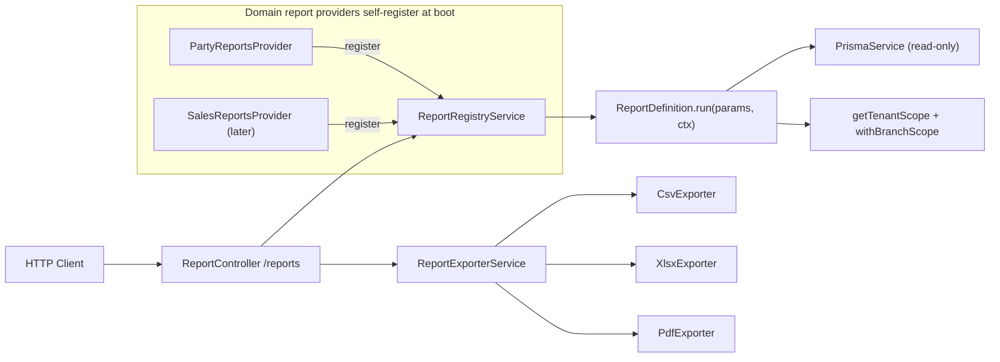

# Extensible Reporting Module

## Goal

A central `reporting` module that owns report execution, pagination, permissions, and export (JSON/CSV/Excel/PDF), while each domain module contributes its own report definitions through a registry. Party ships first; sales/inventory/purchase/finance plug in later with zero changes to the reporting core.

## Architecture

The reporting core is domain-agnostic. Domain modules register `ReportDefinition`s into a global `ReportRegistryService` at startup via a small self-registering provider. This inverts the dependency (domain -> reporting), avoiding circular imports and keeping the core free of domain knowledge.

Key reuse from existing code:
- Reads only, no `UnitOfWorkService`/`Outbox`/`Audit` (mirrors `CustomerService.list` in [backend/src/party/customer.service.ts](backend/src/party/customer.service.ts) lines 39-70).
- Tenant scoping via [backend/src/persistence/context/tenant-scope.util.ts](backend/src/persistence/context/tenant-scope.util.ts) (`getTenantScope`, `withBranchScope`).
- Pagination via [backend/src/common/dto/pagination-query.dto.ts](backend/src/common/dto/pagination-query.dto.ts) and `PaginatedResult` in [backend/src/common/response/paginated-result.ts](backend/src/common/response/paginated-result.ts).
- Decimal/BigInt/Date serialization helpers already used in [backend/src/party/mappers/customer.mapper.ts](backend/src/party/mappers/customer.mapper.ts).

## Core contracts

`backend/src/reporting/core/report-definition.interface.ts`:
- `ReportColumn { key; label; type: 'string'|'number'|'decimal'|'date'|'datetime'|'boolean'; align? }`
- `ReportResult { columns; rows: Record<string, unknown>[]; totals?; pagination? }`
- `ReportContext { scope: TenantScope; userId?: bigint }`
- `ReportDefinition { id; name; category; permission; run(params, ctx): Promise<ReportResult> }` where `id` is namespaced (e.g. `party.customer-list`).

`ReportRegistryService` (global): `register(def)`, `get(id)` (throws `REPORT_NOT_FOUND`), `list()` and `listForUser(permissions)`.

## Report execution flow

1. `GET /reports` returns metadata for all registered reports the caller may access (filtered by `permission`).
2. `GET /reports/:reportId` runs a report. Shared query DTO `ReportQueryDto extends PaginationQueryDto` adds `fromDate?`, `toDate?` (`@IsDateString`), `branchId?`, and `format?` (`json`|`csv`|`xlsx`|`pdf`, default `json`); report-specific filters pass through as extra query params.
3. Controller resolves the definition, performs a fine-grained permission check against `request.user.permissions` (since the report id is dynamic, the static `@RequirePermissions` guard can only enforce the coarse `REPORT_VIEW` gate), validates the date range (`fromDate <= toDate` else `REPORT_INVALID_DATE_RANGE`), builds `ReportContext`, and calls `def.run(...)`.
4. For `format=json`: return `PaginatedResult.of(rows, pagination)` (interceptor adds the envelope + pagination) or a plain object for pure aggregates.
5. For file formats: use `@Res({ passthrough: false })` to stream the exporter buffer with proper `Content-Type`/`Content-Disposition`, bypassing `ResponseInterceptor` without modifying it.

## Export layer

`backend/src/reporting/export/`:
- `report-exporter.service.ts` dispatches by format and returns `{ buffer, contentType, filename }`.
- `csv.exporter.ts` and `xlsx.exporter.ts` built on `exceljs` (one dependency covers both; no native build deps, safe for the Electron/desktop target).
- `pdf.exporter.ts` built on `pdfmake` for tabular PDFs with a header (report name, date range, branch) and column-typed formatting.
- Unsupported format -> `REPORT_UNSUPPORTED_FORMAT`.

## First reports (party provider)

`backend/src/reporting/providers/party/party-reports.provider.ts` implements `OnModuleInit`, injects `ReportRegistryService` + `PrismaService`, and registers:
- `party.customer-list` — customers with code, name, credit limit, outstanding, active flag (source: `customer` + related `party`, `deletedAt: null`, branch-scoped).
- `party.supplier-list` — analogous for suppliers.
- `party.customer-outstanding` — aggregate of outstanding by customer with a grand total (drives `totals`).

Provider lives under `reporting/` (not `party/`) for the first cut so reporting owns its providers; when other modules land they add their own `*ReportsProvider` in their module following this template.

## Wiring, permissions, deps, docs

- `backend/src/reporting/reporting.module.ts`: `@Global()`-style export of `ReportRegistryService`; declares `ReportController`, `ReportExporterService`, exporters, and `PartyReportsProvider`; imports `PrismaModule`, `PersistenceModule`. Register `ReportingModule` in [backend/src/app.module.ts](backend/src/app.module.ts).
- Permissions: reuse existing `REPORT_VIEW` as the coarse route gate. Add granular per-category codes (`REPORT_PARTY_VIEW`, later `REPORT_SALES_VIEW`, etc.) to [backend/seed/data/security/permission.json](backend/seed/data/security/permission.json) and grant to the admin role in [backend/seed/data/security/role-permission.json](backend/seed/data/security/role-permission.json), following the existing underscore convention.
- Error codes: add `REPORT_NOT_FOUND`, `REPORT_INVALID_DATE_RANGE`, `REPORT_UNSUPPORTED_FORMAT` to [backend/src/common/exceptions/error-code.ts](backend/src/common/exceptions/error-code.ts).
- Dependencies: add `exceljs`, `pdfmake`, and `@types/pdfmake` (dev) via npm.
- Docs: add `docs/pharmacy_erp_architecture_docs/architecture/reporting.md` describing the registry/provider contract and the "how a new module adds reports" recipe; link it from the docs README index.

## Tests

- `report-registry.service.spec.ts` — register/get/duplicate/unknown-id behavior.
- `party-reports.provider.spec.ts` — customer-list shape, branch scoping, `deletedAt` filter, totals.
- `report-exporter.service.spec.ts` — csv/xlsx/pdf produce non-empty buffers with correct content types.
- Run `npm run lint` and `npm run test` on touched files before finishing.

## Extensibility contract (for future modules)

To add reports, a module: (1) creates `<domain>-reports.provider.ts` implementing `OnModuleInit`, (2) registers `ReportDefinition`s with namespaced ids and a `permission`, (3) adds that provider to its own module `providers`. No edits to the reporting core, controller, or exporters are required.

## Out of scope

- Report scheduling / emailing / saved-report subscriptions.
- Charting or dashboard aggregation endpoints (this delivers tabular + aggregate reports).
- Building sales/inventory/purchase/finance report providers (only the party provider ships; their tables exist but write modules do not yet).