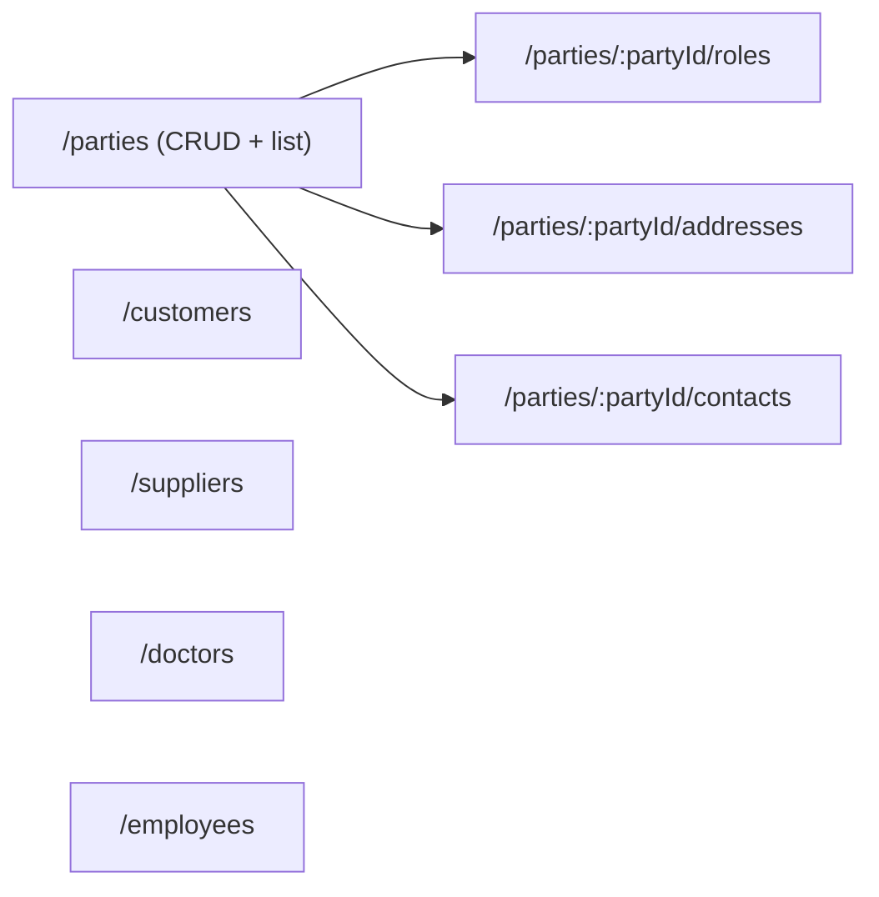

# Party Management CRUD API

Add a `party` feature module to the backend exposing CRUD + list endpoints for all 8 `party_management` entities, following the existing Settings/Auth module conventions and the repo-standard persistence write path.

## Key facts driving the design
- All 8 models are **org-global masters** — no `companyId`/`branchId` columns, so lists are **not** branch-scoped.
- `Customer`, `Supplier`, `Doctor`, `Employee` each have a **unique `partyId`** (one-to-one detail on a `Party`) and a unique business code (`customerCode`, etc.).
- `PartyRole`, `PartyAddress`, `PartyContact` are child collections of a `Party`.
- Every model has `uuid`, `version Int`, `deletedAt`; `Party`/`Customer`/`Supplier` also have `deletedBy`.
- Writes use the decided pattern (confirmed): `UnitOfWorkService.run()` transaction + `AuditService.log(tx, ...)` + soft delete + optimistic `version` check + `OutboxService.enqueue(tx, ...)`.
- Response envelope is applied globally by `ResponseInterceptor`; controllers return raw entities / `PaginatedResult.of(...)`. BigInt ids must be converted to strings in response DTOs (no global serializer exists).

## API surface



Each resource: `GET /` (paginated list + `search`), `GET /:id`, `POST /`, `PATCH /:id`, `DELETE /:id` (soft). Nested resources are scoped by `:partyId`.

## Shared infrastructure (new, reusable)
- [backend/src/common/dto/pagination-query.dto.ts](backend/src/common/dto/pagination-query.dto.ts) — `page` (default 1), `pageSize` (default 20, max 100), optional `search`; `@Type(() => Number)` + `class-validator`.
- [backend/src/common/pipes/parse-bigint.pipe.ts](backend/src/common/pipes/parse-bigint.pipe.ts) — converts `:id`/`:partyId` route params to `bigint`, throws `ApplicationException(VALIDATION_ERROR, ...)` on bad input.
- Small `buildPagination(total, page, pageSize)` helper returning `{ page, pageSize, total, totalPages }` (add to [backend/src/common/response/paginated-result.ts](backend/src/common/response/paginated-result.ts) or a new `pagination.util.ts`).

## Module layout — `backend/src/party/`
- `party.module.ts` — imports `PrismaModule`, `PersistenceModule`, `AuditModule`; registers all 8 controllers + services; register in [backend/src/app.module.ts](backend/src/app.module.ts).
- Controllers (8): `party`, `party-role`, `party-address`, `party-contact`, `customer`, `supplier`, `doctor`, `employee`. Each decorated with `@RequirePermissions('PARTY:<RESOURCE>:<ACTION>')`.
- Services (8): read methods use `this.prisma.client.<model>` with `deletedAt: null` filter + pagination; write methods wrap logic in `unitOfWork.run(tx => ...)`.
- `dto/` — `create-*.dto.ts` + `update-*.dto.ts` (update includes required `version` for optimistic locking) per entity, using `class-validator`. Business codes (`customerCode`, etc.) are client-provided and validated for uniqueness (Prisma unique constraint → mapped to `CONFLICT`).
- `mappers/` — per-entity `toResponse(entity)` functions converting `bigint` fields (`id`, `partyId`, `updatedBy`, `cityId`, etc.) to strings and `Decimal` to string; keeps existing endpoints untouched (no global BigInt patch).

### Service write pattern (all creates/updates/deletes)
```ts
return this.unitOfWork.run(async (tx) => {
  // create: tx.party.create({ data: { uuid: randomUUID(), ...dto } })
  // update: optimistic check — updateMany({ where: { id, version: dto.version, deletedAt: null }, data: { ...dto, version: { increment: 1 } } });
  //         if count === 0 -> ApplicationException(ENTITY_VERSION_CONFLICT / *_NOT_FOUND)
  // delete: soft — set deletedAt: new Date(), deletedBy (where column exists), version increment
  await this.audit.log(tx, { entityType: 'Party', entityUuid, action: AuditAction.CREATE, module: AuditModule.PARTY });
  await this.outbox.enqueue(tx, { entityType: OutboxEntityType.PARTY, entityUuid, operation: OutboxOperation.CREATE, payload });
  return mapped;
});
```
- Detail creates (`Customer`/`Supplier`/`Doctor`/`Employee`) first validate the referenced `Party` exists (else `PARTY_NOT_FOUND`) and no existing detail (unique `partyId`).

## Constants & error codes
- [backend/src/persistence/outbox/entity-type.constants.ts](backend/src/persistence/outbox/entity-type.constants.ts) — add `PARTY: 'Party'`, `PARTY_ROLE`, `PARTY_ADDRESS`, `PARTY_CONTACT`, `SUPPLIER`, `DOCTOR`, `EMPLOYEE` (`CUSTOMER` already exists).
- [backend/src/common/exceptions/error-code.ts](backend/src/common/exceptions/error-code.ts) — add `PARTY_ROLE_NOT_FOUND`, `PARTY_ADDRESS_NOT_FOUND`, `PARTY_CONTACT_NOT_FOUND`, `CUSTOMER_NOT_FOUND`, `SUPPLIER_NOT_FOUND`, `DOCTOR_NOT_FOUND`, `EMPLOYEE_NOT_FOUND`, `ENTITY_VERSION_CONFLICT` (`PARTY_NOT_FOUND` already exists).

## Seed permissions (RBAC)
- [backend/seed/data/security/permission.json](backend/seed/data/security/permission.json) — add `PARTY:PARTY:{READ,CREATE,DELETE}` (UPDATE exists via `PARTY_MANAGE`) and `PARTY:{CUSTOMER,SUPPLIER,DOCTOR,EMPLOYEE}:{READ,CREATE,UPDATE,DELETE}`. Party sub-resources (roles/addresses/contacts) reuse `PARTY:PARTY:*`.
- [backend/seed/data/security/role-permission.json](backend/seed/data/security/role-permission.json) — grant all new permissions to the ADMIN role (`roleUuid …cccccccc…cc01`).
- Re-seed (`npm run db:seed:fresh`) so the `admin` e2e user carries the new permissions.

## Tests
- Unit specs (co-located, one per service) following [backend/src/settings/settings.service.spec.ts](backend/src/settings/settings.service.spec.ts): mock `{ provide: PrismaService, useValue: { client: prismaMock } }`, `RequestContextService`, and a `UnitOfWorkService` whose `run` invokes the callback with a `tx` mock; assert not-found (`rejects.toMatchObject({ code, statusCode })`), version conflict, create wiring (audit + outbox called), and list pagination.
- E2E: [backend/test/party.e2e-spec.ts](backend/test/party.e2e-spec.ts) following [backend/test/auth.e2e-spec.ts](backend/test/auth.e2e-spec.ts): bootstrap `AppModule` + `ValidationPipe`, login as `admin` for a Bearer token, then exercise full lifecycle — create Party -> add role/address/contact -> create Customer/Supplier/Doctor/Employee referencing the party -> paginated list -> update with `version` -> soft delete -> `GET` returns 404 (`*_NOT_FOUND`) -> 401/403 without token/permission. Assert `ApiEnvelope` `success`/`error.code`, and that ids come back as **strings**. Clean up created rows in `afterAll`.

## Verification
- `npm run lint` and `npm run build` (from `backend/`).
- `npx jest src/party` (unit), `npm run test:e2e` (after `npm run db:seed:fresh`).