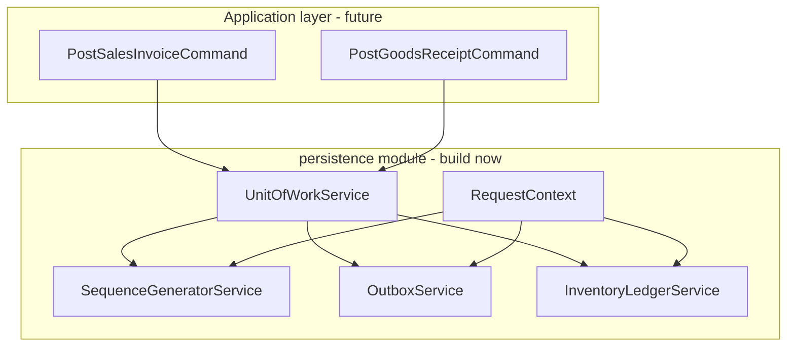

# Persistence Foundation Patterns

## Current state

- Schema is production-ready ([`architecture-review.md`](docs/pharmacy_erp_architecture_docs/database/architecture-review.md) post-remediation: 10/10).
- [`backend/src`](backend/src) is scaffold-only: `PrismaService`, legacy [`store/`](backend/src/store/) (broken `prisma.store`), global exception/response interceptors.
- **Zero** `prisma.$transaction` usage in application code.
- Docs already mandate: outbox-in-transaction ([`55_outbox.md`](docs/pharmacy_erp_architecture_docs/database/tables/synchronization/55_outbox.md)), branch-scoped numbering ([`63_sequence_generator.md`](docs/pharmacy_erp_architecture_docs/database/tables/configuration/63_sequence_generator.md)), alignment checklist ([`prisma_sqlite_jpa_postgres_alignment.md`](docs/pharmacy_erp_architecture_docs/database/prisma_sqlite_jpa_postgres_alignment.md)).

## Known SQLite prerequisite

`db push` creates `BIGINT` PK columns **without** `AUTOINCREMENT` (discovered during seed). [`PrismaService`](backend/src/prisma.service.ts) must get the same `$extends` id-assignment hook used in [`backend/seed/lib/prisma-client.ts`](backend/seed/lib/prisma-client.ts), or integration tests will hit `P2011 Null constraint violation on id`. Extract shared helper: `createPrismaClient(adapterUrl)`.

---

## Target architecture



**Rule:** Domain commands never call `prisma.*` directly for writes. They receive a `TxClient` from `UnitOfWorkService.run()` and call persistence services with that client.

---

## Module layout (new)

```
backend/src/
  persistence/
    persistence.module.ts          # exports all persistence services
    prisma/
      prisma-client.factory.ts       # shared client + BIGINT id extension
      prisma-tx.type.ts              # export Prisma.TransactionClient
    unit-of-work/
      unit-of-work.service.ts
    sequence/
      sequence-generator.service.ts
      document-type.constants.ts     # SALES_INVOICE, GOODS_RECEIPT, STOCK_MOVEMENT, ...
      document-number.formatter.ts
    outbox/
      outbox.service.ts
      outbox-operation.constants.ts  # CREATE | UPDATE | DELETE
    inventory/
      inventory-ledger.service.ts    # StockMovement + Stock balance (atomic within tx)
    context/
      request-context.ts             # companyId, branchId, userId, deviceId
      request-context.storage.ts     # AsyncLocalStorage for Nest request scope
```

Wire [`PersistenceModule`](backend/src/persistence/persistence.module.ts) into [`app.module.ts`](backend/src/app.module.ts). **Remove** legacy [`StoreModule`](backend/src/store/) and duplicate provider registrations.

---

## Pattern 1: Transactional writes (`UnitOfWorkService`)

**API:**

```typescript
await unitOfWork.run(async (tx) => {
  const docNo = await sequenceService.next(tx, { companyId, branchId, documentType: 'SALES_INVOICE' });
  const header = await tx.salesInvoice.create({ ... });
  await inventoryLedger.applyMovement(tx, { direction: 'OUT', ... });
  await outboxService.enqueue(tx, { entityType: 'SalesInvoice', entityUuid: header.uuid, operation: 'CREATE', payload: ... });
});
```

**Implementation notes:**

- Wrap `prisma.$transaction(callback, { maxWait, timeout })` in [`unit-of-work.service.ts`](backend/src/persistence/unit-of-work/unit-of-work.service.ts).
- Export `Prisma.TransactionClient` as `TxClient` so all persistence services accept `tx` as first argument (never `this.prisma` for writes inside a workflow).
- Map Prisma `P2002` / `P2003` to [`ApplicationException`](backend/src/common/exceptions/application.exception.ts) with new codes: `SEQUENCE_CONFLICT`, `STOCK_INSUFFICIENT`, `OUTBOX_DUPLICATE_OPERATION`.
- Retry policy: optional 1–2 retries on `P2034` (write conflict) for sequence optimistic-lock collisions.

**Inventory workflow contract** ([`inventory-ledger.service.ts`](backend/src/persistence/inventory/inventory-ledger.service.ts)):

For every stock-affecting document, in **one** transaction:

1. Allocate `movementNumber` via `SequenceGeneratorService` (`STOCK_MOVEMENT`).
2. Read current `Stock` for `(branchId, batchId)`; reject if OUT would go negative.
3. `stockMovement.create` with `balanceAfter`.
4. `stock.upsert` / `update` `availableQuantity` + `lastMovementAt`.
5. (Caller) creates document header + line items referencing `movementNumber` / batch.

This centralizes FEFO selection and negative-stock guards for future Sale/GRN/Transfer/Adjustment commands.

---

## Pattern 2: Outbox-in-transaction (`OutboxService`)

**API:**

```typescript
outboxService.enqueue(tx, {
  entityType: 'SalesInvoice',
  entityUuid: header.uuid,
  operation: 'CREATE',
  payload: serializedEntity,
  branchId,
  payloadVersion: 1,
});
```

**Implementation** ([`outbox.service.ts`](backend/src/persistence/outbox/outbox.service.ts)):

| Field | Source |
|-------|--------|
| `deviceId` | `RequestContext.deviceId` (from Electron config / `AppSetting` / env `DEVICE_ID`) |
| `operationId` | `crypto.randomUUID()` per enqueue call (idempotency key) |
| `sequenceNo` | `MAX(sequenceNo) + 1` for `deviceId` **inside same tx** (no separate table; matches [`55_outbox.md`](docs/pharmacy_erp_architecture_docs/database/tables/synchronization/55_outbox.md) per-device ordering) |
| `syncStatus` | `'PENDING'` |
| `uuid` | explicit `randomUUID()` |

**Multi-entity workflows:** one outbox row per syncable entity written (e.g., `SalesInvoice` CREATE + each `StockMovement` CREATE), all in the same `$transaction`.

**Never** write outbox outside `UnitOfWorkService.run()`.

---

## Pattern 3: SequenceGenerator service

**API:**

```typescript
const { documentNumber, sequenceValue } = await sequenceService.next(tx, {
  companyId,
  branchId,
  documentType: 'SALES_INVOICE',
});
```

**Implementation** ([`sequence-generator.service.ts`](backend/src/persistence/sequence/sequence-generator.service.ts)):

1. `findFirst` on `@@unique([companyId, branchId, documentType])` with `isActive: true`.
2. Apply **reset policy** (`YEARLY` / `MONTHLY` / `NEVER`) by comparing `FinancialYear` or calendar boundary; reset `currentNumber` to 0 when policy triggers (read company/branch FY from seed JSON masters).
3. Atomically increment inside tx:
   - `UPDATE ... SET currentNumber = currentNumber + incrementBy, version = version + 1 WHERE id = ? AND version = ?` (optimistic lock via Prisma `update` with version check).
4. Format using `prefix`, `paddingLength`, optional `format` template (`SI-{BR}-{SEQ}` → `SI-B01-000042`). Reuse seed convention from [`id-registry.ts`](backend/seed/lib/id-registry.ts) `docNumber()`.

**Document types** to support initially (constants file): `SALES_INVOICE`, `GOODS_RECEIPT`, `PURCHASE_ORDER`, `STOCK_MOVEMENT`, `STOCK_ADJUSTMENT`, `STOCK_TRANSFER` — matching seed [`sequence-generator.json`](backend/seed/data/configuration/sequence-generator.json).

SQLite note: single-writer desktop app; optimistic locking inside `$transaction` is sufficient. Cloud JPA side will use `SELECT FOR UPDATE` on PostgreSQL — same logical contract.

---

## Request context

[`RequestContext`](backend/src/persistence/context/request-context.ts) carries `companyId`, `branchId`, `userId`, `deviceId` into persistence services without threading 4 params through every method.

- Populate via Nest middleware/interceptor from headers (`X-Branch-Id`, `X-Device-Id`) or defaults for desktop single-branch dev.
- Integration tests set context explicitly before calling `unitOfWork.run()`.

---

## Integration tests (validation — no feature APIs)

Add `backend/test/persistence/` (or `src/persistence/__tests__/`) with a real SQLite DB:

| Test | Asserts |
|------|---------|
| `sequence-generator.integration.spec.ts` | Two concurrent `next()` calls in separate transactions yield unique, monotonic branch-scoped numbers; version conflict retries |
| `outbox-in-transaction.integration.spec.ts` | Simulated business insert + outbox commit together; forced mid-tx throw rolls back both |
| `inventory-ledger.integration.spec.ts` | IN movement increases stock; OUT decreases; OUT beyond available throws `STOCK_INSUFFICIENT` and rolls back |
| `atomic-workflow.integration.spec.ts` | **End-to-end skeleton**: allocate SI number → create minimal `SalesInvoice` stub row → `InventoryLedgerService.applyMovement` OUT → `OutboxService.enqueue` ×2 — all in one `unitOfWork.run()`; verify counts in DB |

Use seeded DB (`npm run db:seed:fresh`) or programmatic minimal fixtures in `beforeAll`.

Test harness: `@nestjs/testing` + real `PrismaService` (not mocks).

---

## Error codes to add

Extend [`error-code.ts`](backend/src/common/exceptions/error-code.ts):

- `SEQUENCE_NOT_FOUND`, `SEQUENCE_CONFLICT`
- `STOCK_INSUFFICIENT`, `STOCK_NOT_FOUND`
- `OUTBOX_DUPLICATE_OPERATION`
- `TRANSACTION_FAILED`

---

## Documentation touch-up (small)

Add `docs/pharmacy_erp_architecture_docs/database/persistence-patterns.md` (or section in [`backend/README.md`](backend/README.md)) documenting:

- When to use `UnitOfWorkService.run`
- Mandatory outbox enqueue checklist per workflow
- Sequence `documentType` registry
- Link to alignment doc checklist item "Outbox writes entityUuid in same transaction"

---

## Implementation order

1. **Prisma client factory** + fix `PrismaService`; remove `StoreModule`
2. **`PersistenceModule` + `RequestContext`**
3. **`UnitOfWorkService`**
4. **`SequenceGeneratorService`** + formatter
5. **`OutboxService`** (sequenceNo allocation)
6. **`InventoryLedgerService`**
7. **Integration tests** (four specs above)
8. **Docs + error codes**

---

## Out of scope (this plan)

- REST controllers for Sale / Purchase / Transfer
- Sync worker / cloud ingest
- Full DTO validation pipelines per domain
- Prisma migrations (user continues `db push`)
- Changing Outbox or SequenceGenerator schema

## Success criteria

- All integration tests pass against seeded SQLite DB.
- No persistence write path uses bare `this.prisma` for multi-step inventory workflows.
- Document numbers come only from `SequenceGeneratorService.next()` inside a transaction.
- Every test that simulates a business write also asserts a matching `Outbox` row with `entityUuid`, `deviceId`, `operationId`, `sequenceNo`.
