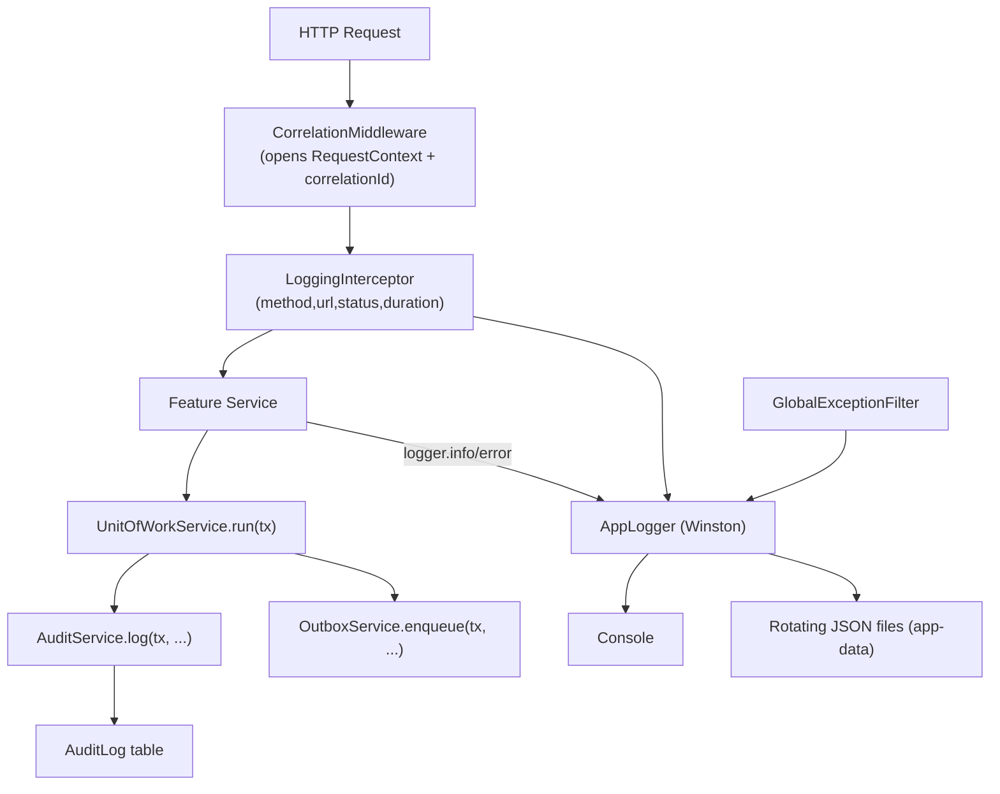

# Add Winston Logging Framework + Transactional Audit to Backend

## Goal
Introduce a fully-fledged **technical logging** stack (Winston) and a **business audit** stack (transactional `AuditService` → existing `AuditLog` table), wired to the existing `RequestContextService` / `UnitOfWorkService` patterns, with a technical how-to doc. Additive only.

## Two lanes (per prior discussion)
- **Technical logs** (developers/support): Winston → console (pretty in dev, JSON in prod) + rotating JSON files. Routed through Nest's logger so existing `new Logger(...)` calls (e.g. `GlobalExceptionFilter`) flow through it automatically.
- **Business audit** (regulatory trail): `AuditService.log(tx, …)` inserts into the existing `AuditLog` model **inside the same `UnitOfWork` transaction** — mirroring `OutboxService.enqueue(tx, …)`.



## Dependencies (add to backend/package.json)
- `winston`
- `nest-winston`
- `winston-daily-rotate-file`

## New: technical logging module — `backend/src/common/logging/`
- **`winston.config.ts`** — builds `WinstonModuleOptions`:
  - `format.combine(timestamp, errors({stack:true}), safeSerializer(), json())` for files; `nestLike`/`colorize` for console in dev.
  - **`safeSerializer()`** custom `format((info) => …)` that converts `bigint` → string and `Prisma.Decimal` → string before `json()` (critical: `JSON.stringify(1n)` throws). This is the must-have gotcha for this codebase.
  - **Redaction**: strip `password`, `pin`, `token`, `accessToken`, `refreshToken`, `authorization` (deep) per `nestjs-rules.mdc` "no sensitive data".
  - **Transports**: `Console` + `DailyRotateFile` (`filename: <logDir>/app-%DATE%.log`, `datePattern: YYYY-MM-DD`, `zippedArchive: true`, `maxSize: 20m`, `maxFiles: 14d`) and a separate `error-%DATE%.log` at `level: error`.
  - Read `level`, `logDir` from `ConfigService` (env `LOG_LEVEL`, `LOG_DIR`; default a desktop app-data path). Levels: dev `debug`, prod `info`.
- **`app-logger.service.ts`** — `@Injectable() AppLogger` implementing Nest `LoggerService`, delegating to the Winston instance and injecting current correlation/user/branch context (via `RequestContextService.tryGet()`) into every line. Exposes `log/error/warn/debug/verbose` + a structured `info(meta, msg)` helper.
- **`correlation.middleware.ts`** — global `NestMiddleware` that: reads/derives `correlationId` (incoming `x-correlation-id` or `randomUUID()`), `deviceId`/`userId`/`companyId`/`branchId` from headers with env fallbacks (consistent with existing `getDeviceId()` fallback), sets `res` header `x-correlation-id`, and opens `RequestContextService.run({...})` for the request lifecycle.
- **`logging.interceptor.ts`** — `APP_INTERCEPTOR` logging one structured line per request: `method`, `url`, `statusCode`, `durationMs`, `correlationId`, `userId`, `branchId`. Never logs full bodies.
- **`logging.module.ts`** — imports `WinstonModule.forRootAsync` (Config-driven) + `PersistenceModule` (for `RequestContextService`), provides/exports `AppLogger`, registers `LoggingInterceptor`.

## Extend request context (small, additive)
- In [backend/src/persistence/context/request-context.ts](backend/src/persistence/context/request-context.ts): add optional `correlationId?: string`, `ipAddress?: string`, `sessionId?: string` to `RequestContextData` (keeps existing required `companyId/branchId/deviceId`).
- No change needed to `request-context.storage.ts` / `.service.ts` (already generic). Test helper `buildTestRequestContext` stays valid (new fields optional).

## New: audit module — `backend/src/audit/`
- **`audit-action.constants.ts`** / **`audit-module.constants.ts`** — `as const` registries (`CREATE/UPDATE/DELETE/LOGIN/LOGOUT/APPROVE/REJECT/POST/SYNC`; module names) matching the CHECK constraint documented in [58_audit_log.md](docs/pharmacy_erp_architecture_docs/database/tables/audit/58_audit_log.md).
- **`audit.service.ts`** — `@Injectable() AuditService` with:
  ```ts
  async log(tx: TxClient, input: AuditLogInput): Promise<void>
  ```
  Pulls `userId`, `deviceId`, `correlationId`, (`ipAddress`,`sessionId`) from `RequestContextService.tryGet()`, sets `actionTimestamp = new Date()`, and calls `tx.auditLog.create({...})`. Matches real columns in [backend/prisma/audit/audit-log.prisma](backend/prisma/audit/audit-log.prisma). Takes `tx` so it commits atomically with the business mutation (like `OutboxService`). Does **not** duplicate stock deltas already captured by `StockMovement`.
- **`audit.module.ts`** — imports `PersistenceModule`, provides/exports `AuditService`.

## Wiring
- **[backend/src/main.ts](backend/src/main.ts)**: `NestFactory.create(AppModule, { bufferLogs: true })`, then `app.useLogger(app.get(AppLogger))` so bootstrap + all `new Logger(...)` (incl. `GlobalExceptionFilter`) route through Winston.
- **[backend/src/app.module.ts](backend/src/app.module.ts)**: import `ConfigModule.forRoot`, `LoggingModule`, `AuditModule`; register `LoggingInterceptor` as `APP_INTERCEPTOR`; apply `CorrelationMiddleware` for all routes via `configure(consumer)`.
- **`AuditLog` table**: model already exists; verify the SQLite DB has it (run `npm run db:reset` / `prisma db push` if missing). No schema edit required.

## Usage example (target)
```ts
await this.unitOfWork.run(async (tx) => {
  const sale = await createSale(tx, dto);
  await this.auditService.log(tx, {
    entityType: 'SalesInvoice', entityId: sale.id,
    action: AuditAction.POST, module: AuditModule.SALES,
    description: 'Sales invoice posted',
  });
  await this.outboxService.enqueue(tx, { /* ... */ });
  return sale;
});
this.logger.info({ saleId: sale.id, branchId: dto.branchId }, 'Sale posted');
```

## Docs (the "how to use")
- New guide: **`docs/pharmacy_erp_architecture_docs/architecture/logging-and-audit.md`** covering:
  - When to use technical log vs audit (decision table), log levels, structured-field conventions.
  - How to inject/use `AppLogger`; the bigint/Decimal serializer + redaction rules; correlationId flow.
  - How to write audit entries (inside `UnitOfWork`, using action/module constants) and what belongs in `AuditLog` vs `StockMovement`/`Outbox`.
  - Log file location/rotation/retention and how support pulls logs from a desktop install.
- Add a one-line pointer in [backend/AGENTS.md](backend/AGENTS.md) "Logging" area referencing the new guide (small, additive).

## Tests
- Unit: `winston.config` serializer (bigint + `Prisma.Decimal` → string; redaction removes secrets); `AppLogger` injects correlation context.
- Unit: `AuditService.log` maps input→`tx.auditLog.create` and pulls context (mock `tx`, `RequestContextService`).
- Persistence integration (`test/persistence/`): `AuditService.log` inside `runWithTestContext` writes a real `AuditLog` row for a seeded branch, then cleans up (per testing-rules).

## Validation
- `npm run lint` on touched files, `npm run test`, `npm run test:persistence`.
- Manual: hit an endpoint, confirm a JSON request log line with `correlationId`/`durationMs`, a rotating file in the log dir, and an `AuditLog` row for an audited action.

## Out of scope
- No auth system (userId/context derived from headers + fallbacks for now).
- No `ChangeHistory` field-level diffing (separate table/concern).
- No external/centralized log shipping (future PostgreSQL/sync phase).